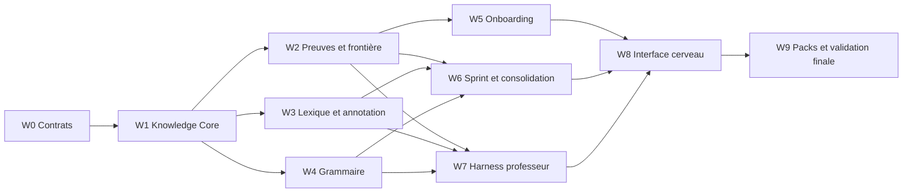

# Polyglot Knowledge Convergence Implementation Plan

> **Mode d'exécution obligatoire :** utiliser `superpowers:executing-plans` en mode
> inline. Aucun sous-agent, conformément à la demande explicite de Sami. Chaque incrément
> passe tests, revue et preuve locale avant le suivant.

**Goal:** Faire converger Word Bank, grammaire, exercices, progression, onboarding,
sprints et professeur autour d'un graphe personnel de connaissances multilingue,
explicable et visible.

**Architecture:** Ajouter un Knowledge Core universel dans PostgreSQL, relier chaque
contenu et activité à une Q-matrix versionnée, puis projeter les preuves existantes vers
des niveaux 0-8 et une frontière d'apprentissage. Adapter le harness Agent Alpha au
professeur avec skills progressifs, gateway, workspace, vault et receipts. Construire les
vues React après stabilisation des contrats backend.

**Tech Stack:** Python 3.13.11, FastAPI, SQLAlchemy async, PostgreSQL 17, Alembic,
Pydantic, LM Studio, React 19, TypeScript 6, TanStack Query, `@xyflow/react`, Vitest,
Playwright, Docker Compose.

**Spec:** `docs/superpowers/specs/2026-08-13-polyglot-knowledge-operating-system-design.md`

## Global Constraints

- PostgreSQL reste l'unique source de vérité ; aucun Neo4j ni fichier Markdown normatif.
- API publique sous `/api/v1`, OpenAPI et client TypeScript généré.
- Événements, réponses, observations et preuves immuables ; projections reconstructibles.
- Toute commande à effet exige `Idempotency-Key`, version attendue et owner check.
- FSRS reste propriétaire de l'échéancier des cartes.
- LM Studio exact : `qwen/qwen3.6-35b-a3b`, `store=false`, aucun retry ni fallback.
- Le professeur ne publie, ne supprime définitivement, ne note officiellement et
  n'attribue jamais une maîtrise.
- Un onboarding ordinaire présente 4 à 12 épreuves, 15 minutes maximum.
- Les langues connues créent des priors explicables, jamais des preuves.
- Toute vue de niveau expose confiance et fraîcheur.
- Italien complet, japonais exécutable ; turc limité à une fixture de preuve du modèle.
- Aucun remplissage massif du lexique avant validation du moteur.
- Aucun sous-agent pendant l'implémentation.

---

## 1. Carte des fichiers

### Backend à créer

```text
backend/src/polyglot/modules/knowledge/
  __init__.py              exports publics
  domain.py                nœuds, arêtes, taxonomies, niveaux et invariants
  catalogue.py             référentiel publié et validation de graphe
  projection.py            projection preuve -> niveau 0-8
  frontier.py              calcul de frontière et explications
  application.py           cas d'usage de lecture et commande
  persistence.py           repositories PostgreSQL et reconstruction

backend/src/polyglot/modules/annotation/
  __init__.py
  domain.py                mentions, plages, analyses et snapshots
  resolver.py              forme -> lemme -> sens candidat
  application.py           annotation et capture universelle
  persistence.py           snapshots et résolutions

backend/src/polyglot/modules/consolidation/
  __init__.py
  domain.py                ConsolidationPrescription
  planner.py               sélection déterministe d'activités
  application.py
  persistence.py

backend/src/polyglot/modules/teacher/
  skills.py                catalogue L1, pipelines L2 et packs
  tool_protocol.py         recherche, ouverture, mutation, receipt
  gateway.py               permissions et exécution
  workspace.py             mémoire structurée du professeur
  vault.py                 résultats bruts, vues compactes et locators
  runtime.py               boucle native et finish_turn
  delivery.py              deadline, cancel et états terminaux
  qa.py                    trace expurgée et détection de stagnation

backend/src/polyglot/interfaces/http/routes/
  knowledge.py
  annotations.py
  consolidation.py
  teacher_runtime.py

backend/migrations/versions/
  0026_knowledge_core.py
  0027_content_annotations.py
  0028_teacher_harness.py
  0029_knowledge_integrations.py
```

### Backend à modifier

```text
backend/src/polyglot/modules/progress/domain.py
backend/src/polyglot/modules/progress/persistence.py
backend/src/polyglot/modules/progress/recommendations.py
backend/src/polyglot/modules/lexicon/memory/domain.py
backend/src/polyglot/modules/lexicon/memory/persistence.py
backend/src/polyglot/modules/exercises/core/domain.py
backend/src/polyglot/modules/exercises/core/persistence.py
backend/src/polyglot/modules/exercises/gym/domain.py
backend/src/polyglot/modules/curriculum/domain.py
backend/src/polyglot/modules/sprints/composer.py
backend/src/polyglot/modules/sprints/persistence.py
backend/src/polyglot/modules/practice/application.py
backend/src/polyglot/modules/placement/domain.py
backend/src/polyglot/modules/placement/policy.py
backend/src/polyglot/modules/placement/persistence.py
backend/src/polyglot/modules/language_profiles/onboarding.py
backend/src/polyglot/modules/identity/languages.py
backend/src/polyglot/interfaces/http/app.py
backend/src/polyglot/bootstrap/pilot.py
contracts/openapi/openapi.yaml
```

### Frontend à créer

```text
frontend/src/features/brain/
  brain-page.tsx
  brain-map.tsx
  brain-list.tsx
  brain-filters.tsx
  node-detail-panel.tsx
  knowledge-visual-state.ts
  graph-layout.ts
  *.test.tsx

frontend/src/features/grammar-tree/
  grammar-tree-page.tsx
  grammar-node-panel.tsx
  grammar-actions.tsx
  *.test.tsx

frontend/src/features/vocabulary/
  vocabulary-domain-map.tsx
  lexical-capture-menu.tsx
  lexical-resolution-dialog.tsx
  sprint-lexical-summary.tsx

frontend/src/features/consolidation/
  consolidation-configure.tsx
  consolidation-preview.tsx
  consolidation-result.tsx

frontend/src/features/teacher/
  teacher-page.tsx
  teacher-turn.tsx
  teacher-action-card.tsx
  teacher-scope.tsx
```

### Frontend à modifier

```text
frontend/package.json
frontend/pnpm-lock.yaml
frontend/src/app/router.tsx
frontend/src/app/navigation.ts
frontend/src/app/app-shell.tsx
frontend/src/app/styles.css
frontend/src/features/profile/placement-page.tsx
frontend/src/features/profile/placement-reader.tsx
frontend/src/features/progress/progress-page.tsx
frontend/src/features/practice/practice-page.tsx
frontend/src/features/sprint/sprint-page.tsx
frontend/src/features/today/today-page.tsx
frontend/src/features/teacher/teacher-drawer.tsx
frontend/src/features/vocabulary/vocabulary-page.tsx
frontend/src/features/exercises/primitive-response-editor.tsx
```

## 2. Vagues de livraison



Chaque vague produit une application utilisable, pas uniquement des tables.

---

### Task 1: Verrouiller les contrats du Knowledge Core

**Files:**
- Create: `contracts/knowledge/knowledge-node.schema.json`
- Create: `contracts/knowledge/knowledge-edge.schema.json`
- Create: `contracts/knowledge/exercise-q-matrix.schema.json`
- Create: `contracts/knowledge/content-annotation.schema.json`
- Create: `contracts/knowledge/teacher-tool-envelope.schema.json`
- Modify: `contracts/registry.yaml`
- Test: `backend/tests/contract/knowledge/test_contract_registry.py`

**Interfaces:**
- Produces: enums fermés `KnowledgeNodeKind`, `KnowledgeEdgeKind`, `TargetRole`,
  `KnowledgeLevel`, `TeacherToolKind` et leurs schémas JSON.

- [ ] Écrire les tests qui refusent un kind inconnu, une arête prérequise cyclique déclarée,
  une Q-matrix sans rôle et une mutation professeur sans idempotency key.
- [ ] Exécuter `python scripts/validate_contracts.py` et vérifier l'échec sur les nouveaux
  contrats absents.
- [ ] Ajouter les cinq schémas avec `additionalProperties=false`, versions et exemples.
- [ ] Enregistrer leurs propriétaires et consommateurs dans `contracts/registry.yaml`.
- [ ] Exécuter `python scripts/validate_contracts.py` puis
  `pytest backend/tests/contract/knowledge/test_contract_registry.py -q`.
- [ ] Commit : `contracts: define knowledge graph boundaries`.

### Task 2: Implémenter le domaine pur du graphe

**Files:**
- Create: `backend/src/polyglot/modules/knowledge/domain.py`
- Create: `backend/src/polyglot/modules/knowledge/catalogue.py`
- Create: `backend/src/polyglot/modules/knowledge/__init__.py`
- Test: `backend/tests/unit/knowledge/test_domain.py`
- Test: `backend/tests/property/knowledge/test_graph_properties.py`

**Interfaces:**

```python
class KnowledgeNodeKind(StrEnum): ...
class KnowledgeEdgeKind(StrEnum): ...
@dataclass(frozen=True, slots=True)
class KnowledgeNodeRevision: ...
@dataclass(frozen=True, slots=True)
class KnowledgeEdgeRevision: ...
def validate_graph(nodes, edges) -> GraphValidationReport: ...
```

- [ ] Écrire des tests unitaires pour tous les kinds et les contraintes de relation.
- [ ] Écrire des propriétés Hypothesis : aucun cycle `prerequisite_of`, ordre stable,
  relations symétriques normalisées, références résolues.
- [ ] Vérifier le rouge avec
  `pytest backend/tests/unit/knowledge backend/tests/property/knowledge -q`.
- [ ] Implémenter les dataclasses immuables, validateurs et empreintes canoniques.
- [ ] Vérifier vert, Ruff et mypy strict sur le module.
- [ ] Commit : `feat(knowledge): add universal graph domain`.

### Task 3: Persister le référentiel partagé

**Files:**
- Create: `backend/migrations/versions/0026_knowledge_core.py`
- Create: `backend/src/polyglot/modules/knowledge/persistence.py`
- Test: `backend/tests/integration/knowledge/test_migration_0026.py`
- Test: `backend/tests/integration/knowledge/test_catalogue_repository.py`

**Interfaces:**
- Produces: `SqlKnowledgeCatalogue.publish_revision`, `read_node`, `read_subgraph`,
  `search_nodes`.

- [ ] Écrire le test de migration sur PostgreSQL réel : tables, FKs, RLS, triggers
  append-only, index de recherche et rejet de cycle.
- [ ] Vérifier l'échec avant migration.
- [ ] Créer schéma `knowledge` avec nodes, revisions, edges, taxonomies, publications et
  provenance. Utiliser closure table uniquement pour les prérequis publiés.
- [ ] Implémenter le repository avec pagination curseur et owner-free read des contenus
  publiés.
- [ ] Tester upgrade, downgrade, upgrade et deux publications idempotentes.
- [ ] Commit : `feat(knowledge): persist versioned graph catalogue`.

### Task 4: Projeter les preuves vers les niveaux 0-8

**Files:**
- Create: `backend/src/polyglot/modules/knowledge/projection.py`
- Modify: `backend/src/polyglot/modules/progress/domain.py`
- Modify: `backend/src/polyglot/modules/progress/persistence.py`
- Test: `backend/tests/unit/knowledge/test_projection.py`
- Test: `backend/tests/property/knowledge/test_projection_properties.py`

**Interfaces:**

```python
@dataclass(frozen=True, slots=True)
class KnowledgeProjection:
    level: int
    receptive_level: int
    productive_level: int
    confidence: float
    freshness: float
    evidence_ids: tuple[UUID, ...]

def project_knowledge(evidence, encounters, *, as_of, policy) -> KnowledgeProjection: ...
```

- [ ] Écrire les cas 0 à 8, avec contrôles de délai, transfert, aide et contradiction.
- [ ] Prouver par propriété qu'ajouter une simple rencontre ne peut pas produire un niveau
  supérieur à 1 et qu'une preuve isolée ne peut pas produire 8.
- [ ] Vérifier les échecs contre la projection V2 actuelle.
- [ ] Réutiliser `LearningEvidence` et `project_mastery`; ajouter la traduction vers niveau
  visible sans dupliquer le calcul normatif.
- [ ] Tester reconstruction et empreinte stable.
- [ ] Commit : `feat(progress): project evidence into explainable levels`.

### Task 5: Calculer la frontière d'apprentissage

**Files:**
- Create: `backend/src/polyglot/modules/knowledge/frontier.py`
- Modify: `backend/src/polyglot/modules/progress/recommendations.py`
- Test: `backend/tests/unit/knowledge/test_frontier.py`

**Interfaces:**

```python
@dataclass(frozen=True, slots=True)
class FrontierCandidate: ...
def compute_frontier(graph, projections, goals, needs, recent_history, policy): ...
```

- [ ] Tester prérequis bloquant, oubli, faiblesse, objectif, intérêt, information gain,
  surcharge et redondance récente.
- [ ] Vérifier que les candidats non accessibles sont expliqués mais non recommandés.
- [ ] Implémenter le score versionné de la spec et un tie-break déterministe.
- [ ] Ajouter des reason codes publics, sans score opaque exposé comme vérité.
- [ ] Exécuter tests de recommandations existants et nouveaux.
- [ ] Commit : `feat(progress): derive personal learning frontier`.

### Task 6: Exposer le cerveau en lecture

**Files:**
- Create: `backend/src/polyglot/modules/knowledge/application.py`
- Create: `backend/src/polyglot/interfaces/http/routes/knowledge.py`
- Modify: `backend/src/polyglot/interfaces/http/app.py`
- Test: `backend/tests/contract/knowledge/test_api.py`
- Test: `backend/tests/integration/knowledge/test_owner_scope.py`

**Interfaces:**
- `GET /api/v1/knowledge-graphs/{profile_id}`
- `GET /api/v1/knowledge-nodes/{node_revision_id}`
- `GET /api/v1/knowledge-frontier/{profile_id}`
- `GET /api/v1/learner-model/{profile_id}`
- `GET /api/v1/learner-model/{profile_id}/evidence`

- [ ] Écrire contrats 200, curseur, `non_observed`, données retirées et owner denial.
- [ ] Vérifier rouge.
- [ ] Implémenter modèles Pydantic fermés et application service.
- [ ] Générer OpenAPI et vérifier aucun changement non intentionnel des routes V2.
- [ ] Commit : `feat(api): expose knowledge graph and learner model`.

### Task 7: Ajouter taxonomie lexicale et métadonnées

**Files:**
- Modify: `backend/src/polyglot/modules/catalogue/core/domain.py`
- Modify: `backend/src/polyglot/modules/lexicon/core/domain.py`
- Modify: `backend/src/polyglot/modules/lexicon/core/persistence.py`
- Modify: `backend/migrations/versions/0026_knowledge_core.py`
- Test: `backend/tests/unit/lexicon_core/test_metadata.py`
- Test: `backend/tests/integration/lexicon_core/test_domain_bindings.py`

**Interfaces:**
- Produces: `LexicalMetadata`, `DomainBinding`, `LanguageRelationshipBinding`.

- [ ] Tester un sens multidomaine, fréquence par canal, registre, collocation, cognat et faux
  ami.
- [ ] Tester qu'une forme de surface ne devient jamais l'identité du sens.
- [ ] Étendre le domaine et la persistance par relations explicites.
- [ ] Ajouter recherche combinée surface, domaine, fréquence, état et liste.
- [ ] Exécuter les tests Word Bank et import existants.
- [ ] Commit : `feat(lexicon): enrich senses with domain metadata`.

### Task 8: Annoter et résoudre tout texte

**Files:**
- Create: `backend/migrations/versions/0027_content_annotations.py`
- Create: `backend/src/polyglot/modules/annotation/domain.py`
- Create: `backend/src/polyglot/modules/annotation/resolver.py`
- Create: `backend/src/polyglot/modules/annotation/application.py`
- Create: `backend/src/polyglot/modules/annotation/persistence.py`
- Create: `backend/src/polyglot/interfaces/http/routes/annotations.py`
- Test: `backend/tests/unit/annotation/test_resolver.py`
- Test: `backend/tests/integration/annotation/test_capture.py`

**Interfaces:**
- `POST /api/v1/content-annotations/resolve`
- `POST /api/v1/content-annotations/{snapshot_id}/mentions/{mention_id}/confirm`
- `POST /api/v1/profiles/{profile_id}/encounters`

- [ ] Tester flexion italienne, expression multi-mots, japonais sans espaces, homographe et
  absence de candidat.
- [ ] Vérifier qu'une ambiguïté ne crée ni carte ni sens arbitraire.
- [ ] Implémenter snapshots, mentions, candidats, résolutions et provenance.
- [ ] Brancher l'enregistrement de rencontre Word Bank existant.
- [ ] Tester idempotence, RLS et conservation du contexte exact.
- [ ] Commit : `feat(annotation): add universal lexical capture pipeline`.

### Task 9: Transformer la boîte grammaticale en graphe

**Files:**
- Modify: `backend/src/polyglot/modules/catalogue/core/domain.py`
- Modify: `backend/src/polyglot/modules/exercises/gym/domain.py`
- Modify: `backend/src/polyglot/modules/exercises/gym/planning.py`
- Create: `fixtures/canonical/FX-KNOWLEDGE-UNIVERSAL/grammar-functions.json`
- Create: `fixtures/canonical/FX-KNOWLEDGE-IT/grammar-realizations.json`
- Test: `backend/tests/contract/gym/test_grammar_graph.py`

**Interfaces:**
- Fonction universelle -> réalisation de pack -> transformations -> primitives -> preuves.

- [ ] Écrire les tests sur les 24 familles de la spec, prérequis et transformations.
- [ ] Vérifier que japonais et italien peuvent réaliser différemment la même fonction.
- [ ] Publier la taxonomie universelle et mapper les 30 moules italiens existants.
- [ ] Brancher Gym sur les IDs de nœuds plutôt que sur des chaînes libres.
- [ ] Vérifier les tests pédagogiques italiens existants.
- [ ] Commit : `feat(grammar): publish functional grammar graph`.

### Task 10: Versionner la Q-matrix des exercices

**Files:**
- Modify: `backend/src/polyglot/modules/exercises/core/domain.py`
- Modify: `backend/src/polyglot/modules/exercises/core/persistence.py`
- Modify: `backend/migrations/versions/0029_knowledge_integrations.py`
- Test: `backend/tests/unit/exercises_core/test_q_matrix.py`
- Test: `backend/tests/integration/exercises_core/test_evidence_attribution.py`

**Interfaces:**

```python
@dataclass(frozen=True, slots=True)
class ExerciseKnowledgeTarget:
    node_revision_id: UUID
    role: TargetRole
    modality: Modality
    operation: str
    local_difficulty: int
    evidence_protocol_revision_id: UUID | None
```

- [ ] Tester primary, required, support, incidental et distractor.
- [ ] Tester crédit partiel, aide révélée et nœud seulement exposé.
- [ ] Ajouter tables et validation lors de la publication d'exercice.
- [ ] Produire plusieurs observations atomiques depuis une correction structurée.
- [ ] Rejouer la suite des 43 primitives.
- [ ] Commit : `feat(exercises): attach versioned knowledge targets`.

### Task 11: Refaire le placement autour du gain d'information

**Files:**
- Modify: `backend/src/polyglot/modules/placement/catalogue.py`
- Modify: `backend/src/polyglot/modules/placement/domain.py`
- Modify: `backend/src/polyglot/modules/placement/policy.py`
- Modify: `backend/src/polyglot/modules/placement/persistence.py`
- Modify: `backend/migrations/versions/0029_knowledge_integrations.py`
- Test: `backend/tests/unit/placement/test_information_policy.py`
- Test: `backend/tests/property/placement/test_diversity.py`

**Interfaces:**
- Produces: `PlacementFacet`, `ItemInformationProfile`, `PlacementUncertainty`.

- [ ] Écrire le test qui reproduit le défaut actuel : même prompt neuf fois, train répété,
  aucun domaine.
- [ ] Tester maximum d'une même famille de domaine dans quatre questions, variété de
  primitive et difficulté réelle distincte.
- [ ] Tester arrêt après 4 lorsque la séance initiale ne changerait plus, poursuite jusqu'à
  12 si incertitude utile.
- [ ] Étendre le cycle de calibration existant de trois à cinq sprints dans la migration
  `0029`, sans convertir une déclaration ou un prior en preuve.
- [ ] Étendre les blueprints aux domaines, registres, charges et Q-matrix.
- [ ] Remplacer `lowest_evidence_near_boundary` par gain d'information contraint par
  diversité.
- [ ] Commit : `fix(placement): select short diverse diagnostic probes`.

### Task 12: Ajouter l'entretien conversationnel

**Files:**
- Modify: `backend/src/polyglot/modules/language_profiles/onboarding.py`
- Modify: `backend/src/polyglot/modules/language_profiles/onboarding_persistence.py`
- Modify: `backend/src/polyglot/modules/identity/languages.py`
- Create: `backend/src/polyglot/modules/language_profiles/intake.py`
- Test: `backend/tests/unit/language_profiles/test_intake.py`
- Test: `backend/tests/integration/language_profiles/test_intake_persistence.py`

**Interfaces:**
- Produces: `LearnerIntakeRevision`, `DeclaredExperience`, `ContrastivePrior`.

- [ ] Tester reprise des champs V1 : langues, usages, niveau déclaré, objectifs, intérêts,
  temps, correction, apprentissage et audio.
- [ ] Tester français + espagnol -> italien comme prior explicable sans preuve.
- [ ] Implémenter résumé structuré versionné et confirmation utilisateur.
- [ ] Lier entretien confirmé au démarrage du placement.
- [ ] Tester export et suppression.
- [ ] Commit : `feat(onboarding): add structured teacher intake`.

### Task 13: Publier un petit corpus diagnostique diversifié

**Files:**
- Replace: `fixtures/canonical/FX-PLACEMENT-IT/catalogue.json`
- Replace: `fixtures/canonical/FX-PLACEMENT-JA/catalogue.json`
- Create: `backend/src/polyglot/modules/placement/editorial_validation.py`
- Test: `backend/tests/contract/placement/test_editorial_diversity.py`

**Interfaces:**
- 24 blueprints italiens et 16 japonais, chacun avec variantes contrôlées.

- [ ] Écrire validateur qui refuse prompt dupliqué par niveau, difficulté sans variation,
  domaine absent, QCM > 60 %, média d'écoute absent et registre non déclaré.
- [ ] Vérifier que les fixtures actuelles échouent pour la bonne raison.
- [ ] Rédiger les blueprints sur quotidien, santé, relations, travail, administration,
  culture, science, société, argumentation et implicite.
- [ ] Conserver 4 à 12 questions réellement servies par run.
- [ ] Faire une revue humaine des réponses et distracteurs.
- [ ] Commit : `content(placement): diversify Italian and Japanese probes`.

### Task 14: Intégrer le graphe au sprint

**Files:**
- Modify: `backend/src/polyglot/modules/sprints/domain.py`
- Modify: `backend/src/polyglot/modules/sprints/composer.py`
- Modify: `backend/src/polyglot/modules/sprints/persistence.py`
- Modify: `backend/src/polyglot/modules/curriculum/bindings.py`
- Test: `backend/tests/unit/sprints/test_knowledge_composition.py`
- Test: `backend/tests/property/sprints/test_budget_and_frontier.py`

**Interfaces:**
- `PlanningSnapshot` ajoute frontier IDs, domain coverage, target projections et annotation
  snapshot IDs.

- [ ] Tester thème plage avec vocabulaire prévu, rappels dus, structure cible et faiblesse
  personnelle.
- [ ] Tester plafonds de nouveauté et conservation des 10/30/60 minutes.
- [ ] Tester qu'un mot incident devient rencontre mais pas carte.
- [ ] Ajouter frontière et domaines aux contraintes et au score du compositeur.
- [ ] Figer les IDs de nœuds et annotations dans le plan.
- [ ] Rejouer tous les tests J+1, interruption et déterminisme.
- [ ] Commit : `feat(sprints): compose from learner knowledge frontier`.

### Task 15: Construire les prescriptions de consolidation

**Files:**
- Create: `backend/src/polyglot/modules/consolidation/domain.py`
- Create: `backend/src/polyglot/modules/consolidation/planner.py`
- Create: `backend/src/polyglot/modules/consolidation/application.py`
- Create: `backend/src/polyglot/modules/consolidation/persistence.py`
- Create: `backend/src/polyglot/interfaces/http/routes/consolidation.py`
- Test: `backend/tests/unit/consolidation/test_planner.py`
- Test: `backend/tests/contract/consolidation/test_api.py`

**Interfaces:**
- `POST /api/v1/consolidation-prescriptions`
- `POST /api/v1/consolidation-prescriptions/{id}/start`
- `GET /api/v1/consolidation-prescriptions/{id}`

- [ ] Tester sources nœud, branche, erreur, domaine, pile et modalité.
- [ ] Tester aucune nouveauté par défaut, prérequis, preuve attendue et durée.
- [ ] Implémenter prescription immuable, sélection de primitives et preview.
- [ ] Démarrer via le moteur Practice existant sans réordonner le curriculum.
- [ ] Commit : `feat(practice): plan targeted consolidations`.

### Task 16: Créer le protocole du harness professeur

**Files:**
- Create: `backend/src/polyglot/modules/teacher/skills.py`
- Create: `backend/src/polyglot/modules/teacher/tool_protocol.py`
- Create: `backend/src/polyglot/modules/teacher/gateway.py`
- Modify: `backend/src/polyglot/modules/teacher/orchestration.py`
- Test: `backend/tests/unit/teacher/test_skill_activation.py`
- Test: `backend/tests/unit/teacher/test_gateway.py`

**Interfaces:**
- Produces: `TeacherSkillManifest`, `TeacherStage`, `TeacherToolEnvelope`,
  `TeacherToolResult`, `TeacherReceipt`.

- [ ] Tester catalogue L1 compact et outils invisibles avant activation.
- [ ] Tester lecture candidate -> ouverture canonique -> cible d'écriture.
- [ ] Tester actions automatiques, confirmées et interdites.
- [ ] Implémenter les 12 skills de la spec et leurs étapes atomiques.
- [ ] Mapper les services V2 existants dans la gateway sans accès SQL direct du modèle.
- [ ] Commit : `feat(teacher): add progressive skill and tool gateway`.

### Task 17: Persister workspace, vault et receipts

**Files:**
- Create: `backend/migrations/versions/0028_teacher_harness.py`
- Create: `backend/src/polyglot/modules/teacher/workspace.py`
- Create: `backend/src/polyglot/modules/teacher/vault.py`
- Modify: `backend/src/polyglot/modules/teacher/persistence.py`
- Test: `backend/tests/integration/teacher/test_workspace_vault.py`
- Test: `backend/tests/integration/teacher/test_receipts.py`

**Interfaces:**
- Workspace scope : `account_id + profile_id + conversation_id + turn_id`.

- [ ] Tester isolation, checksum, locator, checkpoint atomique et résultat libéré.
- [ ] Tester qu'un candidat ne peut pas devenir référence canonique.
- [ ] Tester receipt, read-back, compensation et conflit d'idempotence.
- [ ] Stocker les vues structurées en PostgreSQL et les gros résultats privés via le port
  objet existant.
- [ ] Vérifier export/suppression et absence de raisonnement privé.
- [ ] Commit : `feat(teacher): persist scoped workspace and receipts`.

### Task 18: Implémenter la boucle professeur robuste

**Files:**
- Create: `backend/src/polyglot/modules/teacher/runtime.py`
- Create: `backend/src/polyglot/modules/teacher/delivery.py`
- Create: `backend/src/polyglot/modules/teacher/qa.py`
- Create: `backend/src/polyglot/interfaces/http/routes/teacher_runtime.py`
- Modify: `backend/src/polyglot/interfaces/http/app.py`
- Test: `backend/tests/unit/teacher/test_runtime.py`
- Test: `backend/tests/integration/teacher/test_lm_studio_runtime.py`

**Interfaces:**
- `POST /api/v1/teacher/conversations/{id}/turns`
- `GET /api/v1/teacher/conversations/{id}/turns/{turn_id}`
- `POST /api/v1/teacher/conversations/{id}/turns/{turn_id}/cancel`
- `POST /api/v1/teacher/actions/{receipt_id}/undo`

- [ ] Tester succès, message absent, reasoning ignoré, JSON invalide, timeout, cancel,
  boucle sans progrès et fournisseur indisponible.
- [ ] Tester le protocole fermé `activate | invoke | checkpoint | finish` et vérifier qu'un
  pseudo-appel présent uniquement dans `reasoning` est ignoré.
- [ ] Vérifier aucun retry, fallback ou changement de modèle.
- [ ] Implémenter activation, appels, checkpoints et `finish_turn`.
- [ ] Garantir un état terminal et restauration après reload.
- [ ] Ajouter trace QA expurgée, désactivable hors QA.
- [ ] Commit : `feat(teacher): run durable local teaching turns`.

### Task 19: Générer les contrats frontend

**Files:**
- Modify: `contracts/openapi/openapi.yaml`
- Generated: `frontend/src/generated/**`
- Test: `backend/tests/contract/platform/test_openapi.py`
- Test: `frontend/src/app/generated-contracts.test.ts`

- [ ] Régénérer OpenAPI depuis l'application et comparer le diff.
- [ ] Vérifier modèles fermés, enums et erreurs communes.
- [ ] Régénérer Orval.
- [ ] Exécuter typecheck et tests de mocks MSW.
- [ ] Commit : `chore(api): generate knowledge and teacher clients`.

### Task 20: Construire la carte du cerveau

**Files:**
- Modify: `frontend/package.json`
- Modify: `frontend/pnpm-lock.yaml`
- Create: `frontend/src/features/brain/*`
- Modify: `frontend/src/app/router.tsx`
- Modify: `frontend/src/app/navigation.ts`
- Test: `frontend/src/features/brain/brain-page.test.tsx`

**Interfaces:**
- Route `/brain`; query graph, projections, frontier et node detail.

- [ ] Ajouter `@xyflow/react` épinglé et tester rendu vide, partiel et dense.
- [ ] Tester couleur=état, anneau=fraîcheur, opacité=confiance et frontière.
- [ ] Tester zoom, recherche, filtres, clavier et vue liste équivalente.
- [ ] Implémenter layout stable par projection, jamais à partir de positions aléatoires.
- [ ] Vérifier que textes et contrôles ne redimensionnent pas le canevas.
- [ ] Commit : `feat(ui): add explorable learner brain`.

### Task 21: Construire les vues lexicales et grammaticales

**Files:**
- Create: `frontend/src/features/grammar-tree/*`
- Create: `frontend/src/features/vocabulary/vocabulary-domain-map.tsx`
- Modify: `frontend/src/features/vocabulary/vocabulary-page.tsx`
- Modify: `frontend/src/features/practice/practice-page.tsx`
- Test: `frontend/src/features/grammar-tree/grammar-tree.test.tsx`
- Test: `frontend/src/features/vocabulary/vocabulary-domain-map.test.tsx`

- [ ] Tester domaine -> sous-domaine -> sens et fonction -> réalisation -> transformation.
- [ ] Tester bascules rencontré/reconnu/rappelé/produit/robuste.
- [ ] Ajouter actions consolider, tester, prioriser et professeur.
- [ ] Conserver recherche, listes, cartes et filtres Word Bank existants.
- [ ] Commit : `feat(ui): add lexical universe and grammar tree`.

### Task 22: Ajouter la capture lexicale partout

**Files:**
- Create: `frontend/src/features/vocabulary/lexical-capture-menu.tsx`
- Create: `frontend/src/features/vocabulary/lexical-resolution-dialog.tsx`
- Modify: `frontend/src/features/exercises/primitive-response-editor.tsx`
- Modify: `frontend/src/features/sprint/sprint-page.tsx`
- Modify: `frontend/src/features/teacher/teacher-turn.tsx`
- Test: `frontend/src/features/vocabulary/lexical-capture.test.tsx`

- [ ] Tester sélection, clic droit, appui long, clavier et texte japonais.
- [ ] Tester sens unique, ambigu, inconnu et erreur réseau.
- [ ] Proposer ajouter Word Bank, liste, pile, priorité et professeur.
- [ ] Ne jamais créer automatiquement une carte depuis une ambiguïté.
- [ ] Commit : `feat(ui): capture vocabulary from every learning surface`.

### Task 23: Refaire onboarding et résultat provisoire

**Files:**
- Modify: `frontend/src/features/profile/placement-page.tsx`
- Modify: `frontend/src/features/profile/placement-reader.tsx`
- Modify: `frontend/src/features/profile/placement-result.tsx`
- Create: `frontend/src/features/profile/intake-chat.tsx`
- Create: `frontend/src/features/profile/intake-summary.tsx`
- Test: `frontend/src/features/profile/adaptive-onboarding.test.tsx`

- [ ] Tester conversation, résumé éditable, 4 questions et arrêt anticipé.
- [ ] Tester reprise, 12 questions maximum, TTS indisponible et résultat partiel.
- [ ] Afficher grandes branches, confiance et zones non observées.
- [ ] Expliquer les cinq sprints de calibration.
- [ ] Commit : `feat(ui): deliver short conversational onboarding`.

### Task 24: Refaire progression, entraînement et bilan

**Files:**
- Modify: `frontend/src/features/progress/progress-page.tsx`
- Create: `frontend/src/features/consolidation/*`
- Modify: `frontend/src/features/practice/practice-page.tsx`
- Modify: `frontend/src/features/sprint/sprint-page.tsx`
- Create: `frontend/src/features/vocabulary/sprint-lexical-summary.tsx`
- Test: `frontend/src/features/consolidation/consolidation.test.tsx`
- Test: `frontend/src/features/sprint/sprint-summary.test.tsx`

- [ ] Remplacer vue plate par résumé du profil et liens vers le cerveau.
- [ ] Tester prescription depuis nœud, branche, erreur et domaine.
- [ ] Afficher le bilan lexical/grammatical et les changements justifiés.
- [ ] Permettre priorité, liste et consolidation sans modifier le sprint terminé.
- [ ] Commit : `feat(ui): connect progress, consolidation and sprint review`.

### Task 25: Livrer le professeur permanent

**Files:**
- Modify: `frontend/src/features/teacher/teacher-drawer.tsx`
- Create: `frontend/src/features/teacher/teacher-page.tsx`
- Create: `frontend/src/features/teacher/teacher-turn.tsx`
- Create: `frontend/src/features/teacher/teacher-action-card.tsx`
- Create: `frontend/src/features/teacher/teacher-scope.tsx`
- Modify: `frontend/src/app/app-shell.tsx`
- Test: `frontend/src/features/teacher/teacher-runtime.test.tsx`

- [ ] Tester scope profil, sprint, nœud, branche et sélection lexicale.
- [ ] Tester références, receipts, confirmation, undo, partial, cancel et reload.
- [ ] Afficher explicitement fournisseur indisponible sans spinner infini.
- [ ] Préserver le tiroir partout et ajouter la page `/teacher`.
- [ ] Commit : `feat(ui): make the teacher continuously available`.

### Task 26: Publier fixtures universelles et preuves multilingues

**Files:**
- Create: `fixtures/canonical/FX-KNOWLEDGE-UNIVERSAL/*`
- Create: `fixtures/canonical/FX-KNOWLEDGE-IT/*`
- Create: `fixtures/canonical/FX-KNOWLEDGE-JA/*`
- Create: `fixtures/canonical/FX-KNOWLEDGE-TR-PROOF/*`
- Modify: `backend/src/polyglot/bootstrap/pilot.py`
- Test: `backend/tests/contract/knowledge/test_pack_independence.py`

- [ ] Publier taxonomies universelles, réalisations italiennes, preuve japonaise et preuve
  turque.
- [ ] Tester scripts multiples, segmentation japonaise et morphologie turque.
- [ ] Tester bootstrap sur base vide puis second bootstrap idempotent.
- [ ] Vérifier aucun contenu privé ni licence incompatible.
- [ ] Commit : `content: publish multilingual knowledge graph fixtures`.

### Task 27: Étendre l'atelier et les imports mécaniques

**Files:**
- Modify: `backend/src/polyglot/modules/content/application.py`
- Modify: `backend/src/polyglot/modules/generation/orchestration.py`
- Modify: `backend/src/polyglot/interfaces/http/routes/content.py`
- Modify: `backend/src/polyglot/interfaces/http/routes/generation.py`
- Modify: `frontend/src/features/authoring/authoring-page.tsx`
- Create: `frontend/src/features/authoring/knowledge-editor.tsx`
- Create: `frontend/src/features/authoring/knowledge-import-review.tsx`
- Test: `backend/tests/contract/content/test_knowledge_authoring.py`
- Test: `frontend/src/features/authoring/knowledge-authoring.test.tsx`

**Interfaces:**
- Brouillons pour nœuds, arêtes, taxonomies, métadonnées lexicales, bindings de domaine,
  réalisations grammaticales, annotations et Q-matrices.

- [ ] Tester import JSON/CSV en brouillon, preview, doublons, références non résolues,
  provenance et reprise idempotente.
- [ ] Tester que ni l'import ni le professeur ne peuvent publier.
- [ ] Ajouter édition tableau et graphe, diff de révision et validation par lot.
- [ ] Réutiliser les jobs d'import existants pour permettre le futur remplissage mécanique
  de dizaines de milliers d'entrées sans charger l'API en une requête.
- [ ] Tester un lot italien, un lot japonais et un rollback de brouillon rejeté.
- [ ] Commit : `feat(authoring): edit and bulk-import knowledge content`.

### Task 28: Reconstruction, export et observabilité

**Files:**
- Modify: `backend/src/polyglot/modules/progress/persistence.py`
- Modify: `backend/src/polyglot/interfaces/http/routes/identity.py`
- Create: `backend/src/polyglot/modules/knowledge/rebuild.py`
- Create: `backend/tests/integration/knowledge/test_rebuild.py`
- Create: `docs/runbooks/knowledge-rebuild.md`

- [ ] Créer fixture avec rencontres, cartes, sprints, professeur et évaluations.
- [ ] Supprimer uniquement projections et caches.
- [ ] Reconstruire et comparer empreintes bit à bit.
- [ ] Vérifier export contient graphe personnel, preuves, conversations et receipts.
- [ ] Vérifier suppression d'un profil respecte rétention et ownership.
- [ ] Commit : `feat(knowledge): rebuild and export learner model`.

### Task 29: Validation complète et release locale

**Files:**
- Create: `frontend/e2e/knowledge-onboarding.spec.ts`
- Create: `frontend/e2e/knowledge-sprint.spec.ts`
- Create: `frontend/e2e/knowledge-teacher.spec.ts`
- Create: `frontend/e2e/knowledge-japanese.spec.ts`
- Create: `docs/evidence/knowledge-convergence/final-report.md`

- [ ] Backend : unitaires, propriétés, contrats, intégration PostgreSQL, Ruff, mypy.
- [ ] Frontend : Vitest, typecheck, lint et build production.
- [ ] Parcours français+espagnol -> italien : entretien, 4-12 probes, cerveau, sprint plage,
  capture lexicale, structure grammaticale, consolidation et professeur.
- [ ] Parcours français -> japonais : écriture, segmentation, premier sprint et capture.
- [ ] Tester LM Studio succès, message absent, reasoning ignoré, timeout et indisponibilité.
- [ ] Tester Docker base vide, second démarrage, sauvegarde/restauration et reconstruction.
- [ ] Vérifier 320, 768, 1440 px, zoom 200 %, clavier, axe et vue liste du graphe.
- [ ] Capturer les écrans importants et documenter toute limite réelle comme `PARTIAL`.
- [ ] Commit : `test: prove knowledge convergence end to end`.

## 3. Gates de revue

| Gate | Après | Preuve requise |
|---|---|---|
| G1 Référentiel | Task 6 | graphe publié, API owner-safe, reconstruction minimale |
| G2 Pédagogie | Task 10 | Q-matrix et niveaux 0-8 sans faux crédit |
| G3 Placement | Task 13 | 4-12 probes, diversité et arrêt anticipé |
| G4 Personnalisation | Task 15 | sprint et consolidation depuis la frontière |
| G5 Professeur | Task 18 | skills, workspace, receipts, cancel et no-fallback |
| G6 Expérience | Task 25 | cerveau, vocabulaire, grammaire, capture et chat |
| G7 Multilingue | Task 27 | italien, japonais, preuve turque et import mécanique |
| G8 Release | Task 29 | base vide et parcours complets |

Un gate échoué bloque la vague dépendante. Il ne bloque pas les travaux indépendants déjà
validés.

## 4. Ordre de push

Chaque Task produit un commit unique ou une petite série cohérente si les fixtures sont
volumineuses. Le push intervient seulement après le test ciblé et les gates applicables.
Les migrations ne sont jamais squashées après partage de la branche. Les fichiers générés
OpenAPI/Orval sont commités avec leur contrat source.

## 5. Définition de fini

La convergence est complète uniquement si :

- les quatre parcours d'acceptation passent sur une base vide ;
- les niveaux visibles sont explicables par preuve ;
- les projections se reconstruisent ;
- l'utilisateur peut naviguer du cerveau à une consolidation puis revenir ;
- le sprint exploite thème, vocabulaire, structures, dettes et frontière ;
- le professeur travaille avec contexte durable et outils progressifs ;
- une indisponibilité LM ne casse ni Word Bank, ni sprint, ni entraînement ;
- l'italien et le japonais utilisent le même noyau ;
- aucune question diagnostique n'est un simple duplicat auquel seul le niveau a été changé ;
- la release locale redémarre deux fois sans modifier ni perdre les données.
