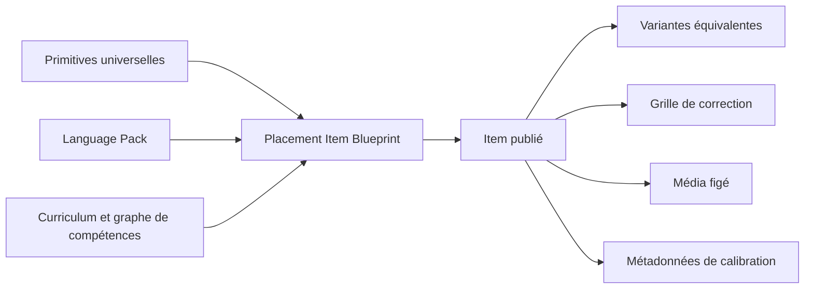
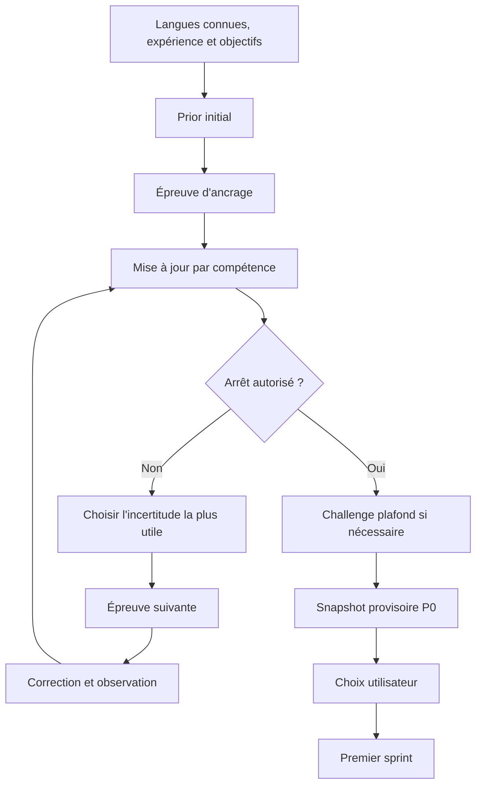
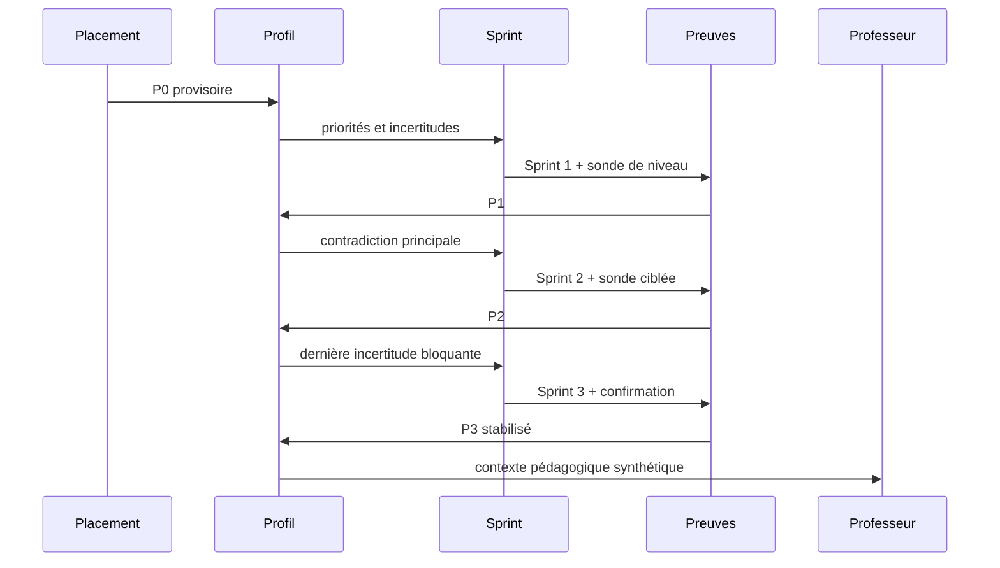

# Polyglot V2 - Placement linguistique adaptatif

## 1. Statut et portée

Ce document spécifie le remplacement du diagnostic fixe de Polyglot V2 par un
placement multilingue adaptatif. Il couvre le protocole initial, la banque
d'épreuves, la sélection, la correction, l'assistance LM Studio, la restitution
et la calibration pendant les trois premiers sprints.

Cette spécification remplace le manifeste fixe de six tâches. Elle ne modifie
pas les principes déjà verrouillés : PostgreSQL est la source de vérité, les
réponses et preuves sont immuables, l'utilisateur peut toujours s'entraîner et
un fournisseur indisponible ne déclenche aucun fallback silencieux.

L'expression orale automatique, le STT et la conversation vocale restent hors
de cette livraison. Une capacité non mesurable reste `not_observed` ou
`not_evaluable`.

## 2. Problème à résoudre

Le diagnostic actuel extrait six tâches des fondations de la langue, les
affiche simultanément et calcule un placement à partir d'une couverture trop
faible. Il ne peut pas :

- distinguer proprement débutant, faux débutant, intermédiaire, avancé et
  locuteur natif déclaré ;
- chercher le plafond réel d'un utilisateur ;
- séparer les compétences réceptives, productives et auxiliaires ;
- tester réellement l'écoute ;
- corriger une production ouverte avec une grille linguistique ;
- résoudre une contradiction entre déclaration, reconnaissance et production ;
- expliquer la confiance et les dimensions non observées ;
- alimenter précisément les sprints et le professeur.

Un formulaire seul ne constitue pas une mesure. Une conversation LLM seule ne
constitue pas davantage un protocole reproductible. Le système cible donc une
architecture hybride : moteur déterministe pour la sélection et la décision,
correcteurs spécialisés pour les réponses et LLM borné pour les productions
ouvertes.

## 3. Décisions verrouillées

1. Le placement dure normalement de 8 à 12 minutes.
2. Il peut s'étendre jusqu'à 20 minutes pour un profil avancé, contradictoire ou
   encore incertain.
3. Un débutant absolu peut sortir avant 8 minutes lorsque plusieurs preuves
   convergentes établissent que les fondations sont la prochaine activité utile.
4. Le résultat est un vecteur de compétences, jamais une moyenne unique.
5. Les déclarations initiales déterminent le premier item, sans créer de preuve.
6. Chaque item possède une compétence principale mesurée.
7. Une réussite ouverte doit être corroborée par une autre épreuve.
8. Le backend choisit les items, met à jour les estimations et arrête le test.
9. Le LLM évalue une production selon une grille ; il ne choisit ni le niveau ni
   la prochaine tâche.
10. Le professeur conversationnel n'est jamais l'évaluateur du placement.
11. Le placement initial produit un snapshot provisoire `P0`.
12. Les trois premiers sprints produisent `P1`, `P2`, puis `P3` stabilisé.
13. Une baisse ou une hausse importante est expliquée, jamais silencieuse.
14. La politique initiale utilise des bornes conservatrices. Un modèle IRT ou
    MIRT ne sera introduit qu'après calibration empirique suffisante.

## 4. Objectifs produit

- Lancer un utilisateur au bon endroit sans lui imposer un long examen inutile.
- Identifier les asymétries : lire sans comprendre à l'oral, reconnaître sans
  produire, connaître une langue proche sans contrôler la langue cible.
- Adapter dès le premier sprint la difficulté, le vocabulaire, les fonctions
  grammaticales, les fondations et les explications.
- Rester honnête lorsqu'une modalité n'a pas pu être observée.
- Permettre à l'utilisateur d'accepter le placement, de commencer plus
  facilement, de demander un défi ou de commencer immédiatement.
- Réutiliser la même architecture pour l'italien, le japonais et les futurs
  packs, y compris les écritures non latines et le RTL.

## 5. Non-objectifs

- Délivrer une certification officielle ou un niveau CECR/ACTFL.
- Déclarer automatiquement qu'une personne est native.
- Déduire la maîtrise de toutes les compétences inférieures.
- Utiliser une moyenne pour compenser une faiblesse bloquante.
- Calibrer psychométriquement des items avec des paramètres inventés.
- Noter automatiquement la prononciation sans signal oral exploitable.
- Laisser le LLM publier du contenu, attribuer une maîtrise ou modifier une
  réponse historique.

## 6. Modèle de compétences

Le placement maintient au minimum les dimensions suivantes :

| Dimension | Rôle | Exemples de facettes |
|---|---|---|
| `script` | Accès au système d'écriture | décodage, translittération, segmentation |
| `reading` | Compréhension écrite | littéral, inférence, cohésion, registre |
| `listening` | Compréhension orale | mots, énoncés, interaction, implicite |
| `writing` | Expression écrite | fonction, précision, cohésion, autonomie |
| `speaking` | Expression orale | reste non observée sans voie qualifiée |
| `vocabulary` | Disponibilité lexicale | reconnaissance, rappel, emploi autonome |
| `grammar_functions` | Fonctions et moules | choix, flexion, transformation, production |
| `interaction_repair` | Maintien de l'échange | demander, clarifier, reformuler |
| `pragmatics_register` | Adéquation sociale | politesse, registre, implicite, destinataire |

Les dimensions sont universelles. Le Language Pack définit leurs facettes et
réalisations propres à la langue.

### 6.1 Échelle interne

Polyglot utilise neuf paliers internes non certifiants :

| Palier | Description opérationnelle |
|---|---|
| 0 | Aucun accès confirmé à l'écriture ou aux sons |
| 1 | Reconnaissance élémentaire |
| 2 | Formules mémorisées et associations fréquentes |
| 3 | Phrases simples et besoins immédiats |
| 4 | Échanges fonctionnels prévisibles |
| 5 | Narration et explication courtes |
| 6 | Autonomie dans des contextes variés |
| 7 | Argumentation, implicite et adaptation du registre |
| 8 | Contrôle très avancé, reformulation fine et nuance |

Le palier est une coordonnée de sélection. L'interface emploie des descriptions
humaines comme `à construire`, `fragile`, `fonctionnel`, `solide` ou `avancé`.

### 6.2 Estimation d'une compétence

Chaque dimension ou facette possède un état versionné :

```text
PlacementSkillEstimate
- skill_ref
- lower_bound
- probable_level
- upper_bound
- confidence
- independent_evidence_count
- confirmed_success_level
- confirmed_failure_level
- unresolved_contradiction_ids
- observation_status
- updated_from_item_instance_id
```

`observation_status` vaut `not_observed`, `observed`, `not_evaluable` ou
`temporarily_unavailable`. Une dimension sans preuve ne reçoit aucun palier par
héritage de la moyenne globale.

## 7. Banque d'épreuves

### 7.1 Séparation des responsabilités



Les primitives universelles couvrent notamment QCM, association, classement,
texte à trous, dictée, conjugaison, flexion, transformation, traduction,
compréhension, production guidée, production libre, correction d'erreur et tour
de dialogue.

### 7.2 Contrat d'un blueprint

```text
PlacementItemBlueprintRevision
- blueprint_revision_id
- language_pack_revision_id
- primitive_revision_id
- primary_skill_ref
- secondary_skill_refs
- editorial_difficulty
- prerequisite_skill_refs
- script_requirements
- discourse_type
- register
- context_tags
- vocabulary_requirements
- grammar_function_refs
- expected_duration_seconds
- required_media_capabilities
- checker_kind
- rubric_revision_id
- accessibility_features
- variant_pool_id
- publication_status
- provenance_id
```

`editorial_difficulty` utilise l'échelle 0-8. Ce champ est une estimation
éditoriale versionnée, pas un paramètre psychométrique observé.

### 7.3 Variantes

Une `PlacementVariantRevision` épingle le stimulus, les choix, la réponse de
référence, les médias, les éléments interdits et le contexte. Les variantes d'un
même pool partagent compétence principale, difficulté et grille.

Le moteur évite de répéter un stimulus ou une réponse attendue. Une
corroboration utilise une autre variante et, si possible, une autre primitive.

### 7.4 Couverture minimale d'un Language Pack

Un pack de placement publiable fournit :

- au moins trois niveaux de difficulté autour de chaque point d'entrée déclaré ;
- au moins deux primitives par dimension principale mesurable ;
- au moins trois variantes par cellule critique ;
- des items sans écriture pour vérifier l'accès aux scripts nouveaux ;
- des médias d'écoute figés ou un état explicite d'indisponibilité ;
- des tâches de plafond pour les paliers 7 et 8 ;
- une grille et un correcteur certifiés pour chaque item.

L'italien est le premier pack complet. Le japonais doit au minimum démontrer la
branche d'écriture, l'accès sans kanji et la séparation oral/écrit.

## 8. Parcours utilisateur



### 8.1 Pré-positionnement

Le formulaire enregistre :

- langues natives, parlées, étudiées et seulement lues ;
- relation avec la langue d'appui ;
- durée et fréquence d'exposition à la langue cible ;
- usages réels : famille, voyage, école, médias, travail ;
- capacité autoévaluée par modalité ;
- système d'écriture connu ;
- objectifs, centres d'intérêt et contraintes d'accessibilité.

Ces données construisent le prior et le premier item. Elles restent des
déclarations distinctes des observations.

### 8.2 Ancrage et recherche verticale

- `complete_beginner` commence au palier 1.
- `already_started` commence au palier 3 ou 4 selon les déclarations.
- `advanced` commence au palier 6.
- une langue connue proche peut augmenter le point d'ancrage réceptif, jamais
  celui de production sans preuve.

Après une réussite nette, le moteur monte. Après un échec net, il descend. Après
une réponse partielle ou ambiguë, il change de primitive à difficulté proche.

### 8.3 Recherche horizontale

Le moteur ne conclut pas à partir d'une seule modalité. Il couvre lecture,
écoute, écriture, vocabulaire et fonctions grammaticales. Il vérifie script,
réparation et pragmatique lorsque la langue ou le niveau les rendent utiles.

### 8.4 Contradictions

Une contradiction est une entité explicite, par exemple :

- reconnaissance élevée et production faible ;
- lecture élevée et écoute faible ;
- succès à un niveau supérieur après échec inférieur ;
- réponse ouverte élevée contredite par deux tâches déterministes ;
- compétence déclarée sans preuve concordante ;
- interférence probable d'une langue connue.

Le moteur sélectionne une épreuve de résolution. Si le temps expire, la
contradiction reste ouverte et réduit la confiance.

### 8.5 Challenge plafond

Un profil dont la borne supérieure reste ouverte reçoit une tâche plus difficile
avant la conclusion. Les paliers élevés mesurent fonction, discours, implicite,
registre, argumentation et reformulation, pas uniquement la grammaire isolée.

Une personne peut déclarer une langue native. Polyglot conserve cette donnée de
biographie, mais le placement indique seulement les capacités observées et si
le plafond du test a été atteint.

## 9. Politique de sélection adaptative

### 9.1 Filtrage

Le moteur construit les candidats en excluant :

- items déjà vus ou variantes trop proches ;
- prérequis inaccessibles ;
- écritures non encore accessibles sans adaptation ;
- médias indisponibles ;
- correcteurs indisponibles sans voie alternative déclarée ;
- contenus incompatibles avec l'accessibilité ou les thèmes exclus ;
- items ne tenant pas dans le temps restant.

### 9.2 Priorité

Chaque candidat reçoit une priorité déterministe :

```text
priority = information_gain
         + required_coverage
         + contradiction_resolution
         + ceiling_value
         + modality_balance
         - time_cost
         - exposure_risk
```

Les coefficients appartiennent à `PlacementPolicyRevision`. La raison de
sélection est persistée sous forme de codes et de données, pas de texte libre.

### 9.3 Mise à jour initiale

La première version emploie des règles de bornes :

- réussite forte : relève la borne basse ;
- échec fort : abaisse la borne haute ;
- réponse partielle : rapproche le niveau probable sans fermer les bornes ;
- faible confiance du correcteur : réduit le poids ;
- aide, révélation ou répétition supplémentaire : change la facette de preuve ;
- réussite ouverte isolée : ne ferme jamais une borne à elle seule.

Une future politique IRT/MIRT sera une nouvelle révision. Elle exigera un volume
minimal par item, une analyse de discrimination, des contrôles différentiels
entre groupes et une validation hors échantillon.

## 10. Règles d'arrêt

Le moteur peut conclure lorsque :

1. la durée minimale applicable est atteinte ;
2. chaque dimension indispensable possède deux opportunités indépendantes ou un
   état non mesurable explicite ;
3. les bornes sont assez étroites pour choisir les prochains contenus ;
4. aucune contradiction bloquante n'est ouverte ;
5. les prérequis du parcours recommandé sont testés ;
6. le challenge plafond a été présenté lorsqu'il pouvait modifier la décision.

Il conclut également à 20 minutes. Dans ce cas, les incertitudes restantes sont
conservées et deviennent des cibles de calibration.

L'arrêt rapide débutant exige des échecs convergents sur au moins deux primitives
et une tentative de production ou de reconnaissance fonctionnelle. Un simple
échec d'écriture ne suffit pas.

## 11. Correction et observations

### 11.1 Correcteurs

| Correcteur | Usage |
|---|---|
| `deterministic` | QCM, association, ordre, choix morphologique |
| `structured` | variantes, flexion, segmentation, réponses multiples |
| `llm_rubric` | production, reformulation, dialogue, réponse ouverte |
| `not_evaluable` | capacité sans voie qualifiée disponible |

Une correction produit une interprétation puis des observations candidates. Le
validateur de preuve décide lesquelles sont admissibles.

### 11.2 Grille de production

La grille sépare au minimum :

- accomplissement de la tâche ;
- intelligibilité ;
- précision grammaticale ;
- étendue et adéquation lexicale ;
- cohésion ;
- registre et pragmatique ;
- autonomie ;
- erreurs fatales pour la fonction demandée.

Le score agrégé n'est pas stocké comme unique vérité. Les critères restent
consultables séparément.

## 12. Contrat LM Studio

### 12.1 Transport

```text
POST http://localhost:1234/api/v1/chat
model = qwen/qwen3.6-35b-a3b
store = false
retry = 0
fallback = none
```

Le backend extrait uniquement les blocs `output[type="message"]`. Il ignore le
raisonnement et valide le contenu du message contre un schéma fermé.

### 12.2 Séparation des rôles

- `PlacementEvaluator` évalue une réponse isolée.
- `Teacher` explique et converse, sans produire d'observation officielle.
- `PlacementOrchestrator` sélectionne les items et décide du placement.

Le prompt de l'évaluateur ne reçoit ni niveau supposé ni résultat global, afin
de limiter l'ancrage. Il reçoit la tâche, la langue, la grille, les références
autorisées et la réponse.

### 12.3 Sortie structurée

```text
PlacementJudgementDraft
- status
- criterion_scores
- demonstrated_skill_refs
- error_observations
- fatal_error_codes
- confidence
- short_rationale
```

`status` vaut `evaluable`, `partially_evaluable`, `not_evaluable`, `off_topic`,
`provider_unavailable` ou `invalid_output`.

Le backend refuse :

- un critère absent ou inconnu ;
- un score hors échelle ;
- une compétence non référencée par l'item ;
- une sortie incohérente avec les erreurs déclarées ;
- une référence inventée ;
- un texte libre hors du schéma.

Une sortie refusée n'entraîne ni retry ni échec utilisateur. L'item devient non
évaluable et la politique cherche une autre observation si le temps le permet.

## 13. Écoute, TTS et expression orale

Une épreuve d'écoute épingle :

- texte source et langue ;
- moteur, voix et empreinte TTS ;
- débit ;
- nombre d'écoutes autorisées ;
- disponibilité de la transcription après réponse ;
- questions et grille.

Le nombre d'écoutes et les contrôles utilisés font partie de la preuve. Si le
TTS et tous les médias équivalents sont indisponibles, `listening` reste
`temporarily_unavailable`.

Le shadowing peut être proposé mais ne crée aucune preuve de prononciation sans
STT, modèle live ou revue humaine. `speaking` reste `not_observed`.

## 14. Snapshots P0 à P3



Chaque sprint réserve au maximum deux sondes. Elles utilisent le thème et le
vocabulaire de la séance pour rester cohérentes avec l'apprentissage.

- Sprint 1 confirme la difficulté générale ou une modalité sous-observée.
- Sprint 2 résout la contradiction la plus importante.
- Sprint 3 confirme le prérequis qui conditionne la suite du curriculum.

L'entraînement normal fournit également des observations, mais seules les
preuves satisfaisant indépendance, correction et contexte peuvent resserrer les
bornes.

Après P3, la calibration spéciale se termine. Le moteur de progression continue
à évoluer normalement à partir des preuves ultérieures.

## 15. Utilisation en aval

### 15.1 Sprint

- borne basse : autorisation d'un prérequis obligatoire ;
- niveau probable : difficulté principale ;
- borne haute : défi facultatif ;
- forte incertitude : sonde de calibration ;
- faiblesse confirmée : activité préparatoire ;
- dimension non observée : aucune supposition.

### 15.2 Curriculum

Le module recommandé doit être accessible selon ses prérequis. Une compétence
forte ne compense pas une faiblesse bloquante. Les fondations sont injectées par
facette, pas comme un parcours monolithique imposé à tous.

### 15.3 Professeur

Le professeur reçoit une synthèse minimale : estimations, confiance, erreurs
récurrentes, langues connues pertinentes, priorités et dimensions inconnues. Il
n'accède aux réponses brutes que si le produit et le consentement l'autorisent.

### 15.4 Entraînement libre et évaluations

Le placement préconfigure la difficulté suggérée sans bloquer les choix de
l'utilisateur. Une évaluation globale ultérieure reste distincte du placement
et produit ses propres preuves.

## 16. Choix utilisateur

Après P0, l'utilisateur peut :

- accepter le départ recommandé ;
- commencer un palier plus facilement ;
- demander un challenge ;
- commencer immédiatement malgré les incertitudes.

Ces choix modifient la sélection du contenu, jamais les preuves observées. Le
profil reste provisoire jusqu'à P3 ou jusqu'à l'expiration explicite de la
calibration.

## 17. API publique

Les ressources cibles sous `/api/v1` sont :

```text
GET  /language-packs/{pack_revision_id}/placement-policy
POST /language-profiles/{profile_id}/placement-runs
GET  /placement-runs/{run_id}
GET  /placement-runs/{run_id}/current-item
POST /placement-runs/{run_id}/responses
POST /placement-runs/{run_id}:complete
POST /placement-runs/{run_id}:interrupt
POST /placement-runs/{run_id}:resume
GET  /language-profiles/{profile_id}/placement-profile
GET  /language-profiles/{profile_id}/placement-history
POST /language-profiles/{profile_id}/placement:choose
```

Le démarrage sélectionne et fige le premier item. Chaque soumission enregistre
la réponse, met à jour les estimations et sélectionne atomiquement l'item
suivant lorsqu'une nouvelle observation est requise. `current-item` ne fait que
relire l'instance déjà figée. Une commande à effet exige `Idempotency-Key`,
version attendue et autorisation propriétaire.

Le manifeste fixe existant est retiré après bascule complète du frontend et des
tests. Il ne subsiste pas comme fallback.

## 18. Persistance et événements

### 18.1 Entités

```text
PlacementPolicyRevision
PlacementItemBlueprintRevision
PlacementVariantRevision
PlacementRubricRevision
PlacementRun
PlacementItemInstance
PlacementResponse
PlacementScoringInterpretation
PlacementObservation
PlacementSkillEstimateRevision
PlacementContradiction
PlacementDecision
PlacementCalibrationCycle
```

### 18.2 Immutabilité

- item, média et grille sont épinglés à l'instanciation ;
- réponse soumise non modifiable ;
- nouvelle correction ajoutée comme interprétation ;
- observation invalidée ou remplacée explicitement ;
- estimation ajoutée comme révision ;
- décision finale conserve toutes les versions sources.

### 18.3 Événements principaux

```text
placement_run_started
placement_item_selected
placement_response_recorded
placement_interpretation_added
placement_observation_added
placement_contradiction_opened
placement_contradiction_resolved
placement_estimate_revised
placement_run_interrupted
placement_run_resumed
placement_run_completed
placement_choice_recorded
placement_calibration_advanced
placement_calibration_completed
```

## 19. Interface utilisateur

Le diagnostic devient un lecteur séquentiel, une tâche par écran :

- temps estimé et progression qualitative, sans nombre fixe trompeur ;
- consigne courte ;
- lecteur spécialisé par primitive ;
- audio accessible sans transcription initiale ;
- sauvegarde automatique ;
- possibilité d'interrompre ;
- aucun corrigé pédagogique pendant le placement ;
- état visible en cas d'indisponibilité d'un service.

Le résultat présente des cartes par compétence, les preuves observées, la
confiance et les inconnues. Il n'affiche pas une note globale dominante.

## 20. Comportements de panne

| Incident | Comportement |
|---|---|
| LM Studio indisponible | réponse conservée, production non évaluable, autre item si utile |
| sortie LLM invalide | aucune preuve, incident visible, aucun retry |
| TTS indisponible | média équivalent publié ou écoute indisponible |
| interruption réseau | reprise au dernier item confirmé |
| fermeture navigateur | run récupérable pendant sa fenêtre |
| banque épuisée | conclusion partielle avec lacune explicite |
| limite de 20 minutes | conclusion avec incertitudes persistées |
| pack retiré pendant un run | versions épinglées utilisables jusqu'à terminaison |

Aucun incident fournisseur ne devient une mauvaise réponse utilisateur.

## 21. Confidentialité et sécurité

- réponses de placement privées par profil ;
- audio et productions considérés sensibles ;
- aucune réponse brute dans les logs ;
- prompts stockés par empreinte ou version, pas avec raisonnement privé ;
- `store=false` pour LM Studio ;
- accès professeur aux données minimisé ;
- export et suppression couvrent runs, réponses, interprétations et snapshots ;
- actions auteur sans accès aux réponses apprenant.

## 22. Publication éditoriale

Un pack de placement suit : brouillon, validation automatique, revue
linguistique, revue pédagogique, publication atomique. Les validateurs vérifient
schéma, couverture, solutions, distracteurs, difficulté, grille, média,
accessibilité et absence de fuite de réponse.

Le LLM peut proposer des variantes en brouillon. Il ne publie jamais et ne fixe
pas seul leur difficulté.

## 23. Validation

### 23.1 Tests de domaine

- débutant absolu arrêté tôt sans faux crédit ;
- faux débutant avec réception supérieure à la production ;
- avancé conduit au challenge plafond ;
- natif déclaré testé en haut sans certification automatique ;
- japonais oral déclaré mais écriture inconnue ;
- lecture forte et écoute faible conservées séparément ;
- réponse ouverte non corroborée ne ferme pas une borne ;
- contradiction résolue par une autre primitive ;
- vingt minutes produisent une conclusion partielle honnête ;
- même seed et mêmes réponses produisent la même sélection.

### 23.2 Tests de fournisseurs

- succès LM Studio avec le modèle exact ;
- raisonnement ignoré ;
- message absent ;
- JSON invalide ;
- compétence inventée ;
- timeout ;
- fournisseur indisponible ;
- aucun retry ni fallback ;
- TTS disponible et indisponible.

### 23.3 Tests PostgreSQL et contrats

- migrations aller-retour ;
- idempotence ;
- contrôle de version ;
- autorisation propriétaire ;
- immutabilité des réponses ;
- remplacement d'interprétation ;
- reconstruction des estimations ;
- retrait d'un pack avec run épinglé ;
- OpenAPI et client TypeScript synchronisés.

### 23.4 Parcours graphiques

1. Français et espagnol connus, italien déjà commencé, placement adaptatif,
   écoute TTS, production LLM, choix recommandé et P0.
2. Français vers japonais, écriture inconnue, activité sans script, fondations
   adaptées et premier sprint.
3. Profil avancé atteignant une tâche de plafond.
4. LM Studio indisponible sans pénalité.
5. Interruption, reprise et absence de double soumission.
6. P0, trois sprints, P3 et explication d'un ajustement.

Les parcours sont vérifiés à 320, 768 et 1440 px, au clavier, avec axe et au
zoom 200 %.

## 24. Critères d'acceptation

Le remplacement est accepté lorsque :

1. aucun écran ne présente les six questions fixes ;
2. chaque item est choisi après la réponse précédente ;
3. le moteur peut monter, descendre et changer de modalité ;
4. lecture, écoute, écriture, vocabulaire et fonctions grammaticales restent
   séparés ;
5. une dimension non testée reste non observée ;
6. l'écoute utilise un média réel et traçable ;
7. le LLM ne choisit ni l'item suivant ni le placement ;
8. l'indisponibilité du LLM ou du TTS n'abaisse pas le niveau ;
9. le résultat explique confiance, inconnues et recommandation ;
10. les sprints P1 à P3 peuvent réviser le snapshot de façon explicable ;
11. le professeur reçoit une synthèse sans pouvoir modifier les preuves ;
12. italien et japonais démontrent la neutralité de l'architecture ;
13. toutes les preuves de validation sont exécutées depuis une base vide.

## 25. Limite de livraison

Cette conception constitue un incrément cohérent : nouveau placement adaptatif,
restitution et calibration P0-P3. Le STT, l'évaluation automatique de la
prononciation, l'entretien vocal live et la calibration IRT/MIRT restent des
incréments ultérieurs explicitement séparés.
