# Polyglot - Système d'exploitation personnel d'une langue

Date : 13 août 2026

Statut : conception validée pour planification

Portée : architecture produit, backend, professeur et frontend ; aucun remplissage massif de contenu

## 1. Résumé exécutif

Polyglot ne doit plus seulement présenter des cours, des cartes et un niveau. Il doit
maintenir un modèle vivant, explicable et personnel de ce que l'apprenant connaît dans
chaque langue : ce qu'il a rencontré, compris, rappelé, produit, transféré et oublié.

Ce modèle devient le centre du produit. Les sprints, l'entraînement libre, le professeur,
les évaluations, la Word Bank et la boîte grammaticale lisent la même représentation et
l'enrichissent avec des preuves immuables.

La représentation interne est un graphe orienté dans PostgreSQL. Le frontend en projette
plusieurs arbres compréhensibles : cerveau global, vocabulaire, grammaire, sons, écriture,
compréhension, production et domaines de vie. Le graphe complet est visible dès le début ;
les zones non observées sont assombries et la frontière utile est mise en évidence.

Le professeur utilise une adaptation du harness Agent Alpha : catalogue compact de skills,
activation progressive, outils limités, recherche puis ouverture canonique, workspace
durable, résultats bruts conservés, receipts, permissions et réponse terminale garantie.
Le modèle choisit sa stratégie, mais il ne publie jamais un contenu, ne supprime jamais une
donnée irréversiblement et n'attribue jamais directement une maîtrise.

Au MVP, LM Studio n'est pas supposé fournir un tool calling natif fiable. Le modèle produit
une enveloppe d'action structurée dans un bloc `message`; le runtime valide cette enveloppe,
exécute lui-même l'outil autorisé, puis ouvre un nouveau pas du même tour. Les blocs de
raisonnement sont ignorés. Ce protocole pourra être remplacé derrière le même port si un
fournisseur local démontre plus tard un tool calling natif fiable.

## 2. Décisions verrouillées

1. La banque de diagnostic peut être large ; un onboarding ordinaire ne présente que 4 à
   12 épreuves après un entretien de 2 à 4 minutes.
2. L'onboarding produit des estimations provisoires. Les cinq premiers sprints continuent
   automatiquement la calibration.
3. Un niveau visible est une projection. Les preuves, la confiance, la fraîcheur, les
   modalités, l'aide et la diversité des contextes restent les données normatives.
4. Les déclarations sur les langues connues produisent des priors et des ponts contrastifs,
   jamais une maîtrise gratuite.
5. La structure interne est un graphe acyclique orienté lorsque les relations expriment des
   prérequis. Les arbres UI sont des vues de navigation, pas la source de vérité.
6. PostgreSQL reste l'unique source de vérité. Aucun moteur de graphe séparé n'est requis au
   MVP.
7. FSRS reste propriétaire de la planification des cartes. Le graphe décide quoi travailler ;
   FSRS décide quand rappeler une invite mémoire existante.
8. Les événements, réponses, observations et preuves restent immuables. Les projections sont
   reconstructibles.
9. L'italien reste le premier pack complet. Le japonais vérifie les écritures non latines ;
   le turc vérifie ensuite une morphologie agglutinante ; l'arabe validera le RTL plus tard.
10. Le contenu massif sera ajouté après le moteur. La première livraison utilise un petit
    corpus éditorial multisituation suffisant pour valider tous les contrats.
11. Les XP récompensent l'effort. Ils ne modifient jamais la maîtrise.
12. Les déblocages sont des recommandations de frontière. Seules des fondations réellement
    indispensables, comme le décodage d'une écriture, peuvent adapter temporairement le type
    d'exercice proposé ; l'utilisateur conserve toujours un accès à l'entraînement.
13. Le professeur textuel fait partie du produit. Le mode vocal live réutilisera plus tard les
    mêmes conversations, skills, outils et permissions.

## 3. Ce qui existe et ce qui change

| Brique V2 | Décision | Évolution |
|---|---|---|
| Profils multilingues | Conserver | Ajouter entretien, relations linguistiques et priors explicables |
| Placement adaptatif | Reprendre | Remplacer les faux niveaux par des items multidimensionnels et un arrêt par gain d'information |
| Word Bank par sens | Conserver | Ajouter taxonomie de domaines, métadonnées riches et capture universelle |
| Listes et snapshots | Conserver | Devenir des vues du graphe lexical et des sources de sprint |
| Cartes FSRS | Conserver | Lier chaque invite aux nœuds et facettes réellement exercés |
| Primitives d'exercices | Conserver | Ajouter une Q-matrix versionnée et des lecteurs spécialisés manquants |
| Boîte grammaticale | Généraliser | Devenir un graphe fonction universelle -> réalisation linguistique -> transformation |
| Gym | Conserver | Agir comme moteur de transformation et de transfert d'une structure |
| Preuves et projections | Conserver | Les étendre à tous les types de nœuds et aux niveaux 0-8 |
| Sprint | Conserver | Le composer depuis la frontière, les dettes, le thème et les rappels |
| Entraînement libre | Conserver | Ajouter consolidations générées depuis une faiblesse ou une branche |
| Progression | Refaire l'UX | Remplacer la vue plate par le cerveau et ses projections |
| Professeur local | Reprendre | Introduire le harness progressif, workspace, gateway et receipts |
| Atelier auteur | Conserver | Ajouter édition du graphe, taxonomies, annotations et Q-matrices |
| PostgreSQL / OpenAPI / React | Conserver | Ajouter migrations et routes sans créer une seconde plateforme |

## 4. Architecture générale

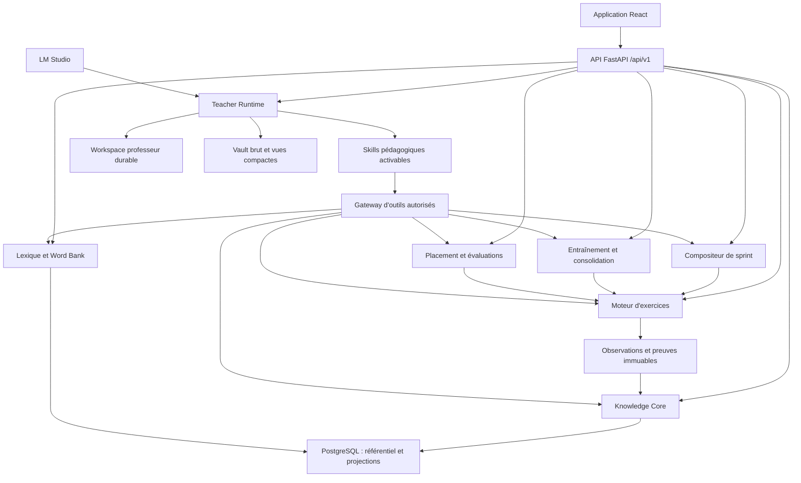

## 5. Le modèle universel de connaissances

### 5.1 Familles de nœuds

Le référentiel partagé utilise les familles suivantes :

| Famille | Exemples |
|---|---|
| `script` | hiragana, valeur de `gli`, liaison graphème-son |
| `orthography` | doubles consonnes, accents, apostrophes, ponctuation |
| `phonology` | contraste de sons, accent tonique, rythme, intonation |
| `morphology` | genre, nombre, personne, cas, flexion, dérivation |
| `conjugation` | présent de `essere`, conditionnel de politesse, paradigme |
| `syntax` | ordre des mots, accord, subordination, clitiques |
| `grammar_function` | demander, nier, comparer, exprimer une condition |
| `grammar_realization` | `vorrei + nom`, `se + imparfait... conditionnel` |
| `lexical_sense` | un sens précis de `partire` |
| `multiword_expression` | `avere bisogno di`, collocation ou locution |
| `semantics` | polysémie, relations, ambiguïté, portée |
| `pragmatics` | politesse, implicite, ironie, distance sociale |
| `discourse` | cohésion, narration, argumentation, synthèse |
| `strategy` | demander de répéter, périphraser, inférer en contexte |
| `domain` | maison, santé, travail, plage, sciences, administration |
| `modality` | lecture, écoute, écriture, parole, interaction |
| `operation` | rencontrer, reconnaître, rappeler, transformer, produire |

### 5.2 Relations

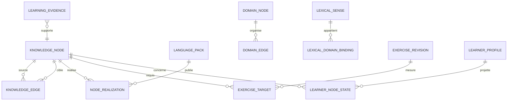

Les types d'arêtes fermés sont :

- `prerequisite_of` : prérequis fort ;
- `supports` : contribue sans être obligatoire ;
- `realizes` : réalisation linguistique d'une fonction ;
- `composed_of` : structure composée ;
- `transforms_into` : transformation Gym ;
- `contrasts_with` : contraste utile ;
- `confusable_with` : confusion fréquente ;
- `broader_than` et `narrower_than` : taxonomie ;
- `used_in_domain` : association thématique ;
- `expresses_sense` : forme ou expression vers sens ;
- `transfers_from` : pont entre langues connues et cible ;
- `evidence_for` : rattachement éditorial d'une activité ;
- `often_cooccurs_with` : collocation ou voisinage ;
- `remediates` : activité ou stratégie qui traite une difficulté.

Les cycles sont interdits pour `prerequisite_of`, autorisés pour les relations
sémantiques symétriques.

### 5.3 Arbre visible et graphe réel

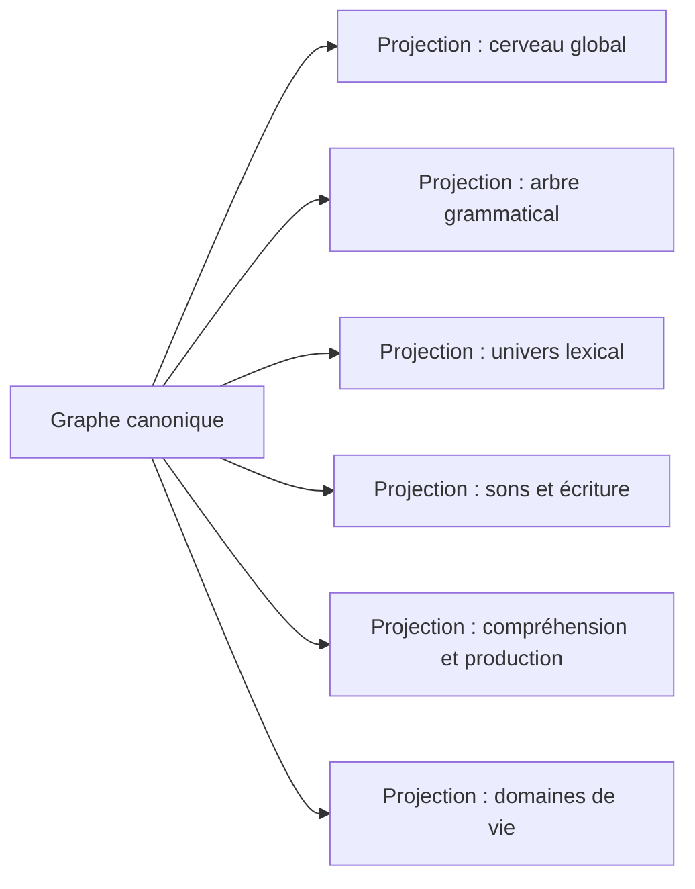

Un nœud peut donc apparaître dans plusieurs vues sans dupliquer son état.

## 6. Échelle de progression 0-8

L'échelle commune rend les vues comparables sans prétendre que toutes les compétences
s'acquièrent de façon identique.

| Niveau | Sens UI | Conditions minimales |
|---:|---|---|
| 0 | Non rencontré | aucune rencontre autorisée |
| 1 | Rencontré | exposition enregistrée avec contexte |
| 2 | Reconnu avec aide | réussite réceptive aidée ou choix discriminant |
| 3 | Reconnu/rappelé seul | réussite directe dans un contexte familier |
| 4 | Utilisé sous contrôle | production guidée correcte |
| 5 | Utilisé indépendamment | production sans aide dans un contexte familier |
| 6 | Transféré | réussite dans plusieurs contextes ou modalités |
| 7 | Flexible et nuancé | transformation, registre ou combinaison maîtrisée |
| 8 | Robuste et disponible | transfert varié, contrôles différés et fraîcheur suffisante |

Chaque état conserve en plus :

- `mastery_base` et `mastery_current` ;
- `confidence` ;
- `freshness` ;
- `receptive_level` et `productive_level` ;
- modalités observées ;
- opérations observées ;
- nombre de sessions, contextes et contrôles différés ;
- aides utilisées ;
- dernière preuve positive et négative ;
- prochaine vérification ;
- statut `non_observed`, `in_progress`, `reliable`, `mastered`, `review_due` ou
  `not_evaluable`.

Le niveau 8 n'est jamais accordé par un LLM ni par une réussite isolée.

## 7. Taxonomie des compétences

### 7.1 Branches universelles

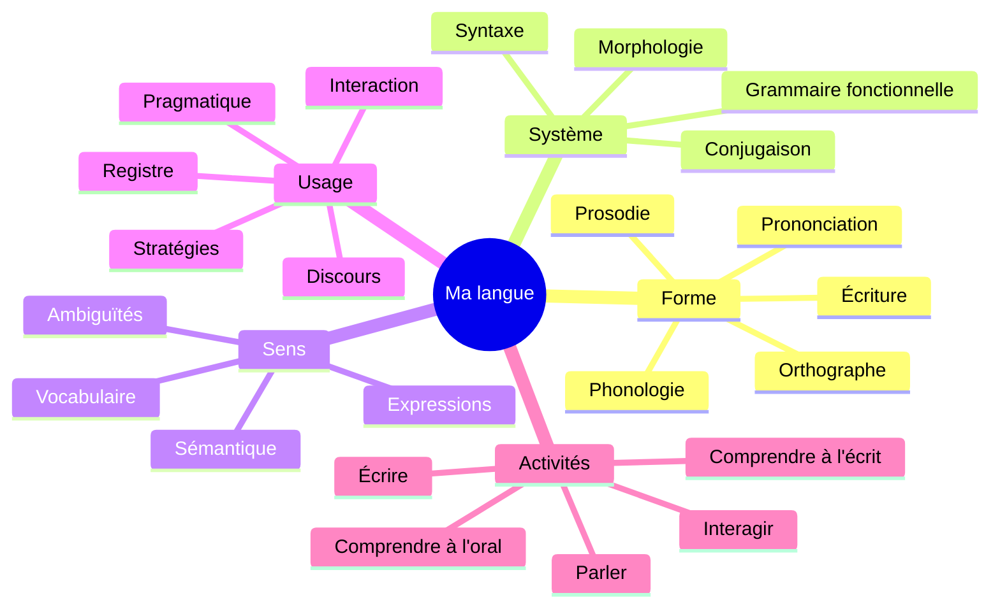

Les activités ne sont pas calculées par une addition naïve. Elles agrègent les preuves
des nœuds requis par leur référentiel, avec couverture, confiance et goulots bloquants.

### 7.2 Profil du linguiste

Le profil visible présente :

- forces stables ;
- compétences émergentes ;
- compétences à revoir ;
- angles morts non observés ;
- erreurs récurrentes ;
- domaines lexicaux couverts ;
- modalités fortes et faibles ;
- équilibre précision, fluidité, complexité et adéquation ;
- frontière recommandée ;
- historique des changements et preuves explicatives.

## 8. Arbre grammatical universel

### 8.1 Fonctions principales

Le graphe initial doit couvrir au minimum :

1. exister, identifier et définir ;
2. posséder, appartenir et manquer ;
3. localiser, se déplacer et orienter ;
4. quantifier, compter et approximer ;
5. décrire personnes, objets et états ;
6. situer dans le temps et exprimer l'aspect ;
7. exprimer fréquence, durée et répétition ;
8. vouloir, préférer, projeter et tenter ;
9. pouvoir, savoir faire et être autorisé ;
10. devoir, falloir, conseiller et interdire ;
11. demander, ordonner, inviter et proposer ;
12. affirmer, nier et interroger ;
13. expliquer cause, conséquence et but ;
14. exprimer condition, hypothèse et irréel ;
15. comparer, graduer et superlativiser ;
16. concéder, opposer et nuancer ;
17. exprimer opinion, émotion, certitude et doute ;
18. rapporter des paroles et attribuer une source ;
19. référer avec pronoms, déterminants et reprises ;
20. organiser l'information et assurer la cohésion ;
21. adapter politesse, distance et registre ;
22. argumenter, illustrer, synthétiser et conclure ;
23. gérer l'implicite, l'ironie et les sous-entendus ;
24. réparer l'interaction et périphraser.

### 8.2 Fonction, moule, transformation et émergence

```mermaid
flowchart LR
    F["Fonction : demander poliment"] --> R["Réalisation italienne : vorrei + nom/infinitif"]
    R --> L["Leçon courte et contraste"]
    L --> C["Reconnaissance"]
    C --> P["Production guidée"]
    P --> G["Gym : personne, temps, négation, registre"]
    G --> T["Transfert dans un nouveau contexte"]
    T --> E["Émergence spontanée"]
    E --> D["Contrôle différé"]
```

Chaque nœud grammatical possède ses primitives compatibles, transformations, pièges
contrastifs, exemples, contre-exemples, prérequis et réalisations par pack de langue.

## 9. Univers lexical et domaines

### 9.1 Unité canonique

La connaissance porte sur un sens lexical ou une expression, jamais uniquement sur la
chaîne affichée. Les métadonnées partagées comprennent :

- lemme, formes et analyses morphologiques ;
- prononciations et écritures ;
- définition et équivalents qualifiés ;
- partie du discours, valence et constructions ;
- collocations et expressions ;
- registre, connotation et contraintes d'usage ;
- fréquence globale, orale, écrite et par domaine ;
- niveau de concrétude et spécialisation ;
- synonymes, antonymes, hyperonymes et confusions ;
- cognats, faux amis et ponts contrastifs ;
- provenance, licence et version.

### 9.2 Taxonomie thématique initiale

Le moteur définit d'abord les branches, pas les dizaines de milliers de mots :

- identité, famille et relations ;
- corps, santé, émotions et besoins ;
- maison, pièces, objets et entretien ;
- alimentation, cuisine, restauration et courses ;
- vêtements, apparence et soins ;
- temps, météo, calendrier et rythmes ;
- ville, services, lieux et orientation ;
- mobilité, route, transports et incidents ;
- vacances, hébergement, plage, montagne, randonnée, camping et visite urbaine ;
- éducation, apprentissage et recherche ;
- travail, métiers, organisation et négociation ;
- argent, commerce, banque et consommation ;
- administration, droit, sécurité et citoyenneté ;
- numérique, médias, communication et réseaux ;
- culture, arts, littérature, musique et cinéma ;
- loisirs, sport, jeux et sociabilité ;
- nature, animaux, environnement et agriculture ;
- sciences, mathématiques, médecine et technologie ;
- société, économie, politique et histoire ;
- raisonnement abstrait, argumentation, valeurs et philosophie.

Une unité peut appartenir à plusieurs domaines avec un poids et un rôle : `core`,
`typical`, `specialized`, `support` ou `distractor`.

### 9.3 État lexical personnel

Pour chaque sens : rencontre, reconnaissance, rappel, utilisation guidée, utilisation
autonome, diversité contextuelle, fraîcheur, fréquence d'erreur, dette, priorité manuelle,
cartes associées et historique des contextes.

### 9.4 Capture universelle

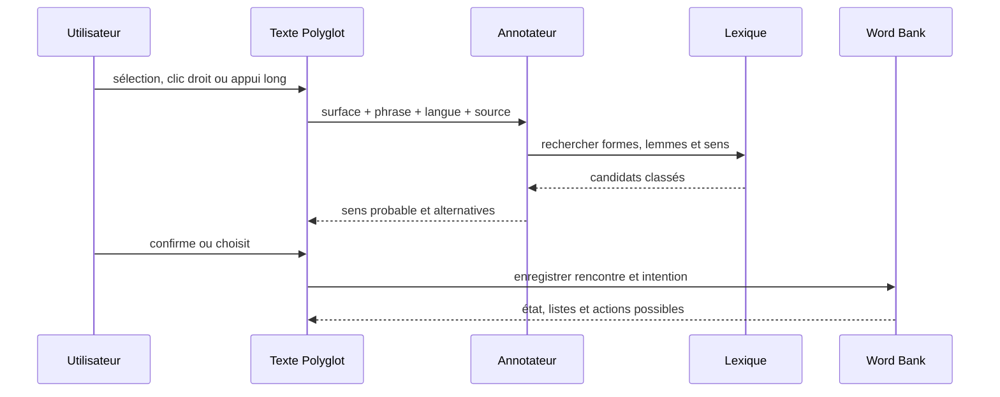

Une chaîne ambiguë ne crée jamais automatiquement une carte. Le contexte exact est
conservé, sous réserve des règles de confidentialité.

## 10. Annotation de tout contenu pédagogique

Chaque texte, audio transcrit, exercice, correction et production possède un snapshot
annoté :

- tokens et plages de caractères ;
- formes, lemmes, sens candidats et expressions multi-mots ;
- structures grammaticales présentes et structures intentionnellement ciblées ;
- domaines, registre et situation ;
- difficulté lexicale, grammaticale, discursive et inférentielle ;
- prérequis ;
- modalités et opérations ;
- éléments nouveaux, autorisés, imposés et distracteurs.

L'annotation déterministe du pack est prioritaire. Un LLM peut proposer des annotations
manquantes sous forme de brouillon ; elles doivent être validées avant publication.

## 11. Preuves et modèle personnel

### 11.1 Chaîne normative

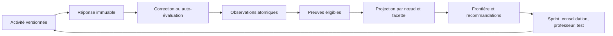

Une réponse peut produire plusieurs observations si l'activité déclare explicitement
sa Q-matrix. Une réussite globale ne donne pas automatiquement du crédit à tous les
nœuds requis. Les nœuds incidents ou simplement exposés reçoivent une rencontre, pas une
preuve de production.

### 11.2 Q-matrix d'un exercice

Chaque cible indique :

- nœud et révision ;
- rôle `primary`, `required`, `support`, `incidental` ou `distractor` ;
- modalité et opération ;
- difficulté locale ;
- type de preuve possible ;
- règle d'attribution partielle ;
- effet de l'aide ;
- correcteur responsable ;
- critères d'indépendance et de transfert.

### 11.3 Frontière d'apprentissage

La frontière contient les nœuds dont les prérequis sont disponibles et dont le travail
offre le meilleur levier. Son score initial est :

```text
frontier_priority = 0.24 due_or_freshness
                  + 0.20 weakness
                  + 0.16 prerequisite_leverage
                  + 0.14 curriculum_relevance
                  + 0.10 personal_goal_relevance
                  + 0.08 domain_interest
                  + 0.08 information_gain
                  - overload_penalty
                  - recent_redundancy_penalty
```

Les coefficients sont versionnés et recalibrables. Ils ne sont pas présentés comme des
constantes scientifiques.

## 12. Onboarding et placement continu

### 12.1 Entretien initial

Le professeur mène un entretien structuré et court :

- langues natives, parlées, lues et étudiées ;
- niveau déclaré et contextes réels d'utilisation ;
- histoire d'apprentissage ;
- objectifs, échéances et situations souhaitées ;
- intérêts et domaines professionnels ;
- temps disponible et rythme ;
- préférences d'explication, correction et audio ;
- difficultés ressenties ;
- accessibilité et consentements.

Le LLM converse naturellement mais remplit un contrat structuré. L'utilisateur relit et
valide le résumé avant les épreuves.

### 12.2 Priors contrastifs

Un pont `français -> italien` ou `espagnol -> italien` propose des hypothèses sur cognats,
structures proches, faux amis et transferts possibles. Il augmente ou diminue la priorité
d'une vérification ; il ne produit aucune preuve.

### 12.3 Épreuves adaptatives

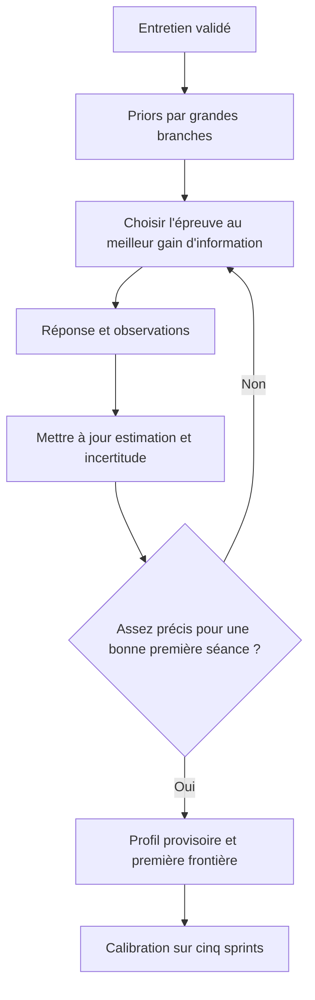

Règles :

- 4 épreuves minimum, 12 par défaut maximum ;
- 15 minutes maximum hors choix volontaire de défi ;
- diversité obligatoire des domaines, opérations et modalités accessibles ;
- arrêt anticipé si l'incertitude restante ne changerait pas la première séance ;
- une dimension non testée reste `non_observed` ;
- deux indisponibilités fournisseur donnent un résultat partiel sans pénalité ;
- l'utilisateur peut accepter, simplifier, demander un défi ou commencer immédiatement.

### 12.4 Banque et diversité

La première release ne nécessite pas 300 questions écrites à la main. Elle publie :

- 24 blueprints italiens multisituations couvrant les contrats ;
- plusieurs variantes contrôlées par blueprint ;
- une matrice domaine × compétence × difficulté × primitive ;
- un validateur refusant répétitions, faux niveaux et surreprésentation thématique ;
- une extension éditoriale progressive après collecte de données anonymisées autorisées.

## 13. Sprints personnalisés

### 13.1 Entrées

Le compositeur ajoute aux entrées V2 existantes :

- frontière active ;
- goulots de prérequis ;
- couverture des domaines ;
- annotations lexicales et grammaticales du contenu ;
- objectifs personnels ;
- historique récent de contextes et primitives ;
- niveaux 0-8 et incertitudes ;
- demandes manuelles de priorité ;
- recommandations acceptées ou refusées.

### 13.2 Composition

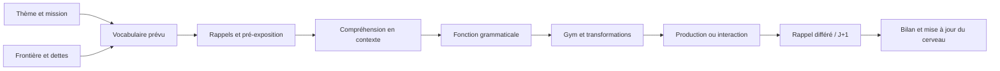

Un module thématique peut exposer 50 à 200 sens sur plusieurs jours. La nouveauté active
quotidienne reste limitée par budget et profil. Tous les autres sens affichés sont
enregistrés comme rencontres, sans devenir automatiquement des cartes.

### 13.3 Bilan

Le bilan montre : nouveaux sens rencontrés, sens ciblés, rappels consolidés, structures
utilisées, preuves produites, dettes ouvertes, changements de niveau justifiés et prochaine
frontière. L'utilisateur peut prioriser, ignorer ou créer une liste depuis chaque groupe.

### 13.4 Divulgation lexicale progressive

Le planificateur distingue quatre ensembles dans un module :

- `anchor` : mots fréquents déjà disponibles qui rendent le contexte compréhensible ;
- `active_target` : petit ensemble à apprendre et produire pendant la journée ;
- `receptive_exposure` : mots rencontrés et expliquables, sans obligation de rappel ;
- `extension` : vocabulaire spécialisé servi seulement si le profil, le temps et l'intérêt
  le justifient.

La sélection initiale suit :

```text
lexical_priority = 0.24 theme_centrality
                 + 0.20 frequency_utility
                 + 0.18 personal_goal_relevance
                 + 0.14 prerequisite_support
                 + 0.12 weak_or_due
                 + 0.07 productive_reuse_opportunity
                 + 0.05 learner_priority
                 - novelty_overload
                 - recent_redundancy
```

Un sens passe de `receptive_exposure` à `active_target` lorsqu'il est central au thème,
fréquent, demandé par l'utilisateur, devenu une dette ou nécessaire à une production. Une
rencontre répétée ne suffit jamais à le déclarer produit. Les cartes FSRS sont créées par
intention explicite ou politique de module publiée, pas pour tous les mots affichés.

## 14. Entraînement et consolidation

Les entrées possibles sont :

- un nœud du cerveau ;
- une branche ;
- une faiblesse détectée ;
- une structure grammaticale ;
- un domaine lexical ;
- une pile ou une liste ;
- une modalité ;
- une erreur récurrente ;
- une mission libre décrite au professeur.

Le moteur produit une `ConsolidationPrescription` déterministe contenant objectifs,
prérequis, primitives admissibles, volume, nouveauté autorisée, preuves attendues et règle
d'arrêt. Le LLM peut rédiger des variantes respectant cette prescription mais ne peut pas
modifier les critères de crédit.

## 15. Professeur permanent et harness

### 15.1 Principe

Le professeur est libre de choisir une méthode, une explication, un exemple ou une suite
d'outils. Sa liberté s'arrête aux frontières déterministes : accès propriétaire, contrats,
contenus publiés, preuves, maîtrise, effets irréversibles et permissions.

### 15.2 Divulgation progressive

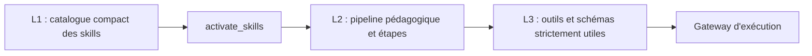

Skills initiaux :

| Skill | Finalité |
|---|---|
| `learner-intake` | entretien, résumé et objectifs |
| `learner-model` | lire forces, faiblesses, preuves et incertitudes |
| `knowledge-navigation` | rechercher et ouvrir nœuds, branches et relations |
| `lexical-coach` | Word Bank, sens, listes, cartes et domaines |
| `grammar-coach` | fonctions, réalisations, transformations et erreurs |
| `pronunciation-coach` | sons, prosodie, TTS et exercices disponibles |
| `exercise-coach` | préparer un exercice conforme à une prescription |
| `sprint-coach` | expliquer, préparer ou ajuster une séance non démarrée |
| `consolidation-coach` | traiter une faiblesse ou une dette |
| `assessment-coach` | préparer un test sans révéler ni noter librement |
| `reflection-coach` | bilan, métacognition et objectifs |
| `content-feedback` | signaler ambiguïté ou contenu défectueux |

L'activation et les appels passent par des messages structurés fermés : `activate`,
`invoke`, `checkpoint` ou `finish`. Le backend reste l'orchestrateur effectif et rejette
toute action hors skill, étape, scope ou budget. Aucun appel contenu uniquement dans le
raisonnement du modèle n'est exécuté.

### 15.3 Outils recherche puis ouverture

Une recherche retourne des candidats légers. Seule l'ouverture d'un objet canonique permet
de l'utiliser comme preuve ou cible d'une action.

```text
search_knowledge_nodes(query, filters) -> candidats
open_knowledge_node(node_revision_id) -> nœud canonique et état personnel

search_lexical_senses(surface, context) -> sens candidats
open_lexical_sense(sense_revision_id) -> sens canonique

search_learning_evidence(target_id) -> index
open_learning_evidence(evidence_id) -> preuve canonique
```

### 15.4 Workspace structuré

Contrairement à Alpha, PostgreSQL reste la source de vérité. Le workspace logique est
stocké sous forme structurée et projetable :

- objectif courant ;
- conversation visible ;
- profil et langue actifs ;
- faits pédagogiques retenus avec IDs de preuve ;
- nœuds ouverts ;
- décisions et préférences confirmées ;
- prescriptions et brouillons ;
- actions et receipts ;
- checklist du tour ;
- état terminal.

Les anciens appels techniques ne sont pas rejoués. Les résultats bruts sont conservés dans
le vault privé avec checksum ; le modèle reçoit une vue compacte et un locator.

### 15.5 Permissions

Actions automatiques réversibles :

- enregistrer une rencontre ;
- ajouter à une liste existante ;
- créer une liste personnelle ;
- marquer une priorité ;
- créer une dette ;
- préparer un preset ou une prescription ;
- produire un brouillon d'exercice ;
- enregistrer un objectif ou une préférence ;
- signaler un contenu.

Actions avec confirmation :

- modifier une séance déjà composée ;
- archiver ou fusionner une liste ;
- réinitialiser une carte ;
- accepter un changement important de parcours ;
- exporter ou supprimer des données.

Actions interdites au modèle :

- attribuer ou retirer directement une maîtrise ;
- modifier une preuve ;
- publier un contenu ou un pack ;
- noter seul une évaluation officielle ;
- supprimer définitivement ;
- changer silencieusement de modèle ou de fournisseur ;
- effectuer un retry automatique.

### 15.6 Tour robuste

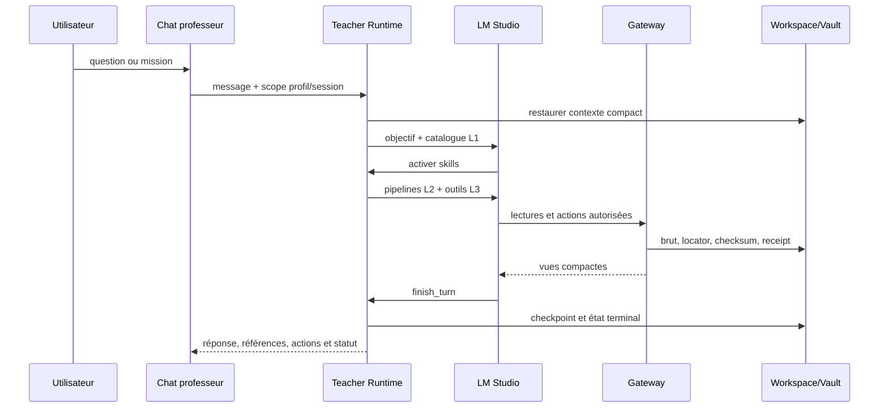

États terminaux : `complete`, `partial`, `cancelled`, `provider_unavailable`, `error`.
Une coupure ne relance jamais silencieusement le modèle.

## 16. Vues produit

### 16.1 Navigation cible

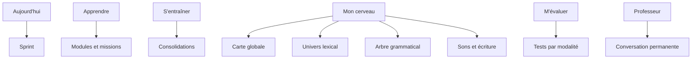

La Word Bank devient une vue de `Mon cerveau`, tout en conservant ses routes directes et
ses workflows avancés.

### 16.2 Carte globale

- scène plein écran ou grand canevas non enfermé dans une carte décorative ;
- zoom macro -> branche -> nœud ;
- brouillard léger sur non observé ;
- couleur = état, anneau = fraîcheur, opacité = confiance ;
- frontière active mise en évidence ;
- filtres langue, modalité, réception/production, état et domaine ;
- recherche directe ;
- panneau latéral pour détails et actions ;
- vue liste accessible équivalente ;
- aucune animation indispensable à la compréhension.

### 16.3 Fiche d'un nœud

- définition et raison de son existence ;
- niveau 0-8, état, confiance et fraîcheur ;
- facettes réceptives/productives et modalités ;
- prérequis, enfants, relations et confusions ;
- preuves positives, négatives et contestées ;
- erreurs fréquentes personnelles ;
- dernière utilisation et prochaine vérification ;
- `Consolider`, `Tester`, `Demander au professeur`, `Prioriser` ;
- historique de progression.

### 16.4 Univers lexical

- vue domaines, fréquence, états et listes ;
- zoom domaine -> sous-domaine -> sens ;
- chaleur de couverture et dette ;
- bascule rencontré / reconnu / rappelé / produit / robuste ;
- génération de fiche thématique et de pile depuis une sélection ;
- ajout manuel et résolution de sens.

### 16.5 Arbre grammatical

- fonctions universelles comme branches ;
- réalisations de la langue active comme nœuds ;
- prérequis et transformations Gym visibles ;
- modes `Découvrir`, `Étudier`, `Transformer`, `Transférer`, `Tester` ;
- exemples contrastifs utilisant les langues connues ;
- indication des contextes où la structure a émergé spontanément.

### 16.6 Aujourd'hui et sprint

Aujourd'hui explique en une phrase pourquoi les cibles ont été choisies. Le lecteur garde
le vocabulaire et le professeur accessibles. Le bilan anime uniquement les changements
réellement justifiés dans le cerveau et permet de créer des priorités ou listes.

### 16.7 Onboarding

- conversation courte avec progression claire ;
- résumé structuré modifiable ;
- épreuves une par une ;
- indicateur de confiance sans faux pourcentage précis ;
- résultat provisoire par grandes branches ;
- choix accepter, simplifier, défier ou commencer ;
- explication de la calibration continue.

### 16.8 Professeur

- tiroir disponible partout et page dédiée ;
- scope visible : langue, séance, branche ou sélection courante ;
- références cliquables vers les nœuds et preuves ;
- aperçu des actions avant confirmation ;
- annulation des actions réversibles ;
- historique par conversation ;
- états fournisseur explicites ;
- architecture prête pour streaming et voix live ultérieurs.

### 16.9 Matrice complète des vues

| Route | Action principale | Lit | Produit |
|---|---|---|---|
| `/today` | composer/reprendre le travail utile | frontière, échéances, module | plan figé |
| `/sprints/:runId` | exécuter une séance | plan, annotations, médias | réponses, observations, bilan |
| `/learn` | choisir et suivre une mission | modules, prérequis, objectifs | enrôlement |
| `/practice` | travailler librement | piles, branches, prescriptions | practice run et observations |
| `/brain` | explorer le modèle personnel | graphe, projections, frontière | priorité ou prescription |
| `/brain/vocabulary` | explorer lexique et domaines | Word Bank, taxonomie, FSRS | liste, pile, priorité |
| `/brain/grammar` | explorer fonctions et moules | graphe grammatical, preuves | étude, Gym, test |
| `/brain/nodes/:id` | comprendre un état | nœud, relations, preuves | consolidation ou question |
| `/assess` | choisir une modalité à évaluer | couverture et dernières évaluations | assessment run |
| `/teacher` | dialoguer et agir avec le professeur | workspace et outils autorisés | réponse, brouillon, receipt |
| `/language-profile` | gérer langues et calibration | expériences, priors, placement | profil actif |
| `/settings` | régler temps, corrections et confidentialité | préférences | révision de préférences |
| `/authoring/*` | éditer le référentiel publié | graphes, contenus, validations | brouillons puis publication humaine |

### 16.10 Parcours reliés

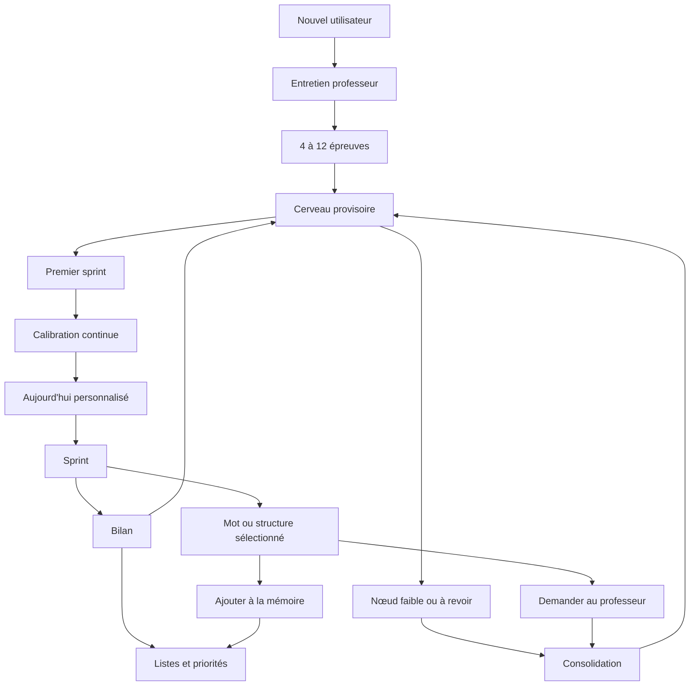

### 16.11 Atelier et boucle éditoriale

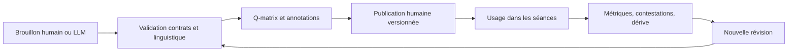

Les données personnelles ne servent jamais directement à republier un contenu. Une
amélioration éditoriale utilise des rapports agrégés et expurgés, puis repasse par la même
validation.

## 17. API publique cible

Nouvelles familles sous `/api/v1` :

```text
/knowledge-graphs
/knowledge-nodes
/knowledge-edges
/knowledge-projections
/knowledge-frontier
/domain-taxonomies
/content-annotations
/consolidation-prescriptions
/learner-model
/learner-model/evidence
/teacher/skills
/teacher/conversations
/teacher/turns
/teacher/actions
```

Les routes Word Bank, mémoire, exercices, sprints, pratique, placement, évaluations et
profils restent en place et référencent progressivement les IDs du Knowledge Core.

Toute commande à effet exige `Idempotency-Key`, version attendue et autorisation
propriétaire. Les réponses paginées utilisent un curseur stable. OpenAPI produit le client
TypeScript.

## 18. Architecture multilingue

### 18.1 Noyau universel

Le noyau définit types de nœuds, relations, modalités, opérations, niveaux, preuves,
taxonomies de domaines et fonctions communicatives.

### 18.2 Language Pack

Chaque pack fournit :

- écritures, segmentation et normalisation ;
- phonologie et TTS ;
- morphologie et conjugaison ;
- réalisations grammaticales ;
- lexique et métadonnées ;
- ponts contrastifs ;
- analyseurs et validateurs ;
- contenus, exercices et modules ;
- projections UI particulières si nécessaires.

### 18.3 Tests de non-dépendance

- italien : langue romane flexionnelle ;
- japonais : écritures multiples, segmentation et ordre syntaxique distinct ;
- turc : morphologie agglutinante et harmonie vocalique ;
- arabe futur : RTL, racines et formes dérivées.

Le turc n'exige pas un curriculum complet dans cette convergence ; un mini-pack de preuve
sera planifié après stabilisation du noyau.

## 19. Gamification responsable

- XP et séries mesurent l'effort, jamais la maîtrise ;
- niveaux de branche issus des preuves ;
- déblocages visibles quand une frontière devient accessible ;
- missions de consolidation comme défis facultatifs ;
- jalons pour premier transfert, première émergence spontanée et contrôle différé ;
- aucune pénalité de série sur la connaissance ;
- aucune comparaison sociale au MVP ;
- réglage permettant de réduire animations et mécaniques de jeu.

## 20. Observabilité, confidentialité et reconstruction

- trace du modèle demandé et réellement utilisé ;
- skills et outils activés ;
- appels, latences, statuts, locators et receipts ;
- aucun raisonnement privé persisté ;
- prompts personnels et conversations privés ;
- export et suppression par profil linguistique ;
- reconstruction complète des projections depuis événements et preuves ;
- métriques de dérive : surreprésentation d'un domaine, primitive répétée, faux niveaux,
  annotations non résolues, recommandations ignorées et corrections contestées ;
- mode fournisseur indisponible sans fallback ni faux succès.

## 21. Invariants

1. Une rencontre n'est pas une compréhension.
2. Une compréhension n'est pas une production.
3. Une carte n'est pas un sens lexical.
4. Un niveau visible n'est pas une preuve.
5. Une déclaration utilisateur n'est pas une maîtrise.
6. Une liste candidate n'est pas un objet canonique ouvert par le professeur.
7. Un LLM ne publie, ne note ni n'attribue une maîtrise.
8. Une activité libre produit des observations mais ne réordonne pas silencieusement le
   curriculum.
9. Un contenu retiré ne détruit pas les preuves historiques qui l'ont référencé.
10. Une projection est reconstructible et versionnée.
11. Un pack de langue ne peut pas redéfinir les invariants universels.
12. Une action annoncée possède un receipt ou est présentée comme proposition.

## 22. Hors portée de la première convergence

- conversation vocale temps réel et STT automatique ;
- normalisation psychométrique officielle ou équivalence CECR ;
- réseau social, classement et compétition ;
- génération massive de 30 000 à 50 000 entrées par langue ;
- graphe 3D ;
- moteur de graphe externe ;
- marketplace de packs ;
- curriculum complet turc ou arabe.

## 23. Critères d'acceptation produit

1. Un nouveau profil français + espagnol -> italien termine l'entretien et 4 à 12
   épreuves, puis reçoit une première séance justifiée.
2. Les cinq premiers sprints réduisent ou maintiennent explicitement l'incertitude sans
   réécrire les réponses précédentes.
3. Tout texte pédagogique permet de sélectionner un mot, résoudre son sens et l'ajouter à
   la Word Bank avec son contexte.
4. Un sprint thématique réutilise vocabulaire, structures, rappels et dettes depuis le même
   snapshot du graphe.
5. Une structure grammaticale peut être découverte, transformée, transférée et rappelée
   après délai avec preuves distinctes.
6. La carte globale explique chaque niveau par des preuves et distingue fraîcheur et
   confiance.
7. Une consolidation peut partir d'un nœud, d'une branche, d'une erreur ou d'un domaine.
8. Le professeur peut rechercher, ouvrir, expliquer, préparer et effectuer les actions
   réversibles autorisées avec receipts et annulation.
9. LM Studio indisponible laisse toutes les fonctions déterministes utilisables.
10. Le japonais traverse onboarding, cerveau, capture lexicale, sprint et professeur sans
    hypothèse latine.
11. Les projections peuvent être supprimées puis reconstruites à l'identique.
12. Les vues passent clavier, lecteur d'écran, zoom 200 % et 320/768/1440 px.
