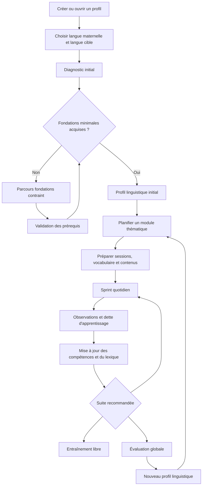
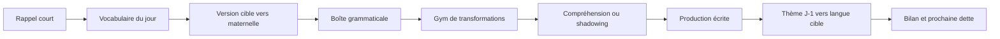
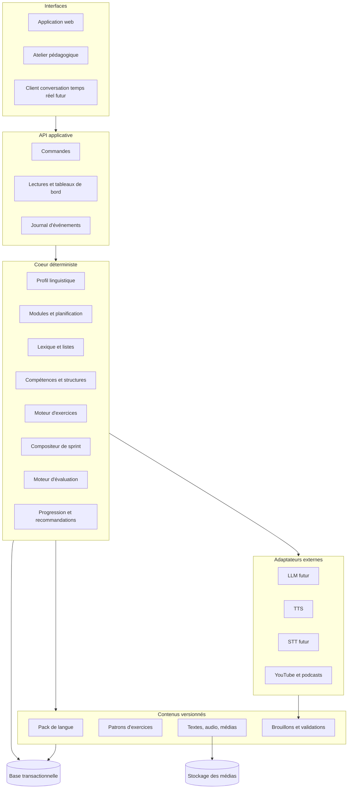
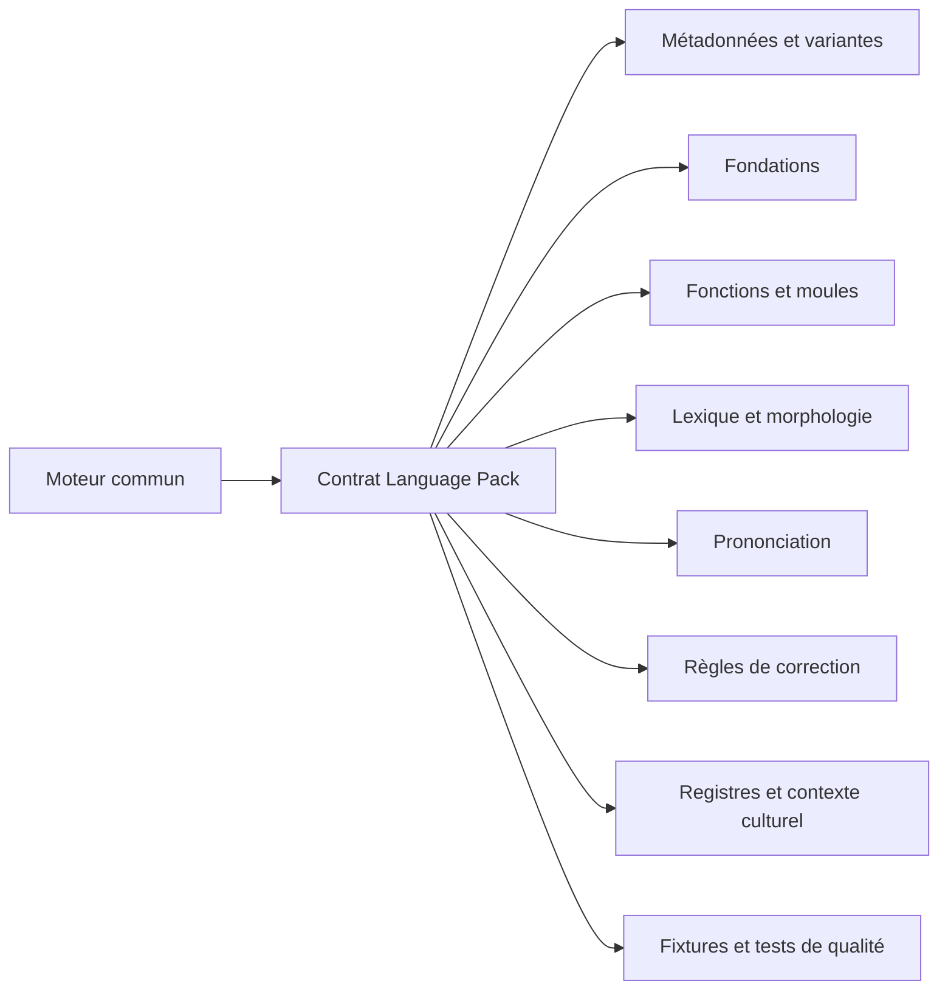

# Polyglot V2 - Vision et architecture globale

## 1. Objectif

Construire une plateforme modulaire d'apprentissage de langues capable de :

- déterminer un point de départ crédible dans une langue cible ;
- préparer des modules cohérents de plusieurs jours ;
- exécuter un sprint quotidien adapté au temps disponible ;
- gérer le vocabulaire avant, pendant et après les sessions ;
- enseigner une boîte à outils grammaticale fonctionnelle ;
- proposer les mêmes exercices en entraînement libre ;
- suivre les progrès sans confondre activité et maîtrise ;
- évaluer séparément compréhension écrite, compréhension orale, expression
  écrite et expression orale ;
- accueillir plus tard une nouvelle langue sans réécrire le produit.

La première langue de référence est l'italien avec le français comme langue
maternelle. Le modèle doit toutefois accepter toute paire `langue maternelle ->
langue cible` disposant d'un pack pédagogique suffisamment complet.

## 2. Parcours global d'une langue

## 3. Les espaces du produit

### 3.1 Diagnostic et fondations

Le diagnostic sert à estimer le point de départ, pas à délivrer une vérité
absolue. Il combine :

- déclaration de l'utilisateur ;
- conversation guidée avec un tuteur ;
- micro-épreuves déterministes ;
- échantillons dans les quatre compétences lorsque c'est possible ;
- détection des prérequis manquants ;
- niveau de confiance de l'estimation.

Le parcours fondations est obligatoire lorsqu'une langue possède un système
d'écriture, des sons ou des conventions indispensables. Pour le japonais, cela
peut couvrir kana et phonologie. Pour l'italien, il sera beaucoup plus court :
correspondances graphèmes-sons, accent tonique, conventions de lecture et
phrases de survie.

Sortie attendue : un `LearnerLanguageProfile` avec compétences observées,
vocabulaire connu estimé, structures reconnues, lacunes, préférences et niveau
de confiance. Le CECR peut rester une étiquette d'interopérabilité, mais ne
pilote pas le produit.

### 3.2 Module d'apprentissage

Un module est une unité cohérente de 3 à 30 jours. Il ne se limite pas à une
situation utilitaire. Il combine :

- une intention communicative ;
- une famille de contextes ;
- des fonctions grammaticales ;
- des domaines lexicaux ;
- des objectifs dans les quatre compétences ;
- une progression de difficulté ;
- des rappels J+1 et espacés ;
- une mission finale ou une évaluation de transfert.

Exemple : « Arriver et devenir autonome en Italie » peut inclure transport,
logement, imprévus, demandes polies, récit d'un problème, compréhension
d'annonces et prise de décision. Les scènes peuvent être réalistes, inattendues
ou fictives tant qu'elles servent les objectifs du module.

### 3.3 Sprint quotidien

Le sprint est une exécution planifiée, non une génération improvisée. Il prend
en compte le temps annoncé, les acquis, les échéances et le thème du jour.

Tous les blocs ne sont pas obligatoires chaque jour :

- 15 minutes : 3 ou 4 blocs essentiels, volume réduit ;
- 30 minutes : noyau complet de 5 blocs environ ;
- 45 à 60 minutes : jusqu'à 7 blocs avec approfondissement ;
- le rappel J+1 et les éléments fortement dus ont priorité sur la nouveauté ;
- chaque bloc indique pourquoi il a été sélectionné.

### 3.4 Entraînement libre

L'entraînement libre utilise exactement le même moteur que le sprint, sans
modifier rétroactivement le plan quotidien. L'utilisateur choisit :

- une compétence ;
- une structure grammaticale ;
- une liste de vocabulaire ;
- un type d'exercice ;
- un contexte ou un thème ;
- une durée ;
- une difficulté ;
- un mode entraînement ou test.

Les observations comptent dans le profil, avec un poids adapté au cadre. Une
réussite libre avec indices ne vaut pas une réussite différée sans aide.

### 3.5 Progression

La page anciennement « Piliers » devient une carte de progression. Elle expose :

- les quatre compétences globales ;
- les sous-compétences et fonctions communicatives ;
- les structures grammaticales ;
- les domaines lexicaux ;
- les dernières preuves et leur ancienneté ;
- les états `non vu`, `découvert`, `en cours`, `fiable`, `maîtrisé`, `à revoir` ;
- l'incertitude et les raisons du statut ;
- les tests disponibles.

Elle ne fournit plus un cours linéaire ni un devoir sur table générique.

### 3.6 Évaluation globale

Chaque langue offre quatre évaluations indépendantes :

- compréhension écrite ;
- compréhension orale ;
- expression écrite ;
- expression orale.

Une évaluation peut inclure des compétences déjà travaillées et des éléments
nouveaux pour mesurer le transfert. Elle produit un score multidimensionnel, un
niveau estimé, une confiance, des preuves et des recommandations. L'expression
orale utilisera d'abord un protocole manuel ou simulé ; l'adaptateur ChatGPT
Live/local sera conçu ultérieurement.

## 4. Architecture logique

## 5. Frontières de domaines

1. **Identité** : compte, préférences, langues connues.
2. **Profil linguistique** : état d'un utilisateur dans une langue cible.
3. **Catalogue pédagogique** : capacités, structures, lexique et prérequis.
4. **Contenu** : unités versionnées, brouillons, publications et provenance.
5. **Vocabulaire** : lexèmes, sens, formes, listes, cartes et planification.
6. **Exercices** : primitives, instances, tentatives, aides et corrections.
7. **Curriculum** : modules, journées, objectifs et scénarios.
8. **Sprint** : sélection temporelle et orchestration d'une session.
9. **Progression** : preuves, maîtrise, oubli et recommandations.
10. **Évaluation** : protocoles, épreuves, résultats et confiance.
11. **Médias** : audio, vidéo, transcription, droits et disponibilité.
12. **Génération** : tâches, outils, schémas, validation et publication.

Ces domaines commencent dans un monolithe modulaire. Ils ne deviennent des
services séparés que si la charge ou l'organisation le justifie.

Le domaine Vocabulaire porte deux couches : un catalogue lexical partagé par
langue et un graphe lexical propre à chaque utilisateur. Ce graphe conserve les
rencontres, les preuves par modalité, les lacunes et les relations personnelles.
Les listes et cartes sont des vues de travail, pas la source de vérité. Son
contrat détaillé est défini dans `07-graphe-lexical-personnel.md`.

## 6. Une nouvelle langue comme pack

Un pack ne redéfinit pas les primitives d'exercices. Il fournit les données et
les contraintes nécessaires pour les instancier correctement. Une langue n'est
ouverte au public que lorsque ses fondations, ses validateurs et son parcours
minimal passent les tests de certification du pack.
