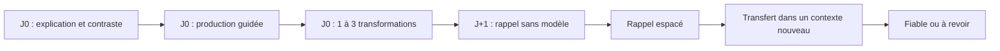
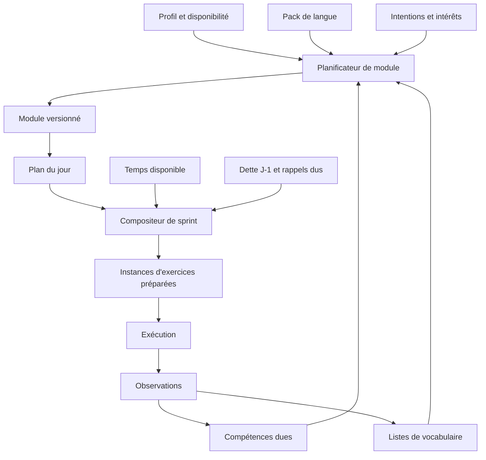
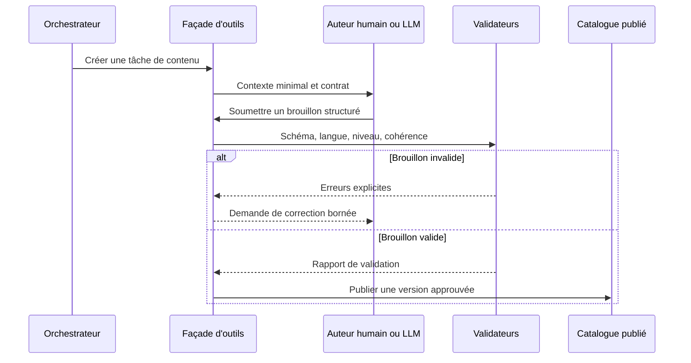

# Polyglot V2 - Backend pédagogique et moteur d'exercices

## 1. Principe directeur

Le backend décide **quoi entraîner, pourquoi, avec quelles contraintes et
comment mesurer le résultat**. Un auteur humain ou un LLM peut proposer le
contenu concret, mais ne peut pas contourner ces décisions.

Une instance d'exercice est toujours produite à partir de :

- un objectif pédagogique ;
- une ou plusieurs compétences ciblées ;
- une primitive d'exercice ;
- un contexte ;
- un ensemble lexical autorisé ou ciblé ;
- des structures grammaticales autorisées ou ciblées ;
- un niveau de difficulté calculé ;
- une politique d'aide ;
- une méthode de correction ;
- un contrat de résultat.

## 2. Taxonomie des compétences

Le catalogue distingue plusieurs axes reliés :

- **modalité** : lire, écouter, écrire, parler ;
- **opération** : reconnaître, rappeler, transformer, produire, interagir ;
- **fonction communicative** : demander, comparer, raconter, nuancer, refuser ;
- **structure linguistique** : moule grammatical, temps, accord, ordre des mots ;
- **lexique** : sens, forme, collocation, registre, domaine ;
- **phonologie** : distinguer, prononcer, rythmer, accentuer ;
- **pragmatique** : politesse, implicite, registre, norme culturelle ;
- **stratégie** : reformuler, demander de répéter, contourner un mot inconnu.

Une même tentative peut produire des observations sur plusieurs axes, sans que
ceux-ci soient fusionnés dans un score unique.

## 3. Boîte à outils grammaticale

Une compétence grammaticale est décrite par une **fonction** et un ou plusieurs
**moules propres à la langue cible**.

Exemple conceptuel :

- fonction : exprimer un futur proche ;
- déclencheur français : « je vais + infinitif » ;
- réalisations italiennes : présent avec repère temporel, ou `stare per +
  infinitif` selon l'intention ;
- contraintes : personne, temporalité, registre, compatibilités lexicales ;
- contrastes : futur simple, intention, imminence ;
- erreurs typiques : calque systématique de `andare + infinitif` ;
- prérequis : présent, infinitif, marqueurs temporels ;
- exemples positifs et contre-exemples ;
- niveaux de reconnaissance, production guidée et transfert.

Les familles initiales issues de la boîte française vers italienne sont :

1. existence et identification ;
2. volonté, capacité, permission, obligation et besoin ;
3. temps et déroulement d'une action ;
4. habitude et fréquence ;
5. goûts, préférences et émotions ;
6. essai, réussite et difficulté ;
7. cause, conséquence et but ;
8. condition et hypothèse ;
9. comparaison, quantité et degré ;
10. manière, ordre temporel et simultanéité ;
11. questions ;
12. demandes et politesse ;
13. opinion, certitude et doute ;
14. relations logiques ;
15. propositions relatives ;
16. pronoms et évitement des répétitions ;
17. ordres, conseils, invitations et interdictions.

Le pack italien complétera cette base avec conjugaison, accords, articles,
prépositions, clitiques, registre, prosodie, collocations, faux amis et
phénomènes propres à l'italien.

## 4. Primitives d'exercices

Les primitives sont communes aux langues. Elles décrivent une interaction et
un mode de preuve, pas un contenu précis.

### 4.1 Exposition et discrimination

- **micro-explication** : règle courte, exemples, contraste et piège ;
- **observation guidée** : repérer une régularité dans plusieurs exemples ;
- **appariement** : associer forme, sens, audio, image ou fonction ;
- **classement** : ranger par sens, registre, temps, construction ou naturel ;
- **intrus** : identifier l'élément incompatible et expliquer pourquoi ;
- **choix contrastif** : départager deux formulations plausibles ;
- **jugement d'acceptabilité** : naturel, possible mais marqué, ou incorrect ;
- **détection ciblée** : repérer une structure dans un texte ou un audio.

### 4.2 Rappel contrôlé

- **carte recto-verso** : sens, forme, audio ou image ;
- **texte à trou** : flexion, connecteur, mot, syntagme ou structure ;
- **rappel indicé** : produire avec indices progressivement retirés ;
- **dictée** : son vers graphie ;
- **transcription partielle** : compléter ce qui a été entendu ;
- **conjugaison** : personne, temps, mode, polarité et verbe imposés ;
- **déclinaison/flexion** : accord ou forme morphologique selon la langue ;
- **reconstruction ordonnée** : recomposer une phrase ou un échange.

### 4.3 Transformation, la nouvelle Gym

- substitution lexicale ;
- changement de personne ;
- changement de nombre ou genre ;
- négation ;
- interrogation ;
- changement de temps ou d'aspect ;
- changement de modalité : vouloir, pouvoir, devoir, permission ;
- changement de registre ou de politesse ;
- changement de point de vue ;
- pronominalisation et dépronominalisation ;
- combinaison de deux phrases ;
- réduction ou expansion ;
- reformulation idiomatique ;
- correction d'un calque depuis la langue maternelle ;
- transformation en chaîne avec conservation du sens ;
- variation contrôlée d'une structure dans plusieurs contextes.

La Gym n'introduit pas seule une structure. Le cycle recommandé est :

### 4.4 Compréhension

- version langue cible vers langue maternelle ;
- questions de compréhension littérale ;
- inférence et intention ;
- ordre d'événements ;
- résumé ou choix de résumé ;
- extraction d'informations ;
- écoute globale puis écoute détaillée ;
- comparaison transcription/audio ;
- repérage de registre, émotion ou relation entre locuteurs ;
- réponse fonctionnelle à un message lu ou entendu.

### 4.5 Production

- thème langue maternelle vers langue cible ;
- réponse courte contrainte ;
- continuation de dialogue ;
- description ;
- narration ;
- argumentation ;
- reformulation ;
- résumé ;
- mission d'écriture avec objectifs lexicaux et grammaticaux ;
- production orale préparée ;
- interaction orale future ;
- shadowing ;
- lecture à voix haute ;
- répétition contrastive de sons ou de groupes rythmiques.

### 4.6 Métacognition et réparation

- corriger sa propre production ;
- expliquer un choix ;
- comparer sa réponse à une réponse de référence ;
- choisir l'aide minimale nécessaire ;
- reformuler sans le mot manquant ;
- transformer une erreur en carte, structure ou mini-rappel ;
- signaler qu'une correction semble fausse ou ambiguë.

## 5. Contrat d'une définition d'exercice

Une définition versionnée précise :

- identifiant et version ;
- primitive ;
- modalités sollicitées ;
- compétences ciblées et secondaires ;
- prérequis ;
- difficulté intrinsèque ;
- paramètres autorisés ;
- données linguistiques requises ;
- format de stimulus et de réponse ;
- aides disponibles et coût pédagogique ;
- méthode de correction ;
- critères de réussite ;
- événements et observations à produire ;
- règles d'accessibilité ;
- exemples valides et invalides ;
- langues pour lesquelles la définition est certifiée.

Une instance ajoute le contenu, le contexte, les cibles du jour, une graine de
génération et une date d'expiration éventuelle. Une tentative conserve la
réponse brute, les aides, le temps, la correction, le résultat et la provenance.

## 6. Composition d'un module et d'un sprint

Le compositeur applique un budget de temps, des quotas et des priorités. Il
cherche la cohérence, mais évite qu'un seul thème masque les lacunes anciennes.
Il peut remplacer une primitive indisponible par une autre couvrant le même
objectif, sans générer silencieusement du contenu hors contrat.

## 7. Correction

Chaque définition choisit une stratégie :

- correction exacte normalisée ;
- ensemble de réponses acceptables ;
- analyse morphologique ;
- comparaison sémantique bornée ;
- grille critériée ;
- validation humaine ;
- validation LLM future ;
- combinaison avec seuil d'incertitude.

Une correction produit : résultat, score par critère, explication courte,
correction proposée, alternatives acceptables, confiance et drapeau de revue.
Un échec du correcteur ne devient jamais une réussite automatique.

## 8. Outils destinés au futur LLM

Le LLM n'accède pas directement à la base. Une façade d'outils contrôlée expose
des opérations comme :

- lire le profil pédagogique autorisé ;
- lister objectifs, compétences et prérequis ;
- consulter le vocabulaire autorisé pour une session ;
- demander un patron d'exercice ;
- soumettre un brouillon d'instance ;
- valider un brouillon contre son contrat ;
- proposer un module ou une journée ;
- soumettre une correction structurée ;
- signaler une ambiguïté ou une donnée manquante ;
- expliquer une recommandation existante.

Chaque appel possède un schéma strict, des limites, une trace d'audit et une
idempotence. En phase 1, des tests et un opérateur humain jouent le rôle du LLM.

## 9. États et erreurs

- Un sprint peut être `préparé`, `prêt`, `en cours`, `interrompu`, `terminé` ou
  `incomplet`.
- Une génération peut être `demandée`, `en cours`, `à corriger`, `validée`,
  `publiée`, `rejetée` ou `expirée`.
- Une ressource externe indisponible est visible et remplaçable.
- Les réponses et progrès ne sont jamais perdus lors d'une interruption.
- Toute modification de contenu conserve la version utilisée dans la tentative.
- Toute correction contestée peut être réévaluée sans réécrire l'historique.
