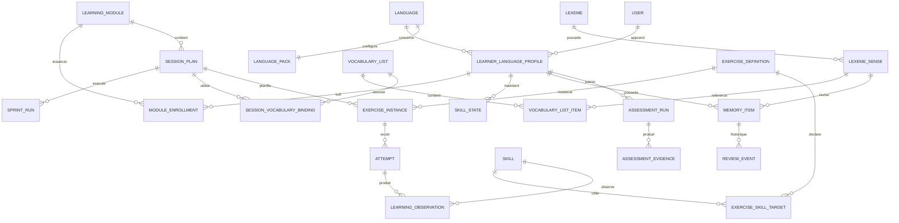
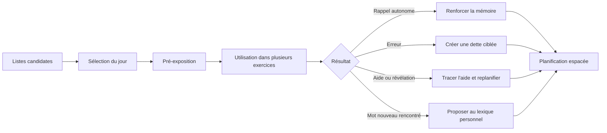
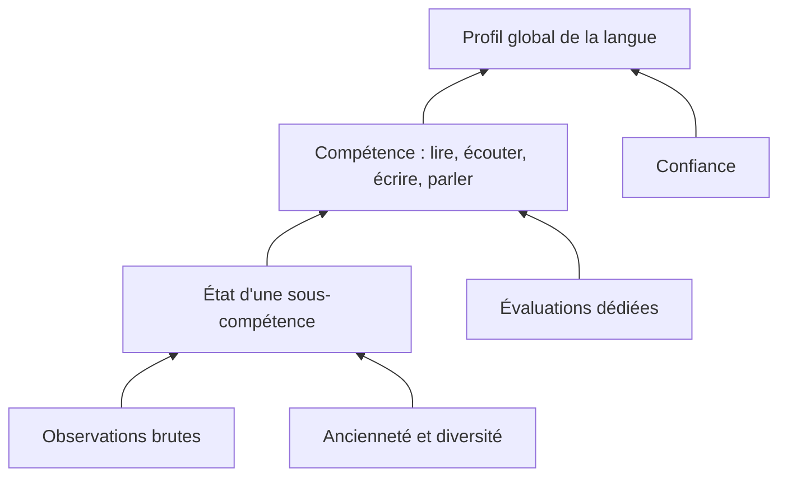

# Polyglot V2 - Données, vocabulaire, progression et statistiques

## 1. Principes de données

- Conserver les faits bruts et calculer les agrégats séparément.
- Versionner les contenus et les règles ayant produit une tentative.
- Utiliser des relations explicites plutôt que des blobs JSON pour le coeur.
- Autoriser des métadonnées extensibles sans y cacher les invariants métier.
- Distinguer identité lexicale, sens, forme de surface et carte de révision.
- Distinguer activité, observation et preuve de maîtrise.
- Permettre de recalculer les tableaux de bord depuis les événements.

## 2. Modèle conceptuel

Le schéma ci-dessus est complété par le graphe lexical personnel décrit dans
`07-graphe-lexical-personnel.md`. `MEMORY_ITEM` représente une invite de rappel,
pas toute la connaissance d'un mot. La source de vérité personnelle est formée
des rencontres lexicales, preuves et projections par sens et modalité.

## 3. Vocabulaire et listes

### 3.0 La Word Bank comme mémoire lexicale personnelle

Chaque profil de langue possède une Word Bank exhaustive de ce qui a été
rencontré dans Polyglot ou ajouté manuellement. Elle n'affirme pas que tout ce
qui a été affiché est compris. Elle conserve trois niveaux séparés : catalogue
partagé de la langue, faits de rencontre propres à l'utilisateur et projections
de connaissance recalculables. Les listes, cartes, dettes et vues de couverture
s'appuient sur ces niveaux sans dupliquer les entrées lexicales.

### 3.1 Pourquoi séparer lexique, carte et liste

Le mot italien `partire` est une entrée lexicale. Son sens « partir » est un
sens. `parto`, `partiva` et `partirò` sont des formes. Une carte est une façon de
réviser une information. Une liste est une sélection éditoriale ou personnelle.
Ces objets ont des cycles de vie différents et ne doivent pas être confondus.

### 3.2 Types de listes

- liste système d'un pack de langue ;
- liste thématique d'un module ;
- liste planifiée pour une journée ;
- liste personnelle ;
- import externe ;
- liste issue d'un texte ou média ;
- liste de dette ;
- liste d'erreurs ;
- liste de consolidation ;
- liste d'évaluation, masquée pendant le test.

Une liste peut être clonée, fusionnée, filtrée, versionnée, archivée et associée
à plusieurs modules ou sessions. L'association précise son rôle : `nouveau`,
`révision`, `autorisé`, `imposé`, `distracteur`, `évaluation` ou `secours`.

### 3.3 Cycle du vocabulaire dans une session

Le système conserve pour chaque exposition : source, contexte, exercice,
direction, réponse, aide, latence, résultat, date et contenu exact. Révéler une
traduction ne « punit » pas arbitrairement une carte : cela crée une observation
distincte et une révision appropriée.

### 3.4 Dette d'apprentissage

La dette est une file de besoins, pas une deuxième base de vocabulaire. Elle
peut cibler :

- un sens lexical ;
- une forme fléchie ;
- une collocation ;
- une structure grammaticale ;
- un contraste phonologique ;
- une stratégie communicative.

Chaque dette possède une cause, une priorité, une échéance, un état et une règle
de résolution. Elle n'est résolue qu'après une preuve adaptée, pas dès qu'elle a
été ajoutée à une session.

## 4. Progression et maîtrise

### 4.1 États

- `non_observed` : aucune exposition ;
- `discovered` : exposé, aucune production concluante ;
- `in_progress` : quelques réussites encore dépendantes du contexte ou des aides ;
- `reliable` : rappels sans aide dans plusieurs contextes et après délai ;
- `mastered` : transfert durable, varié et récent ;
- `review_due` : compétence auparavant fiable dont les preuves se dégradent ;
- `not_evaluable` : données insuffisantes ou contradictoires.

Les traductions françaises sont des labels UI définis dans le registre 25.

### 4.2 Une preuve n'est pas un score brut

Le poids d'une observation dépend de :

- reconnaissance ou production ;
- présence et type d'aide ;
- difficulté ;
- nouveauté du contexte ;
- délai depuis l'apprentissage ;
- correction certaine ou incertaine ;
- nombre de contextes distincts ;
- modalité ;
- conditions d'entraînement ou d'évaluation.

Le calcul conserve un niveau, une confiance, une date de prochaine vérification
et les preuves expliquant la valeur. Aucun statut `mastered` après une seule
réussite.

### 4.3 Agrégation

Le niveau global est un résumé accompagné de son profil. Il ne masque pas qu'un
utilisateur peut bien lire et encore difficilement comprendre l'oral.

## 5. Statistiques à conserver

### 5.1 Activité

- temps actif et temps total ;
- sessions commencées, terminées, interrompues ;
- fréquence et régularité ;
- volume par primitive et modalité ;
- utilisation des aides ;
- disponibilité annoncée comparée au temps réel.

### 5.2 Vocabulaire

- nouveaux sens rencontrés et réellement rappelés ;
- couverture par thème et fréquence ;
- rétention par direction ;
- stabilité, difficulté et échéance ;
- erreurs de sens, de forme, de registre et de collocation ;
- provenance et contextes d'utilisation ;
- éléments en dette et délai de résolution.

### 5.3 Grammaire et compétences

- expositions, productions et transferts ;
- succès avec et sans aide ;
- erreurs typées ;
- contextes distincts ;
- évolution et ancienneté des preuves ;
- structures dues ;
- recommandations et raisons de leur sélection.

### 5.4 Qualité du système

- taux de contenus rejetés par validateur ;
- corrections contestées ;
- ambiguïtés ;
- exercices abandonnés ;
- médias indisponibles ;
- latence et erreurs des adaptateurs ;
- versions de contenu responsables d'anomalies.

## 6. Confidentialité et audit

- Les réponses utilisateur sont privées par défaut.
- Les conversations destinées au diagnostic ont une politique de conservation.
- Les prompts, sorties et appels d'outils du futur LLM sont auditables.
- Les données statistiques séparées des contenus personnels peuvent être
  anonymisées.
- L'utilisateur peut supprimer une langue sans supprimer son compte.
- Les opérations destructrices sont explicites et réversibles lorsque possible.
