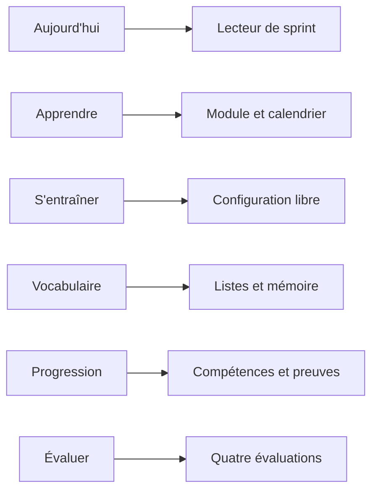
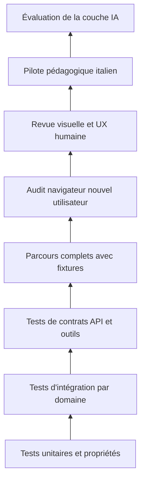

# Polyglot V2 - UX, transition et feuille de route

## 1. Intention UX

Le frontend doit rendre l'apprentissage évident et calme. L'écran principal
n'est pas une vitrine : il doit répondre à trois questions immédiates :

1. Que dois-je faire aujourd'hui ?
2. Pourquoi cela m'est-il proposé ?
3. Où en suis-je réellement ?

La V1 sert de référence visuelle, particulièrement pour la session, la Gym, le
shadowing et la banque de vocabulaire. Les templates ne seront pas copiés avant
d'avoir capturé leurs parcours et identifié les interactions à conserver.

## 2. Navigation cible

- **Aujourd'hui** : sprint prêt, durée, contenu dû et reprise.
- **Apprendre** : module actuel, prochains jours et objectifs.
- **S'entraîner** : moteur libre par compétence, structure ou liste.
- **Vocabulaire** : listes, dette, recherche, import et état mémoire.
- **Progression** : quatre compétences, sous-compétences et preuves.
- **Évaluer** : tests indépendants et historique.
- **Profil de langue** : diagnostic, objectifs et réglages.
- **Atelier** : réservé à l'auteur pour créer et valider contenus et packs.

## 3. Lecteur de sprint

Le sprint utilise une enveloppe stable : progression, temps restant, objectif
du bloc, accès au vocabulaire et sortie. Chaque primitive fournit son composant
d'interaction sans reconstruire toute la page.

Comportements indispensables :

- reprise exacte après interruption ;
- sauvegarde automatique ;
- clavier et mobile ;
- audio accessible sans déplacement de mise en page ;
- indices progressifs clairement signalés ;
- correction lisible avant passage à la suite ;
- possibilité de contester ou signaler une correction ;
- arrêt anticipé sans perte ;
- bilan final court, puis détails facultatifs ;
- aucune métrique de maîtrise trompeuse pendant l'exercice.

## 4. Atelier pédagogique sans LLM

La première version fournit une interface ou des fichiers contrôlés permettant
à un humain de :

- créer et versionner une compétence ;
- définir ses prérequis ;
- créer une structure fonctionnelle ;
- composer une liste lexicale ;
- créer un module et ses journées ;
- instancier une primitive ;
- lancer les validateurs ;
- prévisualiser comme apprenant ;
- publier, retirer ou remplacer une version ;
- inspecter les événements produits par un test.

Cette surface constitue ensuite le backend d'outils du LLM. Si elle ne permet
pas à un humain ou à une suite de tests de construire proprement une semaine,
elle n'est pas prête pour l'IA.

## 5. Conservation fonctionnelle de la V1

### À reconstruire comme capacité obligatoire

- comptes et profils ;
- paquets, cartes, catégories et imports ;
- révision bidirectionnelle et historique FSRS ;
- filtres et modes de révision libre ;
- programmes personnalisés et temps cible ;
- vocabulaire quotidien et dette ;
- version J0 et thème J+1 ;
- Gym et transformations ;
- shadowing vidéo ou TTS ;
- écriture guidée ;
- barre de vocabulaire et ajout contextuel ;
- exercices libres ;
- progression par langue ;
- évaluations et historique ;
- TTS et adaptateurs LLM locaux ;
- contenus italien, japonais et turc comme archives sources.

### À préserver comme intention mais à remplacer techniquement

- blobs JSON de sessions ;
- piliers CECR linéaires ;
- pseudo-FSRS des structures ;
- double stockage de la dette ;
- générations à la demande non validées ;
- corrections dont l'échec vaut réussite ;
- templates Lego concurrents ;
- fallback silencieux entre fournisseurs ;
- scripts de migration successifs servant de logique métier.

## 6. Stratégie de dépôt et transition

1. Geler la V1 comme référence, sans la supprimer.
2. Créer un dépôt `polyglot-v2` avec un monolithe modulaire.
3. Copier ces spécifications et établir une matrice de traçabilité.
4. Capturer les écrans et parcours V1 avant de refaire le frontend.
5. Démarrer avec une base V2 vide et des fixtures canoniques nouvelles.
6. Ne migrer aucun compte, historique, session, carte ou état FSRS de la V1.
7. Réutiliser un contenu V1 uniquement après audit éditorial et conversion dans
   un format V2 ; cette réutilisation reste facultative.
8. Préserver les comportements utiles, pas les structures de données anciennes.
9. Conserver la V1 uniquement pour comparaison UX et fonctionnelle pendant la
   reconstruction.

## 7. Découpage de réalisation

Le projet est trop large pour un unique lot de code. « Tout faire d'un coup »
signifie exécuter automatiquement une chaîne de lots fermés, chacun avec ses
tests et son point de contrôle, pas produire un changement géant invérifiable.

### Lot 0 - Contrats et preuve de faisabilité

- Finaliser vocabulaire métier et décisions ouvertes.
- Définir contrats API, événements et schémas du pack italien minimal.
- Prototyper sans UI un module de trois jours entièrement déterministe.

Tests : validation de schémas, invariants, rejouabilité et scénario complet sur
fixtures.

### Lot 1 - Fondation technique

- Identité, profils et langues.
- Base transactionnelle, migrations, journal d'événements.
- Catalogue versionné et mécanisme de publication.

Tests : unitaires, intégration base, autorisations, concurrence et sauvegarde.

### Lot 2 - Vocabulaire et mémoire

- Lexèmes, sens, formes, listes et associations aux sessions.
- Cartes bidirectionnelles, FSRS, imports et dette unifiée.
- Création de cartes, listes et états mémoire sur fixtures V2 neuves.

Tests : propriétés FSRS, idempotence d'import générique, doublons, directions,
dette et scénarios lexicaux canoniques.

### Lot 3 - Compétences et boîte grammaticale italienne

- Taxonomie, prérequis et états.
- Premier catalogue fonction -> moules italiens.
- Conjugaison et transformations fondamentales.

Tests : graphes sans cycle indésirable, niveaux, exemples/contre-exemples et
revue linguistique des capacités prioritaires.

### Lot 4 - Moteur d'exercices

- Registre des primitives.
- Définitions, instances, tentatives, aides et correcteurs déterministes.
- Contrat commun de rendu frontend.

Tests : contrat par primitive, cas valides/invalides, persistance, reprise,
accessibilité des données et événements produits.

### Lot 5 - Modules et compositeur de sprint

- Modules, journées, contextes et objectifs.
- Budget temporel 10 à 60 minutes par pas de 5 ; 15/30/45/60 restent des ancres éditoriales.
- Rappels J+1, dette et sélection multi-objectifs.

Tests : plans reproductibles, contraintes de temps, priorités, absence de
prérequis interdits et cohérence lexique/grammaire/exercices.

### Lot 6 - Frontend noyau

- Shell, onboarding, Aujourd'hui et lecteur d'exercices.
- Vocabulaire, progression et entraînement libre.
- Responsive, clavier, audio et reprise.

Tests : composants, parcours navigateur avec nouvel utilisateur, captures
desktop/mobile, absence de chevauchements et contrôle visuel humain.

### Lot 7 - Diagnostic, fondations et évaluations

- Placement initial.
- Parcours fondations italien.
- Tests des quatre compétences, expression orale simulée.

Tests : scénarios débutant/faux débutant/intermédiaire, confiance, preuves,
absence de déblocage injustifié et reprise d'évaluation.

### Lot 8 - Atelier et façade d'outils

- Création et publication manuelles.
- Contrats d'outils futurs pour le LLM.
- Sandbox, audit, quotas et validation.

Tests : simulation complète du LLM par fixtures, erreurs de schéma, appels
dupliqués, contenus ambigus, refus de publication et traçabilité.

### Lot 9 - Adaptateurs médias

- TTS, ressources vidéo et cache média.
- STT et conversation comme ports inactifs ou simulés.

Tests : indisponibilité, timeout, formats, droits, reprise et remplacement
explicite de ressource.

### Lot 10 - Couche IA, après validation du produit sans IA

- Connexion à LLM Studio.
- Génération de brouillons, corrections et diagnostic conversationnel.
- Évaluation comparative avec les fixtures et contenus humains.

Tests : conformité aux outils, taux de rejet, qualité linguistique, stabilité
sur plusieurs générations, coûts/latence et validation humaine.

## 8. Pyramide de vérification

## 9. Critères avant connexion d'un LLM

- Un utilisateur neuf peut être placé avec des fixtures.
- Il peut terminer les fondations et un module de trois jours.
- Les quatre durées de sprint produisent des plans cohérents.
- Toutes les primitives prioritaires sont exécutables et reprenables.
- Les listes de vocabulaire peuvent être préparées, associées, retravaillées et
  réutilisées avant ou après une session.
- Chaque tentative crée les bonnes observations.
- La progression est explicable depuis les preuves.
- Un humain peut créer et publier du contenu avec les mêmes contrats que le LLM.
- Les erreurs d'outil sont explicites et n'altèrent pas les données.
- Le parcours complet passe avec un nouvel utilisateur dans le navigateur.

## 10. Décisions résolues avant le plan d'implémentation

Les anciennes décisions ouvertes sont fermées par les documents normatifs :

1. nouveau dépôt vide : `DEC-001` et `DEC-012` ;
2. stack, API et base : `DEC-T01` à `DEC-T10` et document 15 ;
3. contenus V1 : archives candidates, jamais migrées sans audit ;
4. vocabulaire et fonctions du pilote : document 13 ;
5. module de trois jours et budgets : documents 11 et 13 ;
6. oral sans STT/LLM : `DEC-009`, documents 12 et 14 ;
7. statistiques visibles : documents 07, 10 et 20 ;
8. correction contestée : documents 09 et 12 ;
9. rôles et accès Atelier : documents 17 et 20.

Une nouvelle question bloquante doit recevoir un identifiant `DEC-*` ou une ADR
avant d'être introduite dans un plan. Elle ne peut pas rester implicite dans une
tâche d'implémentation.
