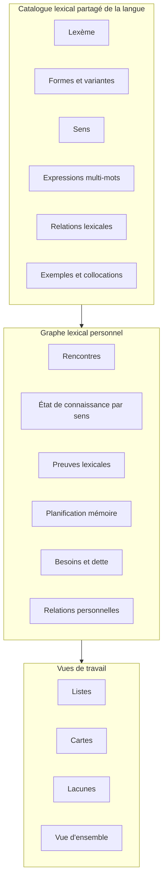
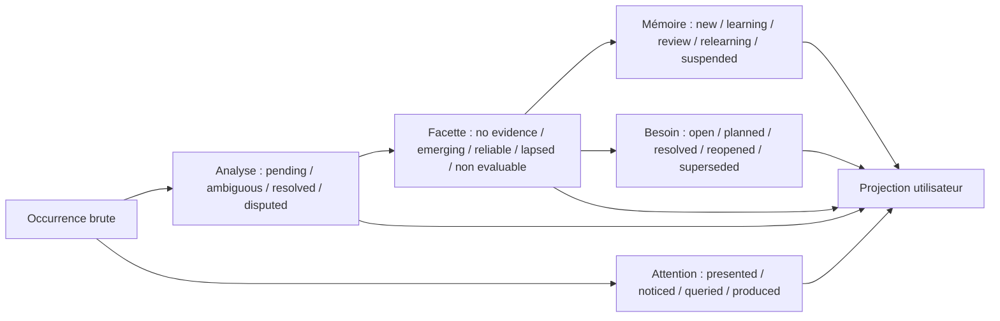
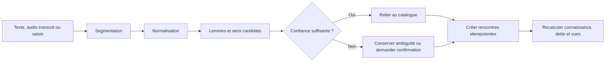

# Polyglot V2 - Graphe lexical personnel et Word Bank

## 1. Décision produit

La Word Bank devient la **mémoire lexicale personnelle complète** d'un
utilisateur pour une langue cible. Elle conserve tout élément lexical rencontré
dans Polyglot, la manière dont il a été rencontré, les sens compris ou produits,
les aides utilisées, les contextes et l'évolution de la connaissance.

Elle n'est ni un paquet de cartes, ni une liste de favoris, ni un dictionnaire
copié dans le compte. Les cartes et les listes sont des vues ou des outils de
travail construits au-dessus de cette mémoire.

Le mot « complète » signifie :

- toute rencontre observable dans Polyglot est enregistrable ;
- aucune rencontre n'est automatiquement assimilée à un apprentissage ;
- le système sait distinguer inconnu, seulement vu, reconnu, rappelé et utilisé ;
- l'utilisateur peut ajouter manuellement un élément rencontré hors de Polyglot ;
- la provenance et l'incertitude sont conservées ;
- le profil ne prétend pas mesurer un pourcentage absolu de toute la langue.

Une langue contient des sens nouveaux, termes spécialisés, noms propres,
expressions, variantes et créations. La V2 ne matérialise donc pas tous les mots
possibles pour chaque utilisateur. Elle construit son graphe de façon paresseuse
à partir des rencontres, des imports et des besoins pédagogiques.

## 2. Deux couches distinctes

### 2.1 Catalogue lexical partagé

Il décrit la langue indépendamment d'un utilisateur :

- lexème ou expression stable ;
- langue, variante régionale et registre ;
- catégorie grammaticale ;
- formes fléchies et variantes orthographiques ;
- prononciations ;
- sens distincts ;
- définitions et équivalents dans une langue d'appui ;
- fréquence et domaines d'usage, avec provenance ;
- collocations et constructions ;
- exemples versionnés ;
- relations : synonyme, antonyme, hyperonyme, dérivé, composé, confusable,
  traduction, registre et association grammaticale.

Il est partagé afin que dix utilisateurs ne créent pas dix définitions
incompatibles de `partire`. Les enrichissements restent versionnés et peuvent
provenir d'un pack, d'un auteur ou plus tard d'un générateur validé.

Objets canoniques envisagés :

- `LanguageVariety` : langue, région, norme et système d'écriture ;
- `LexicalUnit` : mot simple, expression, nom propre ou construction lexicalisée ;
- `LemmaRepresentation` : forme éditoriale de citation, jamais identifiant ;
- `FormAnalysis` : surface, traits morphologiques et prononciation ;
- `LexicalSense` : sens de grain pédagogique et identité stable ;
- `UsageFrame` : valence, préposition, collocation, registre et pragmatique ;
- `Attestation` : exemple sourcé et versionné ;
- `RelationAssertion` : relation qualifiée avec provenance et confiance.

### 2.2 Graphe lexical personnel

Il décrit uniquement la relation d'un utilisateur à ces éléments :

- première et dernière rencontre ;
- nombre et variété des rencontres ;
- sens probablement rencontré ;
- état dans chaque modalité ;
- productions correctes et incorrectes ;
- aides et révélations ;
- planification de rappel ;
- listes personnelles ;
- dette active ;
- notes, associations et préférences ;
- confiance du système et contestations utilisateur.

Objets canoniques envisagés :

- `PresentedOccurrence` : occurrence et position effectivement présentées ;
- `AttentionEvent` : recherche, révélation, sélection, répétition ou correction ;
- `ProductionArtifact` : réponse brute complète et immuable ;
- `LearningEvidence` : conclusion pédagogique bornée ;
- `PersonalSenseFacet` : projection par sens, modalité, direction et opération ;
- `MemoryPrompt` et `ScheduleState` : protocole de rappel et échéance ;
- `LearningNeed` : dette ciblée ;
- `VocabularyList`, `ListMembership` et `ListSnapshot` ;
- `UserLexicalAnnotation` et `PersonalRelation`.

Un ajout manuel absent du catalogue crée d'abord une unité privée ou une
assertion candidate. Il ne modifie jamais automatiquement le catalogue partagé
et ne transmet aucun contexte privé lors d'une éventuelle promotion éditoriale.

## 3. Le noeud de connaissance porte sur un sens

La maîtrise ne doit pas être attachée seulement à une chaîne de caractères.
`Piano` peut être un adverbe italien, un nom ou un emprunt musical selon le
contexte. La connaissance principale porte donc sur un `LexicalSense`.

Une rencontre peut d'abord rester ambiguë :

1. le système enregistre la forme observée et son contexte ;
2. il propose un ou plusieurs sens candidats ;
3. un exercice, un auteur, l'utilisateur ou un analyseur confirme le sens ;
4. l'observation est ensuite reliée au bon état de connaissance ;
5. si le sens est corrigé plus tard, les faits bruts restent inchangés et les
   projections sont recalculées.

Les expressions comme `avere bisogno di` ou `prendere una decisione` sont des
unités lexicales à part entière, reliées à leurs composants. Elles ne sont pas
réduites à une simple somme de mots.

## 4. Rencontre lexicale

Une `LexicalEncounter` est un fait immuable comportant au minimum :

- utilisateur et profil de langue ;
- forme exacte observée ou produite ;
- lexème et sens confirmés ou candidats ;
- date, source et provenance ;
- fragment de contexte et version du contenu ;
- modalité : lecture, écoute, écriture ou oral ;
- rôle : stimulus, consigne, réponse attendue, distracteur, aide ou production ;
- caractère intentionnel ou incident ;
- action : vu, entendu, révélé, recherché, rappelé, produit, corrigé ;
- résultat et confiance de la correction ;
- aides utilisées ;
- lien vers tentative, session, média, liste ou ajout manuel ;
- politique de conservation du contexte.

Afficher automatiquement un texte peut créer des rencontres `vu`, mais pas une
preuve de reconnaissance pour chaque token. Les mots fonctionnels extrêmement
fréquents peuvent être agrégés selon une politique afin d'éviter un journal
inutilement bruyant, tout en conservant les événements pédagogiquement utiles.

## 5. Dimensions de connaissance

Il n'existe pas un booléen unique `known`. L'état est projeté par sens selon des
dimensions séparées :

| Dimension | Question observée |
|---|---|
| Reconnaissance écrite | Comprend-il ce sens lorsqu'il le lit ? |
| Reconnaissance orale | Le reconnaît-il dans un audio naturel ? |
| Rappel vers langue maternelle | Peut-il expliquer ou traduire ce sens ? |
| Rappel vers langue cible | Peut-il retrouver le mot depuis l'intention ? |
| Production écrite | L'utilise-t-il avec la bonne forme et construction ? |
| Production orale | Peut-il le mobiliser oralement ? |
| Flexion | Produit-il les formes requises ? |
| Collocation | L'associe-t-il naturellement aux bons mots ? |
| Registre et pragmatique | L'utilise-t-il dans une situation appropriée ? |
| Transfert | Le réutilise-t-il dans un contexte nouveau ? |

Chaque dimension conserve : état, score interne versionné, confiance, nombre de
preuves, diversité des contextes, dernière preuve, prochaine vérification et
raisons principales.

Les états d'affichage restent communs :

- `rencontré` ;
- `à découvrir` ;
- `en apprentissage` ;
- `reconnu` ;
- `utilisable` ;
- `fiable` ;
- `à revoir` ;
- `ambigu` ;
- `ignoré volontairement`.

## 6. Axes d'état orthogonaux

La connaissance ne suit pas une seule machine linéaire. Plusieurs états évoluent
indépendamment :

- **Analyse** : le sens de l'occurrence est-il identifié ou contesté ?
- **Attention** : l'élément a-t-il seulement été présenté, remarqué, recherché ou
  produit ?
- **Facette de connaissance** : existe-t-il des preuves fiables pour une
  modalité, une direction et une opération précises ?
- **Planification** : existe-t-il une invite de rappel et dans quelle phase ?
- **Besoin** : une dette pédagogique est-elle ouverte ou résolue ?

Les libellés `rencontré`, `reconnu`, `utilisable`, `fiable` et `à revoir` sont
des projections de lecture, jamais des états source. Un utilisateur peut ainsi
reconnaître un sens à l'écrit, rester ambigu à l'oral et être en apprentissage
pour sa production.

## 7. Listes comme vues et intentions

Une liste référence des sens lexicaux ; elle ne les duplique pas. Elle possède :

- propriétaire ou auteur ;
- langue et version ;
- objectif ;
- règles d'inclusion ;
- membres ordonnés ou requête dynamique ;
- rôle pédagogique ;
- associations aux modules, journées, sessions et exercices ;
- état actif, archivé ou figé ;
- historique des modifications.

Types utiles :

- personnelle manuelle ;
- vocabulaire cible d'un module ;
- sélection d'une journée ;
- révision due ;
- dette ;
- mots rencontrés dans un texte ou média ;
- mots utilisables pour produire ;
- lacunes d'un domaine ;
- confusions fréquentes ;
- liste partagée ou éditoriale.

Une liste dynamique peut signifier « tous les aliments rencontrés mais non
utilisables » ou « mots fiables à l'écrit mais faibles à l'oral ». Une liste
figée conserve exactement les membres utilisés par une session historique.

## 8. Cartes et planification mémoire

Une carte devient une `MemoryPrompt`, c'est-à-dire une vue de rappel portant sur
un sens et une direction :

- forme cible vers sens ;
- intention ou traduction vers forme cible ;
- audio vers sens ;
- sens vers prononciation ;
- phrase à trou vers forme ;
- collocation vers complément ;
- forme fléchie vers lemme, ou inversement.

Chaque prompt possède sa propre planification. Les états lexicaux synthétisent
les résultats de plusieurs prompts et d'utilisations authentiques. Une bonne
production dans un exercice peut fournir une preuve, mais ne simule pas une
révision FSRS si le protocole n'était pas un rappel comparable.

## 9. Capture automatique

### 9.1 Sources

- contenu d'une leçon ou d'un sprint ;
- cartes et listes ;
- texte de compréhension ;
- transcription audio ;
- production de l'utilisateur ;
- correction ;
- aide, recherche ou révélation ;
- import manuel ;
- ajout rapide depuis la Word Bank ;
- futur connecteur externe explicitement autorisé.

### 9.2 Pipeline

Le pipeline doit être reproductible et versionné. Une nouvelle version du
tokeniseur ou du désambiguïsateur ne réécrit pas silencieusement l'historique.

### 9.3 Lacune lexicale spontanée

Pendant une production, l'utilisateur peut signaler « je voulais dire X » dans
sa langue d'appui. `CaptureLexicalGap` reçoit le profil, la tentative, le sens
souhaité sous forme de texte privé, le contexte minimal et une clé d'idempotence.
Il crée une rencontre `queried`, une mention à résoudre et un `LearningNeed` de
cause `self_reported_gap`. Ce signal ne constitue ni erreur ni preuve négative.

Après résolution humaine ou déterministe vers un sens partagé/privé, la mention
est reliée au graphe et apparaît dans la Word Bank. L'utilisateur choisit
explicitement de créer une invite mémoire, de l'ajouter à une liste ou de
l'ignorer. Une correction automatique peut ouvrir la même dette seulement si le
mot ou sens était une cible requise, jamais parce qu'une formulation alternative
aurait été possible.

## 10. Utilisation par le moteur pédagogique

Le moteur raisonne toujours par rapport à un `TargetLexiconSet` borné et
versionné : lexique requis par un module, liste choisie, domaine éditorial ou
corpus de fréquence nommé. L'absence d'un sens dans ce référentiel ne signifie
pas qu'il est inutile ; l'absence de preuve utilisateur signifie `non_observed`
(label UI « Non observé »),
pas `inconnu`.

### 10.1 Préparer un sprint

Le compositeur interroge le graphe pour trouver :

- éléments dus ;
- dette prioritaire ;
- vocabulaire requis par les structures du jour ;
- mots déjà reconnus mais pas encore produits ;
- lacunes empêchant un exercice ;
- éléments trop nouveaux pour être combinés ;
- mots fiables servant d'ancrage ;
- besoins de contraste ou de diversité contextuelle.

### 10.2 Choisir du nouveau vocabulaire

Le système compare :

- objectifs du module ;
- fréquence et utilité dans le domaine ;
- prérequis lexicaux ;
- couverture actuelle de l'utilisateur ;
- charge de nouveauté de la journée ;
- réutilisation possible dans plusieurs exercices ;
- proximité avec des mots connus ;
- risques de confusion utiles à traiter ensemble ou à séparer.

Il ne choisit pas un mot uniquement parce qu'il manque dans la base personnelle.

### 10.3 Réorganiser les connaissances

Le graphe rend possibles :

- consolidation automatique par famille ou domaine ;
- entraînement des écarts écrit/oral ou reconnaissance/production ;
- regroupement de synonymes, antonymes et confusables ;
- découverte de trous dans une scène ou intention communicative ;
- création d'exercices utilisant un vocabulaire déjà fiable avec une nouvelle
  structure grammaticale ;
- création d'exercices lexicaux conservant une grammaire déjà fiable ;
- recommandation de listes dynamiques personnalisées.

## 11. Vue utilisateur

La Word Bank doit permettre :

- recherche par forme, sens, traduction, domaine et état ;
- aperçu global rencontré/reconnu/utilisable/fiable/à revoir ;
- détail par modalité ;
- historique des rencontres et contextes autorisés ;
- relations et mots voisins ;
- listes contenant l'élément ;
- prochaine activité prévue ;
- correction d'un sens ou d'une association ;
- ajout manuel ;
- fusion, séparation ou signalement d'un doublon ;
- archivage ou exclusion volontaire ;
- lancement d'un entraînement ciblé.

L'overview évite les faux pourcentages de « langue connue ». Elle peut montrer la
couverture de référentiels bornés : vocabulaire du module, corpus fréquent
versionné, domaine de voyage ou liste personnelle.

## 12. Architecture de stockage

Le MVP utilise une base relationnelle, idéalement PostgreSQL :

- tables normales pour catalogue, sens, formes, rencontres et états ;
- table d'arêtes typées pour les relations lexicales ;
- index sur utilisateur, langue, sens, état, échéance et dates ;
- recherche textuelle adaptée aux langues ;
- projections matérialisées ou tables de lecture pour l'overview ;
- événements append-only pour les faits d'apprentissage ;
- JSON réservé aux extensions non critiques et aux payloads versionnés.

Un moteur de graphe séparé n'est pas requis au départ : les parcours utiles sont
majoritairement des voisinages de profondeur faible. Une projection graphe peut
être ajoutée plus tard pour l'analyse avancée sans changer la source de vérité.

Les arêtes ne doivent pas être réunies dans une table universelle :

- `semantic_edge` relie des sens ;
- `lexical_edge` relie des unités ou expressions ;
- formes et composants d'expressions utilisent des jointures typées ;
- le graphe de prérequis pédagogiques reste séparé du graphe lexical ;
- les relations personnelles restent isolées par profil.

Les rencontres épinglent les révisions de la source, du sens, de l'analyse et de
la politique de calcul. Les commandes d'ingestion utilisent une clé
d'idempotence et une empreinte de requête ; les événements sont publiés via une
outbox transactionnelle. Toute traversée impose profondeur, types d'arêtes,
nombre maximal de noeuds et pagination.

PostgreSQL reste la source de vérité. Une éventuelle base graphe ne serait qu'une
projection reconstruisible, jamais alimentée par un dual-write synchrone.

## 13. Contrats fonctionnels de la Word Bank

| ID | Contrat |
|---|---|
| WB-01 | La projection retourne un état explicable pour chaque sens du référentiel cible. |
| WB-02 | Une observation exige cible, rôle, modalité, opération, aide, résultat, contexte, correction et confiance. |
| WB-03 | La maîtrise est déterministe, versionnée et ne se propage pas entre modalités. |
| WB-04 | L'analyse des lacunes distingue absence de preuve, aide, réception, production, forme, contexte, rétention et contradiction. |
| WB-05 | Le plan lexical attribue les rôles nouveau, dû, dette, cible, support, distracteur ou secours, avec justification. |
| WB-06 | Le sprint borne la nouveauté, respecte prérequis et budget, puis fige son snapshot au démarrage. |
| WB-07 | Programmer une dette ne la résout pas ; seule une preuve conforme ferme le besoin. |
| WB-08 | La Gym sépare structure principale et lexique support et ne crédite que ce qui est réellement rappelé. |
| WB-09 | Compréhension et production déclarent les unités discriminantes ou obligatoires, pas tous les tokens. |
| WB-10 | Le diagnostic produit des estimations avec confiance sans valider les mots non testés. |
| WB-11 | Une évaluation met à jour uniquement les modalités et facettes réellement mesurées. |
| WB-12 | Une recommandation expose cible, raison, preuve manquante, échéance et activité proposée. |

## 14. Invariants

1. Un profil lexical appartient à une paire utilisateur/langue cible.
2. Une rencontre brute n'est jamais une preuve automatique de compréhension.
3. Une preuve référence le sens, la modalité, le contexte et la correction.
4. Un état de connaissance est une projection recalculable, pas un fait brut.
5. Une liste ne possède pas une copie divergente d'un sens lexical.
6. Une session historique conserve une liste figée et les versions utilisées.
7. Une correction ultérieure ne modifie pas la réponse brute.
8. Une désambiguïsation incertaine reste explicitement incertaine.
9. Une relation lexicale possède type, direction, provenance et confiance.
10. Le système ne publie pas de pourcentage de toute la langue sans référentiel
    borné et versionné.
11. L'ingestion automatique est idempotente pour une même commande. Deux
    présentations réelles du même segment restent deux rencontres distinctes.
12. La suppression d'un contexte privé peut conserver une preuve anonymisée
    seulement selon la politique approuvée.
13. Un identifiant lexical ne dépend jamais uniquement d'une chaîne normalisée.
14. Une forme peut recevoir plusieurs analyses morphologiques concurrentes.
15. Une traduction est une relation qualifiée, jamais l'identité d'un sens.
16. Une expression multi-mots et ses composants ont des preuves séparées.
17. Une relation du graphe ne propage jamais automatiquement la maîtrise.

## 15. Cas de test prioritaires

1. Un sens ajouté sans tentative reste `non_observed`.
2. Deux homonymes restent indépendants.
3. Réussir une forme fléchie ne valide pas toutes les flexions.
4. Une traduction révélée puis recopiée ne constitue pas un rappel autonome.
5. Répéter la même instance ne crée pas de diversité contextuelle artificielle.
6. Une version cible vers français n'améliore que la compréhension écrite.
7. Un mot fourni par la Gym n'améliore pas la production lexicale.
8. Omettre un mot facultatif en production libre ne crée aucune dette.
9. Une correction incertaine produit `not_evaluable`.
10. Plusieurs réussites immédiates dans un contexte unique ne suffisent pas à
    produire l'état `reliable`.
11. Une dette ouverte par deux causes fusionne les causes sans se dupliquer.
12. Reprendre une session ou évaluation ne duplique aucune observation.
13. Même profil, snapshot, politique et graine produisent la même sélection.
14. Une évaluation de lecture ne valide ni écoute ni production.
15. Chaque statut affiché se reconstruit depuis les faits et règles versionnées.

Les seuils exacts de `reliable` et `mastered` seront calibrés. L'hypothèse de
départ à tester exige plusieurs réussites indépendantes, au moins deux contextes
et une preuve différée ; un transfert sans aide et un délai plus long sont
nécessaires pour le niveau supérieur.

## 16. Décisions de présentation et de contrôle utilisateur

1. La vue par défaut montre les agrégats par sens, état, modalité et échéance ;
   rencontres, preuves et versions restent accessibles par approfondissement.
2. Toute rencontre ciblée, produite, ajoutée manuellement, ambiguë ou à l'origine
   d'une dette est persistée individuellement. Les mots fonctionnels incidentels
   répétés dans un même support peuvent être agrégés avec compteur et provenance,
   sans créer de preuve ni de carte.
3. Une ambiguïté reste visible sans interrompre l'utilisateur. Une confirmation
   est demandée seulement si le sens conditionne une prochaine activité, une
   dette, une fusion, un partage ou une statistique affichée.
4. « Je connais déjà » est autorisé comme déclaration et filtre d'attention. Son
   poids de preuve est nul ; une vérification peut ensuite produire une preuve.
5. Les couvertures initiales peuvent porter sur le lexique du pack, d'un module,
   d'une liste utilisateur ou d'un corpus de fréquence certifié par le pack. Le
   nom, la version, la licence et le dénominateur sont toujours affichés.
6. L'utilisateur peut supprimer séparément texte source, note, audio ou contexte
   privé. Le fait de rencontre peut devenir un tombstone sans contenu ; une
   preuve dépendante devient non reconstructible et est invalidée si nécessaire.
7. L'utilisateur peut éditer annotations, tags et relations personnelles. Les
   relations du catalogue partagé passent par proposition et revue éditoriale.
8. L'export privé peut contenir toute la Word Bank autorisée. Le partage public
   porte uniquement sur des listes ou snapshots explicitement sélectionnés ; il
   n'expose jamais par défaut rencontres, preuves, dettes ou historique complet.
