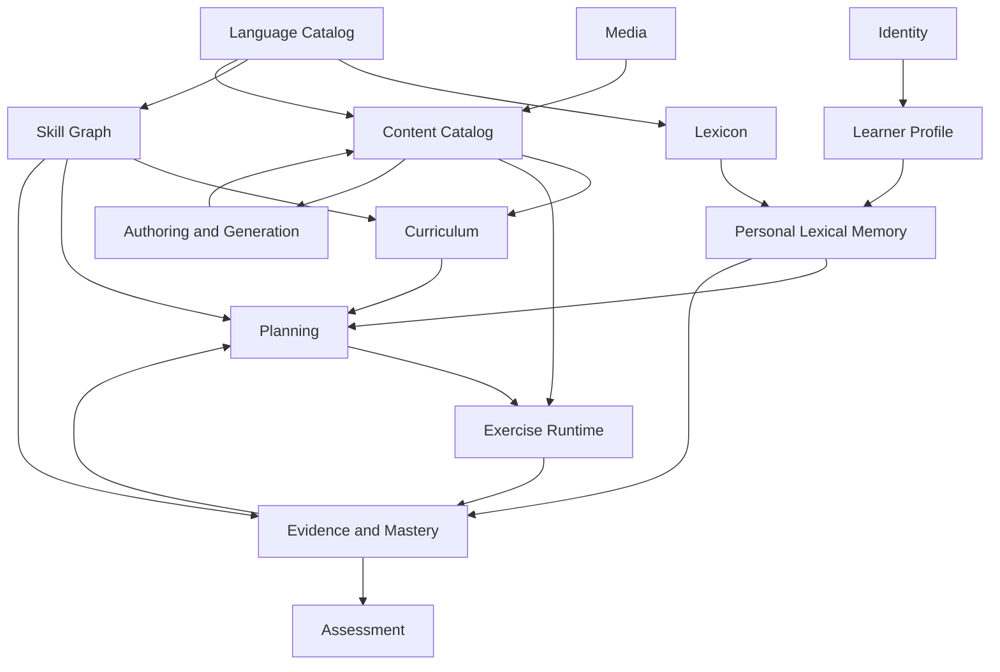
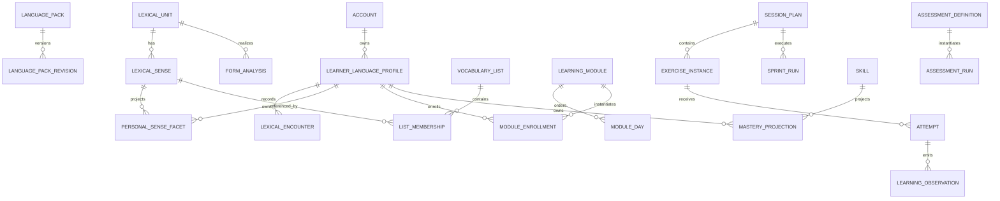

# Polyglot V2 - Modèle métier canonique

## 1. Principes

- Chaque donnée possède un domaine propriétaire.
- Les domaines communiquent par interfaces et identifiants, pas par accès direct
  aux tables d'un voisin.
- Les agrégats protègent les invariants transactionnels.
- Les faits pédagogiques et réponses brutes sont append-only.
- Les projections sont recalculables et versionnées.
- Les contenus publiés sont immuables.
- Les relations métier principales sont relationnelles ; JSON ne porte pas les
  invariants.
- La suppression d'un agrégat privé ne détruit pas un catalogue partagé.

## 2. Contextes et dépendances autorisées

Les cycles du diagramme sont des boucles métier entre exécutions successives,
pas des dépendances de code. `Planning` lit des projections publiées de
`Evidence`; `Evidence` ne dépend pas de l'implémentation de `Planning`.

## 3. Domaine Identity

### Agrégat `Account`

- `account_id` ;
- une ou plusieurs `LoginIdentity` locales ou OIDC ;
- une identité locale conserve identifiant normalisé et hash Argon2id ;
- une identité OIDC conserve issuer et subject opaques ;
- statut `active`, `locked`, `pending_deletion`, `deleted` ;
- rôles ;
- versions de session et de sécurité ;
- dates de création et dernière activité de sécurité.

### Agrégat `UserPreferences`

- `account_id` ;
- locale d'interface ;
- fuseau IANA ;
- heure de bascule pédagogique ;
- durée de sprint préférée ;
- accessibilité ;
- consentements et rétention ;
- préférences média générales.

Identity ne possède aucune progression pédagogique.

## 4. Domaine Learner Profile

### Agrégat `LearnerLanguageProfile`

- `profile_id`, `account_id`, `target_variety_id` ;
- langue maternelle et langues d'appui autorisées ;
- objectifs, intérêts, thèmes exclus ;
- préférence de correction ;
- disponibilité et rythme ;
- statut `onboarding`, `foundations`, `active`, `paused`, `archived`,
  `deleting` ou `deleted` ;
- phase actuelle et module actif éventuel ;
- version de profil pour concurrence optimiste.

Un compte possède au plus un profil actif par variété cible. Un profil archivé
peut être restauré ; sa suppression suit la politique de confidentialité.

### `DeclaredLanguageExperience`

Déclaration personnelle d'une langue connue, d'une expérience et d'un niveau.
Elle fournit du contexte, jamais une preuve de maîtrise.

## 5. Domaine Language Catalog

### Agrégat `LanguagePack`

- identité stable et révisions immuables ;
- variété cible et langues d'appui certifiées ;
- capacités du pack ;
- références aux fondations, graphes, validateurs et politiques ;
- compatibilité avec versions du moteur ;
- statut éditorial.

### `LanguageVariety`

Langue, région, norme, systèmes d'écriture, direction du texte, conventions de
segmentation, formats de locale et capacités média.

Le pack référence les catalogues Lexicon et Skill Graph ; il ne les duplique pas.

## 6. Domaine Lexicon

### Agrégats partagés

- `LexicalUnit` : identité stable et type ;
- `LexicalUnitRevision` : lemme éditorial, descriptions et statut ;
- `LexicalSense` et `LexicalSenseRevision` : grain pédagogique du sens ;
- `FormAnalysis` : surface, morphologie, prononciation et variété ;
- `UsageFrame` : construction, valence, collocation, registre ;
- `Attestation` : exemple sourcé ;
- `RelationAssertion` : arête typée, directionnelle, versionnée et sourcée ;
- `LexiconSource` : origine et droits.

Une forme peut analyser plusieurs unités. Une unité possède plusieurs sens. Une
expression multi-mots est une unité et possède des composants positionnés.

### Relations

- `semantic_edge` : sens vers sens ;
- `lexical_edge` : unité vers unité ;
- `form_realization` : forme vers unité/sens ;
- `expression_component` : expression vers composant ;
- `usage_frame_member` : sens vers cadre d'usage ;
- `translation_assertion` : sens source vers sens cible avec portée.

## 7. Domaine Personal Lexical Memory

### Agrégat `LexicalEncounter`

- `encounter_id`, `profile_id` ;
- révision source et positions exactes ;
- surface présentée ou produite ;
- modalité, rôle et action ;
- analyses candidates et résolution ;
- liens vers session, tentative ou ajout manuel ;
- contexte privé séparé ;
- idempotence de l'ingestion.

### Agrégat `ProductionArtifact`

Réponse brute immuable, média éventuel, langue attendue, consentement et liens
vers analyses/corrections ajoutées.

### `LearningEvidence`

Conclusion atomique issue d'un protocole : cible lexicale, facette, résultat,
indépendance, aide, contexte, délai, confiance et versions responsables.

### Projection `PersonalSenseFacet`

Un enregistrement par profil, sens, modalité, direction et opération. Il contient
état calculé, confiance, preuves, contradictions, dernière activité et prochaine
vérification. Il n'est jamais modifié manuellement.

### Agrégat `MemoryPrompt`

- cible lexicale et protocole de rappel ;
- direction et modalités ;
- `ScheduleState` FSRS ou équivalent ;
- statut canonique `active`, `suspended`, `superseded`, `archived` ou `deleted` ;
- historique `ReviewEvent` append-only.

### Agrégat `LearningNeed`

Dette ciblant sens, forme, collocation, registre, structure ou son. Les causes
sont multiples et dédupliquées. La résolution exige une politique et une preuve.

### Agrégat `VocabularyList`

- identité, propriétaire et langue ;
- type manuel, éditorial ou dynamique ;
- objectif et requête éventuelle ;
- membres ciblant des sens ;
- révisions et snapshots immuables ;
- associations typées aux modules, journées, plans et exercices.

## 8. Domaine Skill Graph

### Agrégat `Skill`

- type modalité, opération, fonction, structure, phonologie, pragmatique ou
  stratégie ;
- cible et portée linguistique ;
- prérequis obligatoires/recommandés ;
- protocoles de preuve autorisés ;
- niveaux de charge ;
- statut éditorial et révision.

### `GrammarStructure`

Fonction, moules, contraintes, contrastes, erreurs typiques, variantes,
préconditions, exemples et contre-exemples. Une structure peut mobiliser
plusieurs compétences mais conserve sa propre identité.

### `SkillPrerequisiteEdge`

Arête typée `required`, `recommended`, `contrast` ou `transfer`. Le sous-graphe
`required` doit être acyclique.

## 9. Domaine Content Catalog

### Agrégat `ContentItem`

Identité stable, type, langue, propriétaire éditorial et lignée.

### `ContentRevision`

- payload typé ;
- schéma et version ;
- provenance ;
- droits ;
- références épinglées ;
- statuts `draft`, `validating`, `validated`, `approved`, `published`,
  `retired`, `superseded`, `rejected` ou `abandoned` ;
- rapports de validation.

Une seule révision publiée active par canal et compatibilité peut exister à un
instant donné. Retirer une révision ne casse aucune tentative historique.

## 10. Domaine Curriculum

### Agrégat `LearningModule`

- identité et révisions ;
- objectifs communicatifs et quatre modalités ;
- prérequis ;
- durée minimale/maximale ;
- arcs contextuels et mission finale ;
- référentiels lexicaux et compétences cibles ;
- journées ordonnées.

### `ModuleDay`

Objectifs, contexte, cibles nouvelles, rappels souhaités, contenu candidat et
contraintes. Ce n'est pas une date civile.

### Agrégat `ModuleEnrollment`

Relation profil-module, révision épinglée, état, position, dates pédagogiques,
dispenses et historique de progression dans l'arc.

## 11. Domaine Planning

### Agrégat `SessionPlan`

- profil, but `daily`, `free`, `foundation` ou `assessment_prep` ;
- budget et politique ;
- snapshot d'entrée : projections, échéances, dettes et module ;
- blocs ordonnés et raisons ;
- snapshots des listes ;
- instances d'exercices ou tâches de préparation ;
- état `draft`, `preparing`, `ready`, `failed`, `expired`, `cancelled` ;
- graine et version du planificateur.

Un plan prêt est immuable. Une régénération produit un nouveau plan et conserve
la lignée.

## 12. Domaine Exercise Runtime

### `ExerciseDefinition`

Contrat publié : primitive, cibles, prérequis, difficulté, entrées, réponse,
aides, correction, observations, accessibilité et langues certifiées.

### `ExerciseInstance`

Stimulus et attentes figés, versions épinglées, cibles effectives, rôle de chaque
élément lexical, politique d'aide et expiration éventuelle.

### Agrégat `SprintRun`

- plan épinglé ;
- profil et journée pédagogique ;
- statut et bloc courant ;
- temps actif ;
- progression confirmée ;
- raisons d'arrêt ou d'interruption.

### Agrégat `Attempt`

- instance, ordinal et état `draft`, `submitted`, `correcting`, `corrected` ou
  `not_evaluable` ;
- réponse brute ;
- aides ;
- horodatages actifs ;
- soumission idempotente ;
- corrections versionnées ;
- observations émises.

`ExerciseBlockRun` porte `pending`, `available`, `in_progress`, `completed`,
`skipped`, `abandoned` ou `unavailable`. `CorrectionCase` porte contestation et
revue. Interruption appartient à `SprintRun`, jamais à `Attempt`.

## 13. Domaine Evidence and Mastery

### `LearningObservation`

Fait append-only ciblant une compétence ou facette lexicale : protocole,
résultat, qualité, indépendance, contexte, délai, correction et confiance.

### Projection `MasteryProjection`

Par profil et compétence : état, confiance, fraîcheur, diversité, preuves,
contradictions et prochaine vérification.

### `Recommendation`

Projection éphémère ou persistée avec cible, raison, preuve manquante, urgence,
activité proposée et version de politique.

## 14. Domaine Assessment

### `AssessmentDefinition`

Modalité, protocole, matrice de couverture, difficulté, banque d'items, règles de
sécurité, temps, aides autorisées, grille et règles de formes parallèles.

### Agrégat `AssessmentRun`

Profil, définition/révision, snapshot des cibles, sections, minuteur serveur,
état, reprises, réponses et résultat.

### `AssessmentEvidence`

Preuve explicitement liée à la modalité et aux facettes mesurées. Le résultat
global est une projection, pas une validation automatique d'un niveau inférieur.

## 15. Domaines Authoring, Generation et Media

### `GenerationJob`

But, contrat, empreinte d'entrée, auteur cible, statut, limites et lignée.

### `GenerationAttempt`

Fournisseur/auteur, modèle, versions prompt/outils, paramètres, sortie brute,
coût, latence, erreur et brouillon résultant.

### `MediaAsset`

Checksum, type, stockage, droits, langue, durée, variantes, transcription,
segments et statut de disponibilité. Une ressource externe est représentée par
une référence vérifiable et peut devenir indisponible sans casser le contenu.

## 16. Cardinalités centrales

## 17. Suppression et archivage

- Supprimer un compte déclenche une procédure asynchrone auditée.
- Archiver une langue rend son profil inactif sans effacer les faits.
- Supprimer une langue efface ou anonymise ses données privées selon la politique
  approuvée, sans supprimer les catalogues partagés.
- Une liste peut être archivée ; un snapshot historique reste référencé.
- Une révision publiée est retirée, jamais effacée si elle est référencée.
- Un contexte privé peut être supprimé indépendamment ; les preuves restantes ne
  doivent pas permettre de reconstruire ce contexte.
- Un média sans droit de conservation est supprimé et marqué indisponible.
- Les événements de sécurité suivent une rétention distincte.

## 18. Invariants normatifs

1. Un compte actif possède un identifiant de connexion unique.
2. Un compte possède au plus un profil actif par variété cible.
3. Toute langue d'appui est explicitement autorisée par l'utilisateur.
4. Une déclaration d'expérience n'est jamais une preuve.
5. Un identifiant lexical ne dépend jamais uniquement d'une chaîne.
6. Une forme peut avoir plusieurs analyses concurrentes.
7. Une traduction est une assertion directionnelle et qualifiée.
8. Une expression et ses composants ont des identités distinctes.
9. Une arête lexicale possède provenance et confiance.
10. Une arête lexicale ne propage jamais une maîtrise.
11. Une rencontre ne prouve ni attention ni compréhension.
12. Toute rencontre épingle sa source et ses positions.
13. Toute réponse brute est immuable après soumission confirmée.
14. Une correction est ajoutée et peut être remplacée sans réécrire la réponse.
15. Une observation incertaine ne devient ni succès ni échec.
16. Une preuve cible uniquement les facettes réellement testées.
17. Une liste référence des sens ; elle ne copie pas leurs définitions.
18. Un snapshot de liste utilisé par une session est immuable.
19. Une dette n'est pas résolue par sa simple planification.
20. Une dette fusionne ses causes sans dupliquer sa cible active.
21. FSRS est mis à jour uniquement par un protocole de rappel compatible.
22. Une production incidente ne simule pas une révision FSRS.
23. Le graphe de prérequis obligatoires est acyclique.
24. Une structure non prérequise ne peut être ciblée par un sprint guidé.
25. Une révision publiée est immuable.
26. Une tentative épingle toutes les révisions ayant influencé son verdict.
27. Un plan prêt est immuable.
28. Une régénération crée un nouveau plan lié au précédent.
29. Un profil ne possède qu'un sprint quotidien actif par journée pédagogique.
30. Une soumission idempotente ne crée qu'une tentative finale.
31. Saut, abandon, indisponibilité et interruption sont des résultats distincts.
32. Une évaluation ne met à jour que les modalités mesurées.
33. Une reprise d'évaluation ne réinitialise pas silencieusement son minuteur.
34. Une correction défectueuse peut invalider ses observations dérivées.
35. Une projection est reconstructible depuis faits et politiques versionnées.
36. Aucun pourcentage de langue n'existe sans référentiel borné.
37. Une recommandation conserve sa raison et la preuve manquante.
38. Un LLM ne publie jamais directement un contenu.
39. Un échec fournisseur ne devient jamais un succès pédagogique.
40. Aucun fallback fournisseur n'est silencieux.
41. Une commande concurrente utilise une version attendue.
42. Une commande idempotente avec payload différent est rejetée.
43. Une suppression privée ne supprime aucun catalogue partagé.
44. Une opération destructive possède audit et portée explicite.
45. Les droits d'un média sont connus avant publication.
46. Toute traversée de graphe est bornée.
47. Toute journée pédagogique est calculée depuis le fuseau du profil.
48. Un jour manqué ne consomme aucune journée de module automatiquement.
49. Une activité consultée sans tentative ne produit aucune maîtrise.
50. Une fonctionnalité V1 conservée possède une destination V2 explicite.
