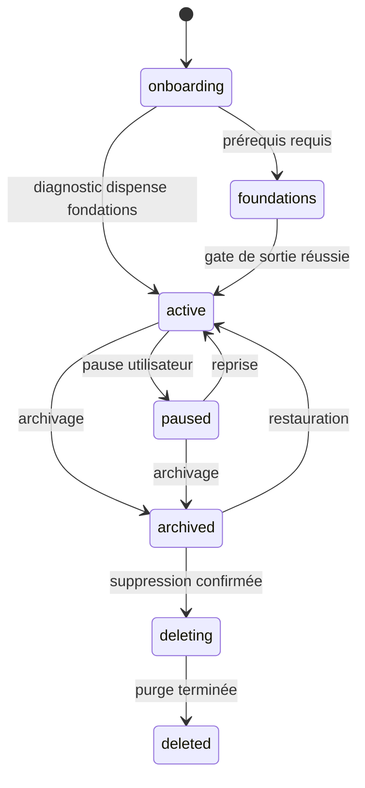
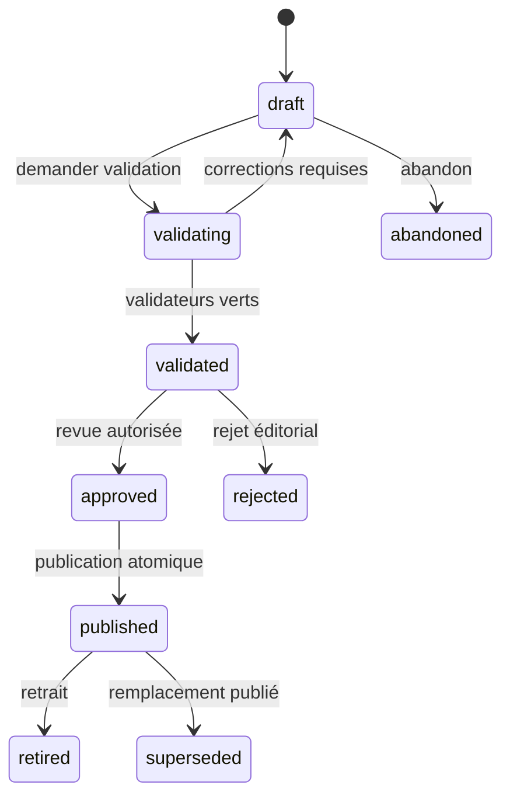
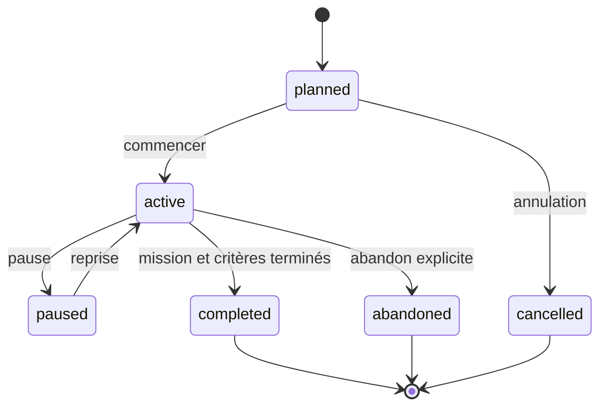
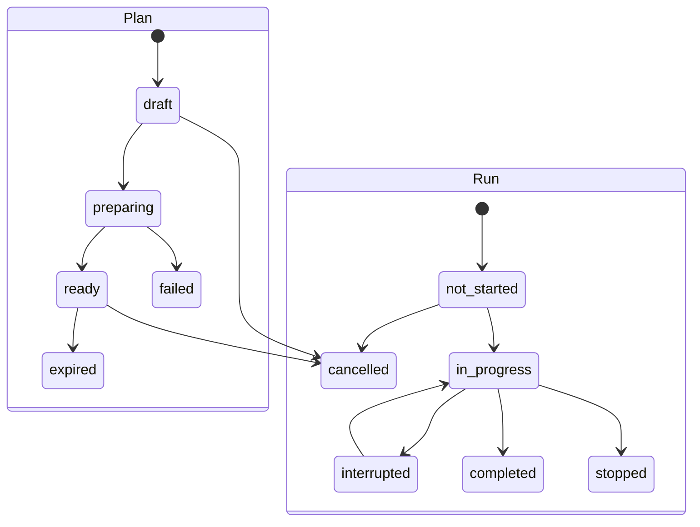
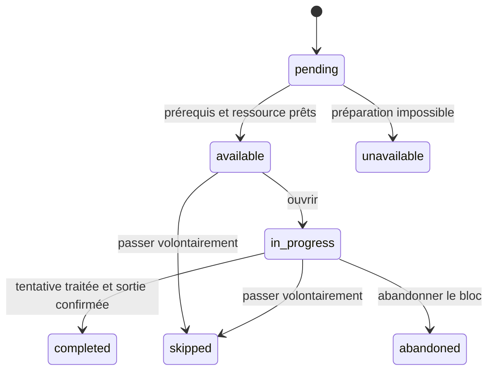
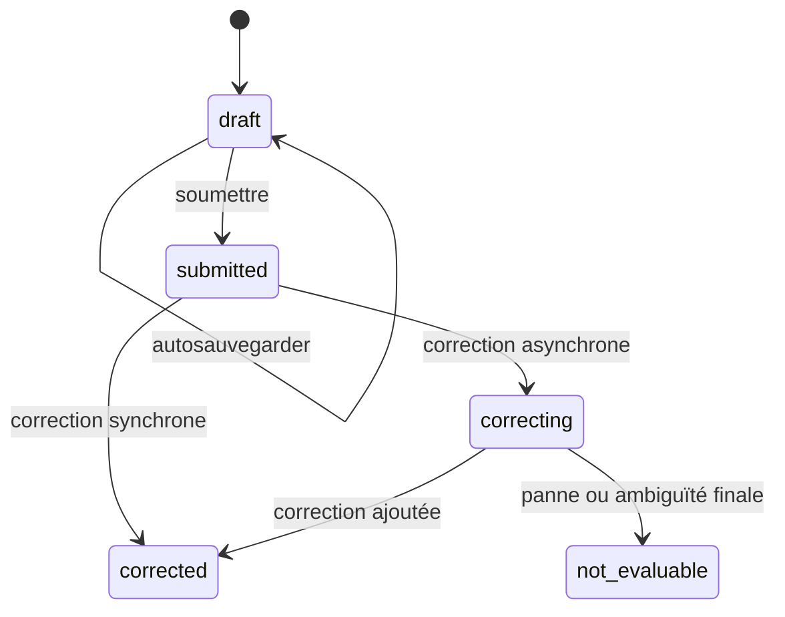
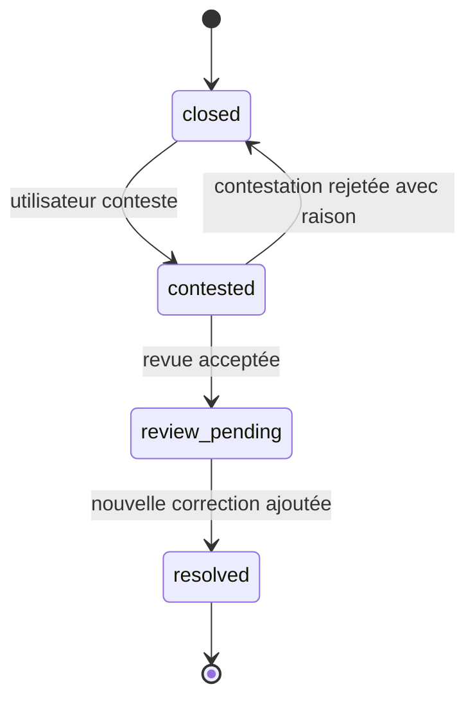
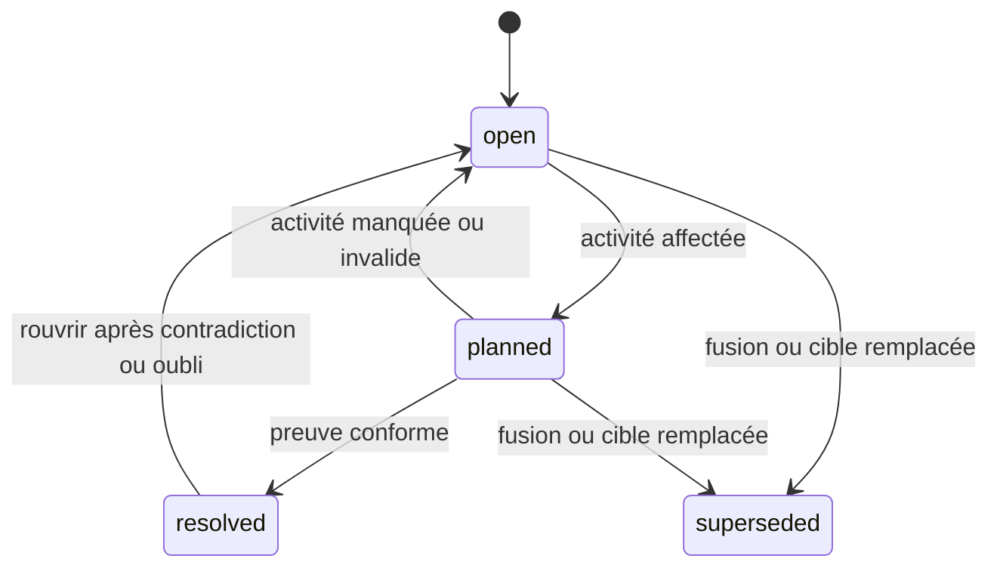
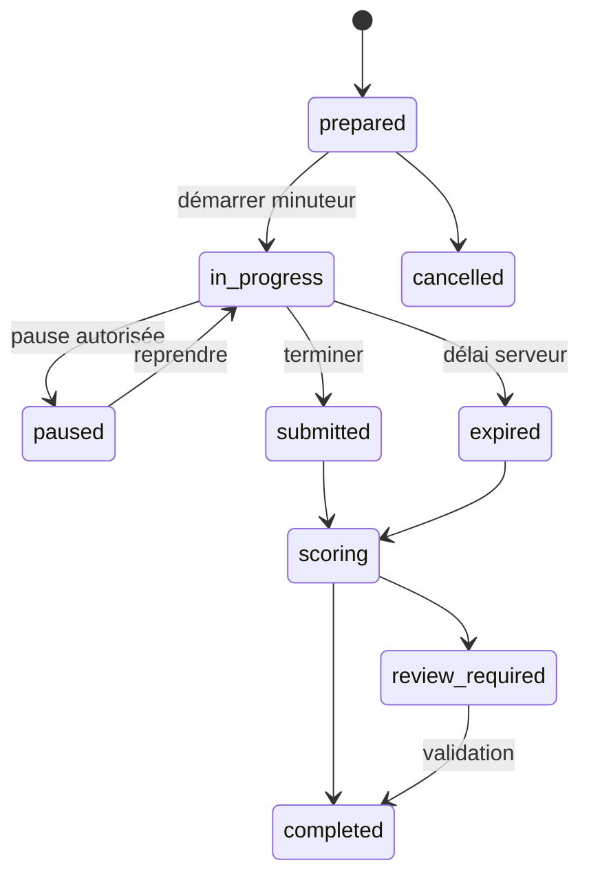
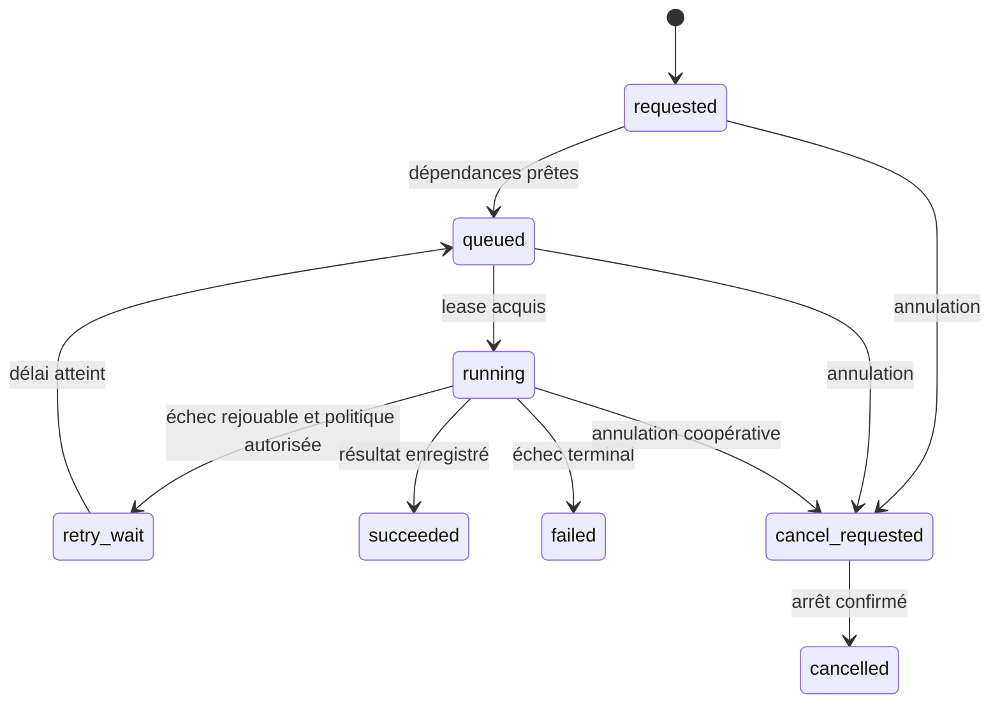

# Polyglot V2 - États, commandes, événements et erreurs

## 1. Modèle de mutation

Toute mutation passe par une commande authentifiée. Une commande :

- cible un agrégat ou en crée un ;
- possède `command_id`, `idempotency_key`, empreinte du payload, acteur,
  corrélation, version attendue et horodatage de réception ;
- vérifie autorisation, état et invariants ;
- modifie l'état et écrit ses événements dans une transaction ;
- ajoute les publications asynchrones à l'outbox ;
- retourne un résultat stable lors d'un rejeu identique ;
- rejette la réutilisation de la clé avec un payload différent.

Les événements pédagogiques ne sont jamais supprimés pour corriger une erreur :
un événement de révision, invalidation ou remplacement est ajouté.

## 2. Enveloppe d'événement

Champs obligatoires :

- `event_id` UUIDv7 ;
- `event_type` et `schema_version` ;
- `aggregate_type`, `aggregate_id`, `aggregate_version` ;
- `actor_type`, `actor_id` ;
- `profile_id` lorsque pertinent ;
- `occurred_at` et `recorded_at` UTC ;
- `correlation_id`, `causation_id`, `command_id` ;
- payload typé ;
- classification de confidentialité ;
- versions de politique ou contenu ayant déterminé le fait.

## 3. Machines d'état

### 3.1 Profil linguistique

### 3.2 Contenu

Une révision ne recule jamais de `published` vers `draft`. Toute correction crée
une nouvelle révision.

### 3.3 Module et inscription

### 3.4 Plan de session et sprint

Un plan `ready` est figé. Un run ne peut cibler qu'un plan `ready` non expiré.

### 3.5 Bloc, tentative et correction

`ExerciseBlockRun` porte la progression du sprint :

`Attempt` porte uniquement la réponse à une instance :

`CorrectionCase` porte la contestation et la revue :

Une correction est une révision immuable, pas un état mutable. Une nouvelle
correction devient courante et invalide/remplace logiquement les observations
dérivées. Interrompre le sprint change `SprintRun` vers `interrupted` ; le bloc
reste `in_progress` et la tentative `draft`. L'expiration appartient au plan ou
à une évaluation, pas à une tentative d'entraînement.

`skipped`, `abandoned`, `unavailable`, `interrupted` et `not_evaluable` ont des
effets différents et ne sont jamais regroupés en « non terminé ».

### 3.6 Dette

### 3.7 Évaluation

La politique de chaque évaluation précise si `paused` est autorisé. Le temps
restant est calculé côté serveur.

### 3.8 Jobs, dont génération

Le brouillon produit suit ensuite la machine `content_revision_status`; il
n'ajoute pas d'états au job. Une tentative fournisseur est un journal
append-only attaché au job, pas une troisième machine implicite.

## 4. Catalogue des commandes

Les noms PascalCase ci-dessous désignent les classes métier dans la
documentation. Sur le fil, `event_type` utilise le `lower_snake_case` du
registre 25. Le registre 25 est exhaustif pour les commandes HTTP ; les
commandes internes y sont cataloguées séparément sans route publique.

### Identity et profils

| Commande | Effet principal | Événements |
|---|---|---|
| `RegisterAccount` | crée un compte | `AccountRegistered` |
| `AuthenticateSession` | crée une session serveur | `SessionAuthenticated` |
| `ChangePassword` | remplace hash et invalide sessions | `PasswordChanged`, `SessionsRevoked` |
| `UpdateUserPreferences` | modifie préférences versionnées | `UserPreferencesUpdated` |
| `CreateLanguageProfile` | crée profil unique | `LanguageProfileCreated` |
| `UpdateLearningGoals` | modifie objectifs futurs | `LearningGoalsUpdated` |
| `PauseLanguageProfile` | suspend planification | `LanguageProfilePaused` |
| `ArchiveLanguageProfile` | archive sans purge | `LanguageProfileArchived` |
| `DeleteLanguageProfile` | lance purge privée | `LanguageProfileDeletionRequested` |

### Lexique et Word Bank

| Commande | Effet principal | Événements |
|---|---|---|
| `ImportLexicalSource` | crée source et révision | `LexicalSourceImported` |
| `AnalyzeSource` | produit mentions candidates | `SourceAnalysisCompleted` |
| `RecordLexicalEncounter` | ajoute occurrence idempotente | `LexicalEncounterRecorded` |
| `ResolveMention` | confirme ou conteste analyse | `MentionResolved` ou `MentionDisputed` |
| `AddPrivateLexicalUnit` | crée candidat privé | `PrivateLexicalUnitAdded` |
| `AssertLexicalRelation` | ajoute assertion sourcée | `LexicalRelationAsserted` |
| `RetractLexicalRelation` | retire assertion | `LexicalRelationRetracted` |
| `MergeLexicalUnits` | crée lignée de fusion | `LexicalUnitsMerged` |
| `SplitLexicalSense` | crée nouveaux sens liés | `LexicalSenseSplit` |
| `DeletePrivateContext` | purge contexte reconstructible | `PrivateContextDeleted` |
| `CreateVocabularyList` | crée liste | `VocabularyListCreated` |
| `ReviseVocabularyList` | crée révision | `VocabularyListRevised` |
| `FreezeVocabularyList` | crée snapshot | `VocabularyListSnapshotCreated` |
| `CreateMemoryPrompt` | active protocole mémoire | `MemoryPromptCreated` |
| `SubmitMemoryReview` | ajoute revue et planifie | `MemoryReviewRecorded` |
| `OpenLearningNeed` | crée/fusionne dette | `LearningNeedOpened` ou `LearningNeedCauseAdded` |
| `ResolveLearningNeed` | ferme sur preuve | `LearningNeedResolved` |

### Contenu et curriculum

| Commande | Effet principal | Événements |
|---|---|---|
| `CreateContentDraft` | crée identité et brouillon | `ContentDraftCreated` |
| `ReviseContentDraft` | ajoute nouvelle révision | `ContentDraftRevised` |
| `ValidateContentRevision` | exécute validateurs | `ContentValidated` ou `ContentValidationFailed` |
| `ApproveContentRevision` | approuve | `ContentApproved` |
| `PublishContentRevision` | publie atomiquement | `ContentPublished` |
| `RetireContentRevision` | retire | `ContentRetired` |
| `CreateLearningModule` | crée module brouillon | `LearningModuleCreated` |
| `PublishLearningModule` | publie révision complète | `LearningModulePublished` |
| `EnrollInModule` | crée inscription | `ModuleEnrollmentCreated` |
| `PauseModuleEnrollment` | suspend | `ModuleEnrollmentPaused` |
| `CompleteModuleEnrollment` | clôture | `ModuleEnrollmentCompleted` |

### Planification et exécution

| Commande | Effet principal | Événements |
|---|---|---|
| `ComposeDailySession` | crée plan déterministe | `SessionPlanComposed` |
| `ComposeFreePractice` | crée plan libre | `FreePracticePlanComposed` |
| `PrepareSessionPlan` | résout instances/assets | `SessionPlanReady` ou `SessionPlanFailed` |
| `CancelSessionPlan` | annule avant/durant préparation | `SessionPlanCancelled` |
| `StartSprintRun` | crée run unique du jour | `SprintRunStarted` |
| `ResumeSprintRun` | reprend état confirmé | `SprintRunResumed` |
| `StopSprintRun` | arrête volontairement | `SprintRunStopped` |
| `CompleteSprintRun` | clôture blocs | `SprintRunCompleted` |
| `OpenExerciseAttempt` | crée tentative | `ExerciseAttemptOpened` |
| `SaveAttemptDraft` | sauvegarde réponse non finale | `AttemptDraftSaved` |
| `UseExerciseHint` | trace aide | `ExerciseHintUsed` |
| `SubmitExerciseAttempt` | fige réponse | `ExerciseAttemptSubmitted` |
| `CorrectExerciseAttempt` | ajoute correction | `ExerciseAttemptCorrected` ou `AttemptNonEvaluable` |
| `ReviewCorrection` | trace consultation | `CorrectionReviewed` |
| `ContestCorrection` | ouvre revue | `CorrectionContested` |
| `SkipExerciseBlock` | passe bloc | `ExerciseBlockSkipped` |
| `AbandonExerciseBlock` | abandon explicite | `ExerciseBlockAbandoned` |

### Évaluation et génération

| Commande | Effet principal | Événements |
|---|---|---|
| `PrepareAssessment` | fige forme et cibles | `AssessmentPrepared` |
| `StartAssessment` | démarre minuteur | `AssessmentStarted` |
| `SaveAssessmentResponse` | sauvegarde | `AssessmentResponseSaved` |
| `SubmitAssessment` | fige réponses | `AssessmentSubmitted` |
| `ScoreAssessment` | ajoute résultat | `AssessmentScored` ou `AssessmentReviewRequired` |
| `ResumeAssessment` | reprend selon politique | `AssessmentResumed` |
| `RequestGenerationJob` | crée travail | `GenerationJobRequested` |
| `StartGenerationAttempt` | démarre tentative | `GenerationAttemptStarted` |
| `SubmitGeneratedDraft` | attache sortie | `GeneratedDraftSubmitted` |
| `FailGenerationAttempt` | classe erreur | `GenerationAttemptFailed` |
| `CancelGenerationJob` | annule | `GenerationJobCancelled` |

## 5. Requêtes publiques principales

- `GetCurrentUser`, `GetUserPreferences` ;
- `ListLanguageProfiles`, `GetLanguageProfile` ;
- `GetOnboardingState`, `GetDiagnosticSummary` ;
- `SearchLexicon`, `GetLexicalSense`, `GetSenseNeighborhood` ;
- `GetWordBankOverview`, `ExplainLexicalKnowledgeState` ;
- `ListLexicalEncounters`, `ListUnresolvedMentions` ;
- `ListVocabularyLists`, `GetVocabularyList`, `PreviewDynamicList` ;
- `ListDueMemoryPrompts`, `ListLearningNeeds` ;
- `GetCurrentModule`, `GetModuleTimeline` ;
- `GetTodayPlan`, `ExplainSessionSelection`, `GetActiveSprintRun` ;
- `GetExerciseInstance`, `GetAttempt`, `GetCorrection` ;
- `GetProgressOverview`, `ExplainMasteryState`, `ListRecommendations` ;
- `ListAssessments`, `GetAssessmentRun`, `GetAssessmentResult` ;
- `GetGenerationJob`, `ListContentDrafts`, `GetValidationReport` ;
- `GetTtsCapabilities`, `GetMediaAvailability`.

Toutes les listes sont paginées. Les requêtes de graphe imposent profondeur,
types d'arêtes et plafond de noeuds.

## 6. Taxonomie d'erreurs

Format stable : `code`, `message_key`, `details`, `correlation_id`,
`retryable`, `field_errors` éventuelles.

| Famille | Exemples | Rejouable |
|---|---|---|
| Authentification | `unauthenticated`, `session_expired` | après authentification |
| Autorisation | `forbidden`, `role_required` | non |
| Validation | `validation_failed`, `schema_mismatch` | après correction |
| Conflit | `version_conflict`, `idempotency_conflict` | selon nouvelle lecture |
| État | `invalid_transition`, `plan_expired` | non ou nouvelle commande |
| Ressource | `not_found`, `content_retired` | non |
| Pédagogie | `prerequisite_missing`, `not_evaluable` | selon contexte |
| Fournisseur | `dependency_unavailable`, `media_unavailable` | seulement par politique |
| Limite | `rate_limited`, `quota_exceeded` | après délai explicite |
| Interne | `internal_error` | inconnu, aucune répétition client aveugle |

Un correcteur indisponible retourne un état non évaluable ; il ne transforme pas
la tentative en réussite ou en échec.

## 7. Concurrence et reprise

- Une version d'agrégat est exigée sur toute mise à jour non commutative.
- Les ajouts append-only utilisent idempotence et contraintes d'unicité.
- Deux démarrages de sprint pour le même profil/jour retournent le même run actif
  ou un conflit explicite.
- Deux soumissions finales identiques retournent le même résultat.
- Deux soumissions différentes pour la même tentative finale provoquent un
  conflit, sans écraser la première.
- Une autosauvegarde antérieure ne peut remplacer une version plus récente.
- Un worker réclame un job avec lease ; un lease expiré peut être repris.
- Une tâche fournisseur en état inconnu est réconciliée avant retry.
- Les projections mémorisent le dernier événement appliqué et peuvent être
  reconstruites.

## 8. Horloge et journée pédagogique

- Les événements utilisent UTC.
- Le `pedagogical_day` est calculé avec fuseau et heure de bascule du profil.
- Un changement de fuseau ne déplace pas rétroactivement les runs terminés.
- Un sprint interrompu avant la bascule reste reprenable selon sa politique
  d'expiration ; après expiration, un nouveau plan conserve les dettes.
- Un jour sans activité ne fait pas avancer automatiquement `ModuleDay`.
