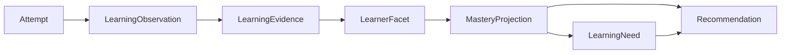

# Polyglot V2 - Preuves, maîtrise, diagnostic et recommandations

## 1. Chaîne normative



- Une tentative conserve l'interaction brute.
- Une observation décrit ce que le protocole et la correction permettent de
  constater.
- Une preuve est une observation recevable, positive, négative ou inconclusive.
- Une facette est `cible × modalité × opération × direction/critère`.
- Une projection résume les preuves avec une politique versionnée.
- Une dette cible une remédiation ; une recommandation propose une action.

Une tentative peut produire plusieurs observations, mais chaque observation
doit déclarer exactement ce qui était testé. La somme des poids provenant d'une
même opportunité est plafonnée par facette afin d'éviter de multiplier
artificiellement une réussite.

## 2. Éligibilité d'une preuve

Une observation est éligible seulement si :

- la cible était discriminante ou explicitement requise ;
- le protocole permettait réellement de l'observer ;
- la réponse a été soumise ;
- la correction est disponible et suffisamment fiable ;
- les aides sont connues ;
- la version du contenu et du correcteur est épinglée ;
- l'opportunité n'est pas un rejeu identique déjà compté ;
- aucune contestation bloquante n'est ouverte.

Règles :

- exposition, consultation ou appartenance à une liste : poids nul ;
- réponse révélée : aucune preuve de rappel autonome ;
- QCM : preuve faible corrigée du hasard, jamais suffisante seule ;
- mot fourni dans une Gym : aucune preuve de rappel lexical ;
- usage spontané correct : preuve de production possible ;
- omission d'un mot facultatif : aucune preuve négative ;
- correction incertaine : `inconclusive` ;
- shadowing : prononciation/rythme, pas compréhension ou rappel du sens ;
- une erreur sur une cible nouvelle non enseignée n'ouvre pas automatiquement
  une dette ;
- une correction révisée remplace logiquement les preuves dérivées sans modifier
  tentative ou observation initiales.

## 3. Pipeline chiffré unique

Politique initiale `MASTERY_V0`, explicitement calibrable. Le document 12 est le
seul propriétaire du calcul `tentative -> observation`. Il fournit pour chaque
cible :

- `observation_value` dans `[-1, 1]`, déjà pondéré par opération, verdict, aide,
  confiance de correction et couverture de cible ;
- `correction_confidence` dans `[0, 1]` à des fins d'explication ;
- `opportunity_id`, contexte, session et délai.

La progression ne réapplique jamais ces facteurs. Elle convertit seulement une
observation éligible en preuve :

```text
evidence_mass = clamp(source_weight × independence_weight, 0, 1)
evidence_score = clamp((observation_value + 1) / 2, 0, 1)

mastery_base = clamp(
  (prior_mass × prior_score + Σ(evidence_mass × evidence_score))
  / (prior_mass + Σevidence_mass),
  0,
  1
)
```

Valeurs `V0` : `prior_mass = 2`, `prior_score = 0.50`.
`independence_weight` vaut `1.00` pour une opportunité indépendante, `0.50`
pour une variante fortement corrélée et `0.00` pour un rejeu identique. Une
même `opportunity_id` ne contribue qu'une fois, avec sa correction courante.

### Poids de source

| Source | Poids `V0` |
|---|---:|
| Évaluation valide | 1.00 |
| Sprint planifié | 0.90 |
| Fondations guidées | 0.90 |
| Entraînement libre | 0.75 |
| Diagnostic adaptatif | 0.70 |
| Déclaration ou exposition | 0.00 |

Une preuve indirecte vers un parent possède un poids maximal de `0.25` et ne
satisfait jamais les gates `reliable` ou `mastered`.

## 4. Fraîcheur et oubli

La décroissance affecte l'estimation de disponibilité courante, jamais les faits
historiques. Pour éviter toute dépendance circulaire :

1. calculer `mastery_base` ;
2. déterminer un `gate_candidate` avec les seuils, comptes, délais et diversités,
   sans fraîcheur ;
3. choisir l'horizon du candidat ;
4. calculer la fraîcheur et l'état courant.

Horizons initiaux :

- `in_progress` : 3 jours ;
- `reliable` : 21 jours ;
- `mastered` : 60 jours ;
- plancher compréhension : 0.55 ;
- plancher production : 0.40.

```text
freshness = clamp(2 ^ (-age_days / horizon_days), 0, 1)
mastery_current = clamp(
  mastery_base × (retention_floor + (1 - retention_floor) × freshness),
  0,
  1
)

effective_mass = Σevidence_mass
context_diversity = min(distinct_context_families / 3, 1)
session_diversity = min(distinct_pedagogical_sessions / 3, 1)
delay_diversity = min(distinct_delay_bands / 3, 1)

confidence = clamp(
  (1 - exp(-effective_mass / 3))
  × (0.40 + 0.20 × context_diversity
          + 0.20 × session_diversity
          + 0.20 × delay_diversity)
  × (0.75 + 0.25 × freshness),
  0,
  1
)
```

La confiance de correction n'est pas multipliée ici : le document 12 l'a déjà
intégrée dans `observation_value` et a rejeté les corrections sous le seuil
d'éligibilité. La réappliquer diminuerait deux fois la même preuve.

Sans preuve éligible, la projection utilise les valeurs techniques déterministes
`mastery_base=0.50`, `mastery_current=0.50`, `confidence=0`, `freshness=0` et
`effective_mass=0`. Elles ne sont jamais affichées comme un niveau ni incluses
dans une moyenne : le statut reste `non_observed`, `discovered` ou
`not_evaluable` selon les faits disponibles.

Bandes de délai `V0` : même session, `24 h à 6 j`, `7 j ou plus`. Une preuve
dont la correction est déterministe et entièrement vérifiable possède une
confiance de correction `1.00`.

Ces valeurs sont versionnées et calibrées sur le pilote. FSRS reste le moteur de
planification des invites mémoire ; il ne remplace pas ce modèle de compétences.

## 5. États de maîtrise

| État | Gate initiale `V0` |
|---|---|
| `non_observed` | aucun fait ou aucune preuve |
| `discovered` | exposition, mais aucune preuve éligible |
| `in_progress` | au moins une preuve, gates supérieures non atteintes |
| `reliable` | maîtrise ≥ 0.75, confiance ≥ 0.60, 3 réussites indépendantes, 2 sessions, 2 contextes, contrôle après 24 h |
| `mastered` | maîtrise ≥ 0.85, confiance ≥ 0.75, 5 réussites, 3 sessions, 3 contextes, un transfert et contrôle après 7 jours |
| `review_due` | ancien état `reliable`/`mastered` avec fraîcheur < 0.50 ou deux échecs directs récents |
| `not_evaluable` | protocole invalide, correction ambiguë ou contradiction bloquante |

Les seuils sont des valeurs initiales et non des faits scientifiques. Modifier la
politique recalcule les projections, sans réécrire les preuves.

### 5.1 Projection des quatre modalités

La page Progression n'additionne pas des exercices. Pour chaque modalité et une
révision de référentiel, elle sélectionne l'ensemble des facettes attendues
`T_m`, avec un poids éditorial `w_i`. Seules les projections ayant au moins une
preuve éligible entrent dans le numérateur :

```text
eligible_weight = Σ(i in T_m) w_i
observed_weight = Σ(i observed in T_m) w_i
modality_coverage = observed_weight / eligible_weight

modality_score = Σ(w_i × mastery_current_i × confidence_i)
                 / Σ(w_i × confidence_i)
modality_confidence = clamp(
  modality_coverage
  × Σ(w_i × confidence_i) / eligible_weight,
  0, 1
)
modality_freshness = Σ(w_i × confidence_i × freshness_i)
                     / Σ(w_i × confidence_i)
```

Un dénominateur nul donne `non_observed`, jamais zéro. Une projection de modalité
est `not_evaluable` seulement si des tentatives existent mais qu'aucune preuve
valide ne peut être produite. Les gates `MODALITY_PROJECTION_V0` sont :

| État | Conditions supplémentaires |
|---|---|
| `discovered` | exposition dans la modalité, aucune preuve éligible |
| `in_progress` | au moins une preuve éligible, gate supérieure non atteinte |
| `reliable` | score >= 0.75, confiance >= 0.60, couverture >= 0.70, au moins 3 familles et 2 sessions dont une preuve après 24 h, aucune facette bloquante sous `in_progress` |
| `mastered` | score >= 0.85, confiance >= 0.75, couverture >= 0.85, transfert après 7 jours, aucune facette bloquante sous `reliable` |
| `review_due` | anciennement fiable/maîtrisée et fraîcheur < 0.50, ou plus de 30 % du poids requis devenu périmé |

Les quatre modalités restent un vecteur : elles ne sont jamais moyennées en un
score global. Un `AssessmentResult` est un snapshot indépendant, affiché à côté
de cette projection continue avec sa date, sa forme et sa confiance.

### Exemples reproductibles

**Une production correcte isolée.** `observation_value = 0.75`, source sprint
`0.90`, indépendance `1.00`. `evidence_score = 0.875`, masse `0.90`, donc
`mastery_base = (1 + 0.90 × 0.875) / 2.90 = 0.616`. L'état reste `in_progress`.

**Trois productions correctes indépendantes sans aide.** Valeurs `0.75`, trois
sessions sprint, trois contextes :
`mastery_base = (1 + 3 × 0.90 × 0.875) / 4.70 = 0.716`. Malgré les comptes,
le seuil `0.75` n'est pas atteint : l'état reste `in_progress`.

**Ajout d'un transfert réussi.** `observation_value = 1.00`, source sprint
`0.90` : `mastery_base = (1 + 2.3625 + 0.90) / 5.60 = 0.761`. Si confiance,
sessions, contextes et contrôle différé sont satisfaits, l'état peut devenir
`reliable`, mais pas `mastered` faute de cinq réussites et de contrôle à sept jours.

**Échec direct ultérieur.** `observation_value = -0.75`, donc score `0.125` et
masse `0.90` : `mastery_base = (4.2625 + 0.1125) / 6.50 = 0.673`. La preuve
négative reste visible et peut ouvrir une dette ; elle ne supprime aucune preuve.

## 6. Contradictions et contestations

- Une preuve négative récente ne supprime pas une preuve positive ancienne.
- Les deux restent visibles dans la projection.
- Une contestation suspend l'éligibilité des preuves liées à la correction.
- Une correction remplacée invalide ses preuves dérivées et en produit de
  nouvelles si possible.
- Une cible mal définie peut être marquée défectueuse ; ses observations sont
  exclues des projections tout en restant auditables.
- Un état `not_evaluable` ne crée aucune dette automatique.

## 7. Diagnostic initial

### Étapes

1. Auto-positionnement et objectifs.
2. Vérification des fondations.
3. Échantillonnage adaptatif de compréhension écrite.
4. Échantillonnage adaptatif de compréhension orale si média disponible.
5. Micro-production écrite.
6. Oral simulé ou état non évaluable.
7. Conversation textuelle guidée, utilisée comme échantillon et non examen.
8. Synthèse : classification, profil par modalité, confiance et lacunes.

### Règles d'arrêt

- minimum de deux opportunités par facette déclarée ;
- arrêt positif après couverture minimale et faible incertitude ;
- arrêt négatif lorsque trois niveaux consécutifs de difficulté échouent ;
- maximum 25 minutes par défaut ;
- l'utilisateur peut interrompre et reprendre sous 24 heures ;
- les cibles non testées restent `non_observed` (label UI « Non observé »).

### Classification `DIAGNOSTIC_V0`

- **débutant** : fondations < 0.40, réception < 0.45 et aucune production
  exploitable ;
- **faux débutant** : exposition ou réception partielle sans satisfaire le seuil
  intermédiaire ;
- **intermédiaire** : fondations bloquantes ≥ 0.80, lecture ≥ 0.65,
  écriture ≥ 0.55, confiance sur ces axes ≥ 0.55 et aucun blocage. Écoute et
  oral sont reportés séparément ; une modalité non évaluable ne bloque pas
  l'orientation, mais reste inconnue et réduit la portée de la conclusion ;
- **indéterminé** : données insuffisantes ou modalités essentielles non
  évaluables.

Cette classification choisit un parcours. Elle n'est pas une étiquette CECR.

## 8. Fondations italiennes

### Bloc F1 - Graphèmes et sons

- valeurs régulières des voyelles ;
- `c/ch`, `g/gh`, `sc/sch`, `gn`, `gli`, `qu` ;
- discrimination et lecture de mots contrôlés.

### Bloc F2 - Rythme et accent

- accent tonique ;
- consonnes doubles ;
- enchaînement syllabique ;
- écoute et répétition contrastive.

### Bloc F3 - Interaction minimale

- salutations ;
- présentation ;
- politesse ;
- comprendre/répondre à une demande très courte.

### Bloc F4 - Châssis fondamentaux

- identité avec `essere` ;
- possession/besoin avec `avere` et `avere bisogno di` ;
- existence avec `c'è/ci sono` ;
- volonté et demande avec `voglio`, `vorrei`, `posso` ;
- questions minimales.

### Bloc F5 - Stratégies de réparation

- demander de répéter ou ralentir ;
- signaler qu'on ne comprend pas ;
- épeler ou reformuler ;
- utiliser une périphrase simple.

### Gate de sortie `FOUNDATIONS_IT_V0`

- facettes bloquantes : discrimination graphème-son, lecture contrôlée,
  reconnaissance de salutations, choix d'un châssis fonctionnel et réparation
  écrite/guidée ; toutes doivent être au moins `reliable` ;
- activités réparties sur au moins deux sessions ;
- contrôle différé de 24 heures ;
- discrimination graphème/son : 8/10 ;
- lecture ciblée : 8/10 ;
- échanges de survie : 4/5 sans révélation ;
- production phonologique et interaction orale sont recommandées mais non
  bloquantes avant correcteur qualifié ; si non corrigeables, elles restent
  `not_evaluable`, jamais auto-validées.

Une dispense diagnostic crée des preuves de diagnostic ; elle ne marque pas tout
le contenu inférieur comme maîtrisé.

## 9. Recommandations

Score initial `RECOMMENDATION_V0` :

```text
priority = 0.30 prerequisite_block
         + 0.25 forgetting_risk
         + 0.20 active_goal
         + 0.15 observed_weakness
         + 0.10 information_gain
```

Une recommandation contient :

- cible et facette ;
- raison humaine ;
- preuves existantes et preuve manquante ;
- dette éventuelle ;
- activité et primitive proposées ;
- durée estimée ;
- urgence, expiration et version de politique.

Le tableau de bord affiche au maximum deux recommandations principales et une
optionnelle. Refuser une recommandation est autorisé et tracé sans sanction.

## 10. Tests normatifs

1. Une exposition seule reste `discovered`.
2. Une réussite isolée reste `in_progress`.
3. Trois réussites immédiates dans une même instance ne deviennent pas trois
   preuves indépendantes.
4. Une révélation empêche le rappel autonome.
5. Une réussite de lecture ne modifie pas l'écoute.
6. Une correction incertaine donne `not_evaluable`.
7. La même série d'événements et la même politique produisent la même projection.
8. L'ordre d'arrivée technique n'altère pas l'ordre causal.
9. Le vieillissement modifie la projection, pas l'historique.
10. Une correction révisée recalcule les états dépendants.
11. Une contestation suspend les preuves concernées.
12. Un diagnostic ne classe pas de force un profil insuffisamment observé.
13. Une dispense de fondations ne maîtrise pas les cibles non testées.
14. Une recommandation expose toujours sa raison.
15. Programmer une dette ne la résout jamais.
