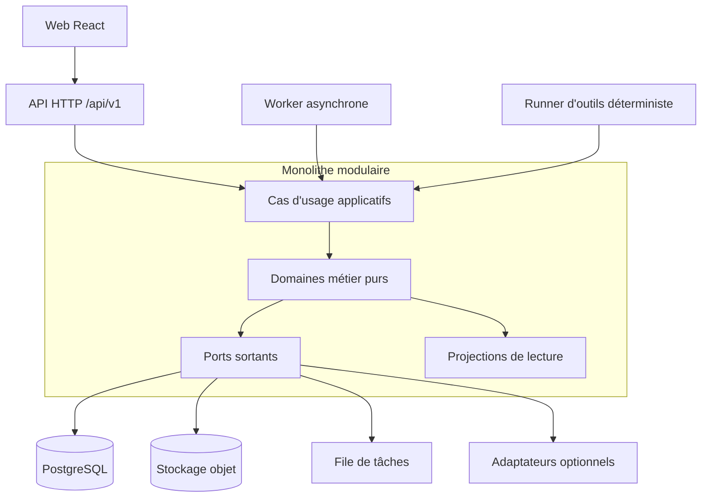

# Polyglot V2 - Architecture applicative et stack

## 1. Statut et portée

Ce document est normatif pour l'architecture technique de Polyglot V2. Il ferme
les choix nécessaires à la planification de l'application. Il ne décrit aucune
migration de données ou de code antérieur.

Tâches couvertes : `C01`, `C09`, `C10`, `I02` et socle de `I04`.

Les décisions sont valables jusqu'à une ADR approuvée qui les remplace. Toutes
les versions sont épinglées par les fichiers de verrouillage. La baseline exacte
est choisie à la création du dépôt parmi les versions stables supportées, puis
enregistrée dans une ADR et testée comme un ensemble.

## 2. Décisions de stack

| Couche | Choix | Décision |
|---|---|---|
| Langage backend | Python stable supporté et verrouillé | Écosystème adapté aux règles linguistiques, aux validateurs et aux futurs adaptateurs IA. |
| API | FastAPI et Pydantic verrouillés | Contrats OpenAPI 3.1 et JSON Schema produits depuis les modèles d'interface. |
| Domaine et persistance | Python sans dépendance web, SQLAlchemy et Alembic verrouillés | Le domaine ne dépend ni de FastAPI ni des modèles ORM. |
| Base | PostgreSQL stable supporté par l'hébergement | Source de vérité transactionnelle, recherche textuelle, JSON borné, verrous et RLS de défense en profondeur. |
| Dépendances Python | `uv`, `pyproject.toml`, `uv.lock` | Résolution reproductible et environnement unique API/worker. |
| Frontend | React, TypeScript strict et Vite verrouillés | Application authentifiée sans besoin de SSR ; livraison statique et contrats stricts. |
| Routage et données web | React Router, TanStack Query | Routes explicites et cache serveur sans dupliquer la source de vérité. |
| Formulaires | React Hook Form, Zod | Validation ergonomique côté client ; le serveur reste autoritaire. |
| Tests web | Vitest, Testing Library, Playwright, axe-core | Composants, parcours, visuel et accessibilité. |
| Tâches asynchrones | Outbox PostgreSQL, Cloud Tasks en production | Livraison au moins une fois ; chaque handler est idempotent. |
| Médias | Stockage objet compatible S3 ; Google Cloud Storage en production | Les blobs restent hors base et privés par défaut. |
| Observabilité | OpenTelemetry, logs JSON structurés | Traces, métriques et logs corrélés sans verrou fournisseur. |
| Packaging | Images OCI distinctes `api`, `worker`, `web` | Un même commit et des dépendances verrouillées, trois rôles d'exécution. |
| Infrastructure | OpenTofu, GCP Cloud Run/Cloud SQL/Cloud Storage | Infrastructure versionnée, managée et hébergée en Union européenne. |

Sont explicitement exclus du premier plan : microservices, Kubernetes, base
graphe, GraphQL, event sourcing intégral, cache distribué obligatoire et moteur
de recherche séparé. Ils exigeraient une preuve de charge ou d'organisation.

## 3. Forme de l'application

Polyglot V2 est un **monolithe modulaire**. L'API et le worker chargent le même
paquet métier, mais démarrent par des points d'entrée différents. Un module ne
communique avec un autre que par son interface publique ou par un événement
versionné. Aucun module ne lit les tables d'un autre directement.



### 3.1 Règles de dépendance

1. `domain` dépend uniquement de la bibliothèque standard et de types partagés
   stables (`Identifier`, `Clock`, `DomainError`).
2. `application` orchestre transactions, politiques et ports ; il ne contient
   pas de SQL, HTTP ou SDK fournisseur.
3. `infrastructure` implémente les ports et peut dépendre des frameworks.
4. `interfaces` traduit HTTP, outils et tâches vers les cas d'usage.
5. Les modèles API, domaine, ORM et frontend sont distincts ; les conversions
   sont explicites et testées.
6. Un événement ne commande pas implicitement un autre module. Le consommateur
   décide de son effet et conserve son propre marqueur d'idempotence.

## 4. Modules backend

| Module | Propriétaire de | Interface publique principale | Dépendances métier autorisées |
|---|---|---|---|
| `identity` | compte, session, consentement, préférences globales | comptes, sessions, consentements | aucune |
| `language_profiles` | paire utilisateur/langue, diagnostic, fondations | profil linguistique | `identity`, `catalogue` |
| `catalogue` | packs, capacités, structures, lexique partagé | consultation et certification | aucune |
| `content` | brouillons, révisions, validation, publication | cycle éditorial | `catalogue` |
| `lexicon` | rencontres, sens personnels, listes, prompts mémoire, dette lexicale | Word Bank et plan lexical | `catalogue`, `language_profiles` |
| `exercises` | définitions, instances, tentatives, aides, corrections | préparer et soumettre une tentative | `catalogue`, `content` |
| `curriculum` | modules, arcs, journées, prérequis | plan de module versionné | `catalogue`, `content` |
| `sprints` | composition temporelle, snapshot, exécution, reprise | sprint quotidien | `curriculum`, `exercises`, `lexicon` |
| `progress` | observations, preuves, projections, recommandations | état explicable | événements des modules d'apprentissage |
| `assessments` | protocoles, sessions, sections, résultats | évaluations et reprise | `exercises`, `progress` |
| `media` | métadonnées, droits, uploads, dérivés, disponibilité | actifs médias | `identity` pour la propriété |
| `generation` | tâches, tentatives, outils, rapports de validation | atelier et façade d'outils | `content`, ports de lecture bornés |
| `platform` | outbox, idempotence, horloge, audit, flags | services techniques partagés | aucun domaine métier |

`progress` consomme des faits mais ne modifie jamais les sources. `generation`
ne publie pas : il produit un brouillon ou un rapport ; seule une commande
humaine autorisée du module `content` publie une révision validée.

## 5. Structure cible du dépôt

```text
backend/
  pyproject.toml
  uv.lock
  src/polyglot/
    bootstrap/
    interfaces/{http,tasks,tools}/
    modules/<module>/{domain,application,infrastructure}/
    platform/
  migrations/
  tests/{unit,integration,contract,property}/
frontend/
  package.json
  pnpm-lock.yaml
  src/{app,features,components,generated}/
  tests/{component,e2e,visual}/
contracts/
  openapi/v1.json
  events/
  tools/
fixtures/
  canonical/
infra/
  environments/{preview,staging,production}/
  modules/
docs/
```

Le client sous `frontend/src/generated` est généré et jamais modifié à la main.
Les schémas d'événement et d'outil sont versionnés comme artefacts de contrat.

## 6. Transactions, concurrence et événements

- Une commande métier ouvre une transaction PostgreSQL unique.
- L'agrégat porte un entier `version`. Toute mutation concurrente utilise un
  contrôle optimiste et retourne `409 version_conflict` en cas d'écart.
- Les commandes à effet acceptent `Idempotency-Key`. La clé est liée à
  l'utilisateur, à l'opération et à l'empreinte canonique du corps.
- Rejouer la même clé et le même corps retourne le résultat mémorisé ; un corps
  différent retourne `409 idempotency_conflict`.
- Les événements sortants sont écrits dans l'outbox dans la même transaction.
- Un dispatcher publie l'identifiant de l'événement. Les consommateurs
  dédupliquent par `(consumer, event_id)`.
- Les faits pédagogiques bruts et réponses utilisateur sont append-only. Une
  correction ajoute une nouvelle interprétation et ne réécrit pas le fait.
- Aucun dual-write synchrone PostgreSQL/stockage externe n'est considéré
  atomique. Les opérations utilisent un état intermédiaire et une compensation.

Chaque événement contient `event_id`, `event_type`, `schema_version`,
`occurred_at`, `aggregate_id`, `aggregate_version`, `actor`, `correlation_id`,
`causation_id` et un payload minimal sans donnée privée inutile.

## 7. Données et schémas

- Identifiants applicatifs : UUIDv7, jamais une valeur métier ou une chaîne
  normalisée.
- Dates : UTC en base, RFC 3339 dans les contrats ; le fuseau utilisateur est une
  préférence IANA séparée.
- Montants et scores bornés : `numeric` ou entiers scalés, jamais `float` si une
  égalité métier est attendue.
- JSONB est réservé aux payloads versionnés, paramètres d'outils et extensions
  non critiques. Les relations, états et propriétaires sont des colonnes.
- Les tables personnelles portent `owner_user_id` ou `language_profile_id` et
  une politique RLS de défense en profondeur.
- Les projections peuvent être reconstruites depuis les faits conservés et la
  version de politique de calcul.
- Une migration de schéma est ascendante, testée sur une copie synthétique et
  compatible avec la version applicative précédente pendant un déploiement.

## 8. Façade d'outils sans LLM

La façade est une interface applicative, pas une API directe vers la base. Le
produit doit démontrer toutes ses capacités avec un auteur humain ou un runner
déterministe avant l'ajout d'un modèle.

### 8.1 Catalogue initial

| Outil | Effet | Autorisation |
|---|---|---|
| `profile.read_authorized` | Vue pédagogique minimale d'un profil | utilisateur ou auteur explicitement mandaté |
| `catalogue.list_targets` | Capacités, objectifs et prérequis publiés | lecture catalogue |
| `lexicon.read_session_scope` | Sens autorisés pour une session | propriétaire du profil |
| `exercise.get_blueprint` | Patron et contraintes d'une primitive | auteur |
| `exercise.submit_draft` | Crée une révision brouillon | auteur |
| `content.validate_draft` | Produit un rapport déterministe | auteur/reviewer |
| `curriculum.submit_module_draft` | Propose un module non publié | auteur |
| `curriculum.submit_day_draft` | Propose une journée non publiée | auteur |
| `correction.submit_structured_draft` | Propose une correction à revoir | correcteur autorisé |
| `quality.report_ambiguity` | Ouvre un signalement lié aux sources | utilisateur/auteur |
| `progress.explain_recommendation` | Explique une projection existante | propriétaire du profil |

Chaque outil a un fichier JSON Schema d'entrée et de sortie, un `tool_version`,
une portée, un budget de taille, un timeout, des erreurs fermées et une règle
d'idempotence. Les sorties libres non conformes sont rejetées. Le contrat
conceptuel complet, incluant exemples positifs et négatifs, est le document 30.

### 8.2 Runner déterministe

Le runner lit un scénario versionné : identité simulée, fixtures autorisées,
suite d'appels, réponses attendues et horloge/graine figées. Il appelle les mêmes
handlers applicatifs que l'API et produit : transcript JSONL, rapports de schéma,
événements, brouillons et diff attendu/réel.

Il n'importe aucun SDK LLM, ne contacte aucun réseau et échoue immédiatement sur
un outil inconnu, une permission manquante ou une sortie non conforme. Ce runner
est la preuve de la gate `G6 AI-ready`.

### 8.3 Ports fournisseurs

Le registre des adaptateurs expose les mêmes erreurs : `unavailable`, `timeout`,
`rate_limited`, `quota_exhausted`, `invalid_response`, `policy_rejected` et
`cancelled`. Une erreur conserve fournisseur, opération et code borné, jamais le
secret ou le contenu privé complet.

| Port | Capacités déclarées | Timeout initial | Retry fournisseur | Cache | Quota |
|---|---|---:|---:|---|---|
| `LlmPort` | JSON Schema, outils, contexte max, langues | 60 s | 0 | aucun résultat privé partagé | appels, tokens, euros/job et euros/jour |
| `TtsPort` | langues, voix, SSML, formats, limites | 30 s | 0 | clé texte/voix/paramètres/version | caractères et euros/jour |
| `SttPort` | langues, timestamps, diarisation, formats | 120 s | 0 | aucun par défaut | minutes et euros/jour |
| `MediaSourcePort` | métadonnées, droits, transcript autorisé | 15 s | 0 | métadonnées publiques avec TTL | requêtes/jour |

La sélection d'un adaptateur est une configuration explicite de l'environnement
ou du job. Une indisponibilité termine la tentative avec une erreur visible ;
elle ne change jamais de fournisseur, de modèle ou de voix. Une relance est une
nouvelle tentative demandée explicitement, soumise au même budget et auditée.

## 9. Invariants d'architecture

1. PostgreSQL est la seule source de vérité métier.
2. Aucun fournisseur externe n'est nécessaire pour un parcours de référence.
3. Aucune publication n'est déclenchée par une génération seule.
4. Une panne de file ou de fournisseur ne perd pas la commande acceptée.
5. Une tentative historique épingle toutes les versions nécessaires à son
   interprétation.
6. Une réponse privée n'apparaît ni dans une URL, ni dans une métrique, ni dans
   un message de file.
7. Un module peut être testé avec des ports en mémoire, mais les tests de
   persistance utilisent PostgreSQL et non SQLite.
8. L'extraction future d'un service exige métriques de charge, contrat stable,
   propriétaire et plan de cohérence ; elle n'est jamais préventive.

## 10. Sources techniques

- [FastAPI : OpenAPI et JSON Schema](https://fastapi.tiangolo.com/features/)
- [PostgreSQL : politiques de sécurité par ligne](https://www.postgresql.org/docs/18/ddl-rowsecurity.html)
- [PostgreSQL : recherche textuelle](https://www.postgresql.org/docs/current/textsearch-controls.html)
- [React avec TypeScript](https://react.dev/learn/typescript)
