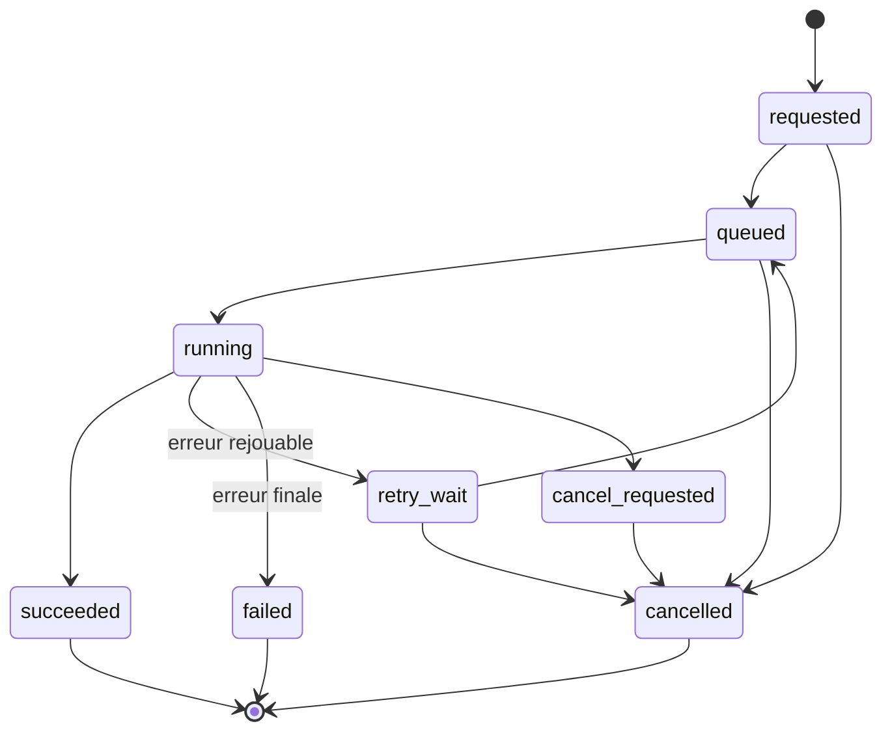
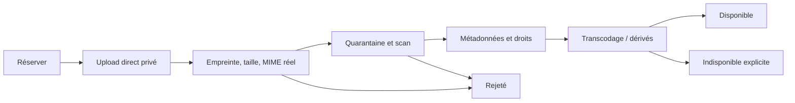

# Polyglot V2 - Sécurité, confidentialité, jobs et médias

## 1. Modèle de confiance

Le navigateur, les fichiers importés, les contenus d'auteur, les webhooks, les
files et tous les fournisseurs sont non fiables. Seuls les handlers applicatifs
après authentification, autorisation, validation et transaction peuvent muter la
source de vérité.

Objectif initial : OWASP ASVS niveau 2 pour l'application et contrôles renforcés
sur l'atelier, les imports, les suppressions, les exports et la publication.

Tâches couvertes : `C07`, `I04`, `I06`, `J06` et volet suppression de `K03`.

## 2. Authentification et sessions

- Le module d'identité expose un port commun pour deux types d'identité :
  `local_password` et `oidc`.
- Une identité locale stocke uniquement un hash Argon2id et permet inscription,
  changement et récupération de mot de passe selon une politique auditée.
- Une identité OIDC utilise Authorization Code avec PKCE ; Google Cloud Identity
  Platform est l'adaptateur hébergé recommandé. Aucun mot de passe fournisseur
  n'est stocké par Polyglot.
- Après validation de l'identité, les deux chemins créent la même session
  applicative opaque et utilisent les mêmes autorisations.
- Cookie : préfixe `__Host-`, `Secure`, `HttpOnly`, `SameSite=Lax`, chemin `/`,
  sans attribut `Domain`.
- Durée inactive : 30 minutes pour l'atelier, 12 heures pour l'apprenant ; durée
  absolue 7 jours. Une action sensible exige une réauthentification récente.
- Rotation à la connexion, au changement de rôle et toutes les 24 heures.
- Les sessions sont révocables individuellement ; les changements de sécurité
  peuvent révoquer toutes les sessions du compte.
- Les requêtes mutantes utilisent un jeton CSRF lié à la session et vérifient
  `Origin`. CORS est désactivé en production car web et API sont même origine.
- Aucun token d'accès n'est stocké dans `localStorage` ou `sessionStorage`.

Le développement local utilise des identités locales de fixture et un faux
fournisseur OIDC. Aucun des deux ne contourne les contrôles d'autorisation.

## 3. Autorisation

Rôles :

| Rôle | Portée |
|---|---|
| `learner` | ses profils, réponses, listes, médias et exports |
| `author` | brouillons et catalogue explicitement attribués |
| `reviewer` | validation et approbation, sans auto-approbation de son brouillon |
| `support` | métadonnées de diagnostic minimales, jamais réponses privées par défaut |
| `admin` | configuration et attribution de rôles, sans contournement silencieux de l'audit |
| `worker` | commandes de service précises, sans session utilisateur interactive |

L'autorisation est évaluée sur `acteur + action + ressource + portée`. Un rôle
global ne suffit pas pour accéder à un profil ou à un brouillon. Les règles
principales sont dans la couche application ; PostgreSQL RLS protège en plus les
tables personnelles à partir d'un `app.user_id` transactionnel.

Séparation des responsabilités : l'auteur d'une révision ne peut pas être son
seul approbateur ; le support doit demander un accès temporaire motivé et audité
pour toute donnée personnelle ; une suppression ou un export appartient au
compte concerné ou à une procédure administrative approuvée.

### 3.1 Politique par famille de commandes

| Famille | Rôles | Condition de ressource | Contrôle renforcé |
|---|---|---|---|
| session et consentement | `learner` | compte courant | réauthentification pour révocation globale |
| profils/Word Bank/listes/sprints | `learner` | propriétaire du profil | `If-Match` pour mutation |
| tentatives/évaluations | `learner` | instance assignée et ouverte | idempotence et état attendu |
| progression/recommandations | `learner` | propriétaire | lecture seule ; preuves privées filtrées |
| brouillons | `author` | attribution explicite | portée de pack/langue |
| validation | `reviewer` | révision accessible | auteur et reviewer distincts pour approbation |
| publication/retrait | `reviewer` ou `admin` | révision validée/approuvée | réauthentification et audit |
| outils | `author`, `reviewer` | allowlist par outil et tâche | budget, schéma et portée de données |
| média | propriétaire ou auteur attribué | objet et finalité | scan avant lecture partagée |
| job | créateur ou rôle opérateur borné | résultat autorisé | payload privé filtré |
| export/suppression | propriétaire, procédure admin | compte ou langue ciblé | réauthentification récente |
| support | `support` | ticket et accès temporaire | justification, expiration et audit |

Toute nouvelle commande doit ajouter sa ligne ou référencer une famille dont les
conditions sont identiques. L'absence de politique est un refus par défaut.

## 4. Classification et minimisation

| Classe | Exemples | Règle |
|---|---|---|
| Publique | contenu pédagogique publié | cache et diffusion autorisés |
| Interne | métriques agrégées, configuration non secrète | accès équipe selon rôle |
| Personnelle | profil, progression, listes, réponses | chiffrement, isolation par propriétaire |
| Sensible | audio, transcription, conversation, diagnostic, export | accès explicite, rétention courte, jamais dans logs |
| Secret | session, clé, URL signée, credential fournisseur | Secret Manager, jamais en base métier ni télémétrie |

Le système ne transmet à un adaptateur que les champs requis pour l'opération.
La langue, le niveau ou une sélection lexicale ne justifient pas l'envoi du nom,
de l'e-mail, de l'historique complet ou d'un contexte de conversation.

## 5. Rétention et droits utilisateur

Valeurs par défaut :

| Donnée | Rétention active | Suppression |
|---|---|---|
| Compte, profil, preuves et réponses | tant que le compte ou la langue existe | purge active sous 30 jours après demande |
| Brouillon de réponse non soumis | 24 heures | expiration automatique |
| Audio brut d'entraînement | 24 heures sauf sauvegarde explicite | purge objet et dérivés |
| Audio d'évaluation | 7 jours | transcription/projection conservée si nécessaire et consentie |
| Prompts/sorties d'une génération privée | 30 jours | purge ; empreinte et statut non sensibles conservés |
| Provenance d'un contenu publié | vie du contenu + 5 ans | contexte personnel exclu avant publication |
| Logs applicatifs | 30 jours | expiration automatique |
| Logs sécurité et audit privilégié | 180 jours | accès restreint et immuable |
| Sauvegardes | 35 jours glissants | tombstones rejoués après restauration |

Une suppression de langue ferme les sessions liées, bloque les jobs, retire les
objets actifs, enregistre un tombstone et purge les projections. Une suppression
de compte fait de même pour toutes les langues. Les sauvegardes ne sont pas
réécrites ; elles expirent et toute restauration rejoue le registre de
suppression avant remise en service.

L'export est un job privé produisant une archive chiffrée, disponible 72 heures
via URL signée. Il contient données brutes, projections explicables, listes,
consentements et un manifeste de versions. Les données internes de sécurité,
secrets et informations d'autres utilisateurs sont exclues.

## 6. Journal d'audit

Événements obligatoires : connexion et échec, création/révocation de session,
changement de rôle, consentement, export, suppression, accès support, upload,
appel d'outil, génération, validation, approbation, publication, retrait,
modification de politique et action d'administration.

Une entrée contient acteur pseudonymisé, action, ressource, résultat, raison,
horodatage, `request_id`, `correlation_id`, empreinte de session et adresse IP
tronquée selon la politique. Elle ne contient ni cookie, token, réponse, prompt,
transcription, URL signée ou corps d'upload.

## 7. Défenses applicatives

- Validation stricte taille/type/forme avant tout cas d'usage.
- Requêtes SQL paramétrées uniquement ; CSP stricte sans `unsafe-inline` en
  production ; HSTS et en-têtes de sécurité sur le point d'entrée.
- Limites distinctes pour login, lecture, mutation, upload, export et outils.
- Les erreurs publiques sont fermées ; stack traces uniquement dans le backend
  d'observabilité avec redaction.
- Les dépendances et images sont scannées ; les secrets sont recherchés dans le
  dépôt et l'historique de build.
- Les URL signées ont une durée maximale de 10 minutes et sont limitées à une
  méthode, un objet et une taille.
- Les imports sont traités comme contenu hostile : archive bornée, nombre de
  fichiers limité, chemins normalisés, aucune exécution ou macro.
- Les callbacks de tâches vérifient identité de service, audience, horodatage et
  identifiant de tâche ; aucun endpoint worker n'est public anonymement.

## 8. Modèle des jobs

Le domaine possède `Job`, `JobAttempt` et, pour la génération,
`GenerationJob`/`GenerationAttempt`. Le fournisseur de file ne porte que
`job_id`, `attempt_hint`, `correlation_id` et une version de message.

Règles :

1. La création du job et l'outbox sont atomiques avec la commande utilisateur.
2. Cloud Tasks livre au moins une fois ; le handler verrouille le job, vérifie
   son état et déduplique l'effet.
3. Un lease de 5 minutes renouvelable évite les workers concurrents. Un lease
   expiré rend le job reprenable, pas réussi.
4. Les retries ne sont autorisés que pour une liste d'erreurs déclarée. Backoff
   exponentiel avec jitter, maximum trois tentatives par défaut.
5. Une erreur fonctionnelle, de schéma, de permission ou de quota financier
   n'est jamais retentée automatiquement.
6. Aucun fallback fournisseur silencieux. L'état expose l'indisponibilité et
   attend une décision explicite.
7. Une tentative conserve fournisseur, modèle, paramètres, versions de prompt
   et outils, empreinte d'entrée, durée, coût déclaré, statut et erreur bornée.
8. Une réussite écrit un résultat immuable ; la publication reste une commande
   séparée.

Les traitements courts utilisent Cloud Tasks vers un service worker Cloud Run
privé. Les traitements batch bornés, migrations et restaurations de projection
utilisent Cloud Run Jobs. Le développement local fournit un dispatcher
PostgreSQL synchrone ou mono-worker qui respecte les mêmes transitions.

## 9. Pipeline média

États : `reserved`, `uploading`, `uploaded`, `verifying`, `quarantined`,
`processing`, `ready`, `rejected`, `failed`, `deleting`, `deleted`.

- Le bucket n'est jamais public. Lecture et écriture passent par des URL signées
  courtes après autorisation.
- L'empreinte SHA-256, la taille, le MIME détecté et la version de traitement
  sont conservés. L'extension utilisateur ne fait pas foi.
- Limites initiales : image 10 MiB, audio 100 MiB, vidéo 500 MiB, archive
  d'import 50 MiB. Tout dépassement échoue avant traitement coûteux.
- Les originaux et dérivés ont des clés opaques ; aucun nom ou e-mail dans le
  chemin objet.
- Droits, provenance, licence, consentement et date d'expiration sont obligatoires
  avant publication d'un média éditorial.
- Le cache TTS est indexé par texte canonique, langue, voix, paramètres, version
  fournisseur et politique. Une voix supprimée rend l'actif `unavailable` ; elle
  n'est pas remplacée silencieusement.
- STT et conversation restent des ports optionnels. Les fixtures audio et
  transcriptions permettent tous les tests sans fournisseur.

## 10. Menaces prioritaires et preuves

| Menace | Contrôle | Preuve bloquante |
|---|---|---|
| IDOR entre profils | autorisation objet + RLS | tests croisés par rôle et propriétaire |
| vol/fixation de session | cookie protégé, rotation, révocation | tests session et scan dynamique |
| CSRF | token lié + contrôle Origin + SameSite | tests cross-site négatifs |
| publication non revue | séparation auteur/reviewer | scénario E2E et audit |
| prompt ou réponse dans les logs | redaction structurée | canary secrets et inspection logs |
| rejeu de job | idempotence + verrou + inbox | 100 livraisons, un seul effet |
| fichier malveillant | quarantaine, sniffing, scan, limites | corpus de fichiers hostiles |
| suppression incomplète | registre de purge + tombstones | test de suppression et restauration |
| coût fournisseur incontrôlé | quotas, aucune relance/fallback implicite | tests de quota et erreur terminale |

## 11. Sources techniques

- [OWASP ASVS et index des contrôles](https://cheatsheetseries.owasp.org/IndexASVS.html)
- [OWASP : gestion de session](https://cheatsheetseries.owasp.org/cheatsheets/Session_Management_Cheat_Sheet.html)
- [OWASP : journalisation](https://cheatsheetseries.owasp.org/cheatsheets/Logging_Cheat_Sheet.html)
- [Cloud Tasks : livraison au moins une fois](https://docs.cloud.google.com/tasks/docs/dual-overview)
