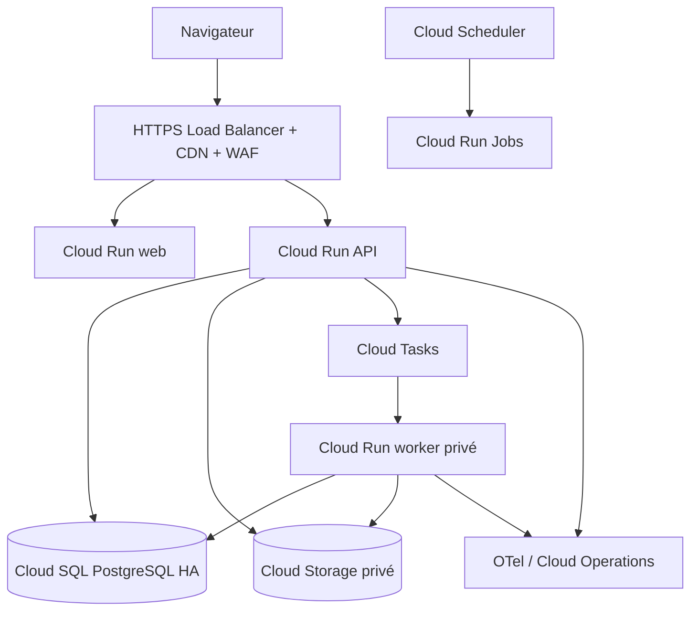

# Polyglot V2 - Exploitation, sauvegarde et livraison

## 1. Objectifs non fonctionnels initiaux

Ces budgets sont des seuils de planification, mesurés côté serveur hors temps de
transfert d'un média ou appel fournisseur explicite.

Tâches couvertes : `A05`, `K03`, `K04` et `K05`.

| Indicateur | Objectif production |
|---|---|
| Disponibilité API et web | 99,5 % mensuel |
| Lecture API | p95 <= 300 ms, p99 <= 800 ms |
| Commande API | p95 <= 700 ms, p99 <= 1,5 s |
| Chargement du lecteur prêt | p75 <= 2,5 s sur mobile moyen, réseau 4G simulé |
| Taux d'erreur serveur | < 1 % hors erreurs utilisateur et dépendances déclarées |
| Délai de prise en charge job | p95 <= 60 s |
| Reprise d'un sprint accusé | aucune tentative perdue |
| RPO base | <= 5 minutes |
| RTO service | <= 4 heures |

L'accessibilité cible est WCAG 2.2 AA. Les navigateurs supportés sont les deux
dernières versions stables de Chrome, Safari, Firefox et Edge, plus Safari iOS
et Chrome Android courants. Les matrices exactes sont figées à chaque release.

## 2. Topologie de production

Déploiement recommandé sur GCP, région primaire UE `europe-west1`, avec données
et sauvegardes maintenues dans l'Union européenne.

- Projets GCP séparés : `polyglot-dev`, `polyglot-preview`, `polyglot-staging`,
  `polyglot-production`.
- Comptes de service distincts pour API, worker, migrations, CI et sauvegarde.
- Cloud SQL sans IP publique ; connexions via connecteur managé et IAM.
- Buckets privés avec uniform bucket-level access, versioning, règles de cycle de
  vie et clés gérées selon la classification.
- Artifact Registry conserve les images par digest et empêche leur écrasement.
- OpenTofu est la seule voie de modification durable de l'infrastructure.

## 3. Environnements

| Environnement | Données | Déploiement | Usage |
|---|---|---|---|
| `local` | fixtures synthétiques, PostgreSQL et stockage objet locaux | Compose, hot reload | développement hors réseau |
| `test` | recréées par suite, horloge/graine figées | processus CI éphémères | unités, propriétés, intégration |
| `preview` | une base et un préfixe objet par PR, aucune donnée réelle | automatique, durée 72 h après fermeture | revue fonctionnelle et visuelle |
| `staging` | fixtures canoniques et données synthétiques volumétriques | promotion du digest candidat | répétition migration, E2E et canary interne |
| `production` | données réelles | approbation manuelle et promotion du même digest | utilisateurs |

Aucune copie de production n'est autorisée hors production. Les jeux réalistes
sont générés et portent un marqueur empêchant leur import en production.

## 4. Configuration et secrets

- Configuration non secrète validée au démarrage, versionnée par environnement.
- Secrets dans Secret Manager, injectés par référence et accessibles au seul
  compte de service requis.
- Aucun fichier `.env` de production, secret dans image, log, CI, état OpenTofu
  non chiffré ou variable frontend.
- Rotation au moins annuelle et immédiatement après incident ou départ d'un
  propriétaire. Les credentials courts et Workload Identity sont préférés.
- Le démarrage échoue si une configuration obligatoire manque ; aucune valeur
  dangereuse par défaut en production.

## 5. Observabilité

### 5.1 Signaux

Tous les services émettent OpenTelemetry avec conventions sémantiques communes.

- Logs JSON : niveau, timestamp, service, version, environnement, request/trace/
  correlation id, code événement, résultat, durée et dimensions bornées.
- Traces : requête HTTP, cas d'usage, transaction, publication outbox, job,
  stockage objet et appel fournisseur.
- Métriques : RED pour HTTP, USE pour ressources, profondeur/âge de file,
  taux/retry/durée des jobs, état outbox, connexions DB, disponibilité média,
  validation et publication.
- Événements métier agrégés : sprint commencé/terminé/interrompu, tentative
  reçue, correction contestée, contenu rejeté. Aucun texte utilisateur.

Attributs interdits : e-mail, nom, réponse, prompt, transcription, URL signée,
cookie, token, corps de requête et identifiant fournisseur secret. Les IDs
utilisateur sont pseudonymisés avant export télémétrique.

### 5.2 Tableaux de bord et alertes

| Tableau | Alertes principales |
|---|---|
| Parcours utilisateur | disponibilité, latence, erreurs par route, reprise |
| Jobs et génération | plus vieux job, échecs, retries, quotas, coût déclaré |
| Données | connexions, verrous, réplication, espace, échec backup/outbox |
| Médias | uploads bloqués, scan, transcodage, objets orphelins |
| Sécurité | échecs auth, refus d'autorisation, accès support, rate limit |
| Qualité pédagogique | rejets validateurs, ambiguïtés, contestations par version |

Une alerte exige un propriétaire, un seuil, une fenêtre, un runbook et une
sévérité. `P1` : données ou parcours critiques indisponibles ; accusé sous 15
minutes. `P2` : dégradation significative ; accusé sous une heure ouvrée. `P3`
alimente le backlog et ne réveille pas l'astreinte.

Runbooks minimaux : API indisponible, saturation DB, outbox bloquée, file en
retard, fournisseur indisponible, upload malveillant, fuite suspectée, rollback,
restauration, suppression et clé compromise.

## 6. Sauvegarde et restauration

### 6.1 Politique

- Cloud SQL HA, sauvegarde quotidienne et PITR activé avec fenêtre de 35 jours.
- Sauvegardes protégées dans un projet de sauvegarde séparé ; suppression
  protégée et accès restreint au rôle de restauration.
- Export logique chiffré hebdomadaire du schéma et des données critiques, retenu
  35 jours, comme preuve indépendante du mécanisme managé.
- Cloud Storage : versioning, soft delete et réplication/backup dans une seconde
  région UE selon la classe d'objet.
- L'infrastructure, les schémas, packs publiés et manifests sont versionnés dans
  Git/Artifact Registry ; ils ne dépendent pas d'une sauvegarde de poste.

### 6.2 Tests de restauration

Chaque trimestre, un environnement isolé est restauré depuis PITR et objets :

1. choisir un instant aléatoire dans la fenêtre ;
2. restaurer vers une nouvelle instance ;
3. rejouer migrations et tombstones de suppression ;
4. vérifier comptes synthétiques, tentatives, outbox, versions de contenu et
   empreintes média ;
5. exécuter les parcours canoniques hors réseau ;
6. mesurer RPO/RTO et détruire l'environnement ;
7. archiver rapport, écarts, propriétaire et correction.

Une sauvegarde non restaurée dans le trimestre ne permet pas la gate `G3`.

## 7. Pipeline de livraison

```mermaid
flowchart LR
    PR["Pull request"] --> STATIC["Lint, types, contrats, sécurité"]
    STATIC --> TESTS["Unités, propriétés, intégration"]
    TESTS --> BUILD["Build OCI + SBOM + signature"]
    BUILD --> PREVIEW["Preview éphémère"]
    PREVIEW --> E2E["E2E, a11y, visuel, performance"]
    E2E --> MERGE["Merge"]
    MERGE --> STAGE["Promotion digest staging"]
    STAGE --> GATE["Migration rehearsal + smoke + approbation"]
    GATE --> CANARY["Production 10 %"]
    CANARY --> PROMOTE["50 % puis 100 %"]
```

Le build est unique : staging et production reçoivent exactement les mêmes
digests. Les images produisent SBOM, provenance et signature vérifiée au
déploiement. Une release référence commit, digests, schéma DB, contrat API,
flags, preuves et approbateur.

### 7.1 Migrations

- Alembic, une tête unique sur la branche d'intégration.
- Séquence `expand -> migrate/backfill -> switch -> contract`.
- `expand` doit rester compatible avec la version actuellement servie.
- Une migration destructive est différée à une release ultérieure après preuve
  que l'ancien code et les anciennes données ne sont plus utilisés.
- Migrations et backfills s'exécutent par un Cloud Run Job dédié avec timeout,
  métriques et verrou d'exclusion.
- Le rollback applicatif ne tente jamais d'annuler automatiquement une migration.

### 7.2 Canary et rollback

Production reçoit 10 %, puis 50 %, puis 100 % du trafic avec observation de 15
minutes minimum par palier. Promotion bloquée si erreurs, latence, saturation DB,
jobs ou parcours canoniques dépassent leurs budgets.

Rollback : remettre le digest précédent, désactiver le flag du lot et suspendre
les nouveaux jobs concernés. Une restauration de données n'est déclenchée que
pour corruption avérée, après conservation des preuves et décision d'incident.

## 8. Feature flags

- Tout lot utilisateur indépendant possède un kill switch serveur.
- Les flags sont typés, ont propriétaire, raison, date d'expiration et valeur par
  environnement.
- Une permission ou un invariant de sécurité ne dépend jamais d'un flag client.
- Le frontend reçoit seulement les flags nécessaires à l'affichage.
- Un flag retiré est supprimé du code et de la configuration dans la release qui
  suit la généralisation.

## 9. Capacité et coûts

Hypothèse de départ pour les tests : 10 000 comptes, 1 000 actifs quotidiens,
50 requêtes/s en pointe, 100 jobs/minute, 100 millions de faits pédagogiques et
1 To de médias. Cette hypothèse dimensionne les index et scénarios, pas une
préallocation coûteuse.

- Les limites Cloud Run protègent Cloud SQL ; le pool total reste inférieur à
  70 % des connexions disponibles.
- Toute requête listant faits, rencontres ou logs est paginée et bornée.
- Les partitions ne sont introduites qu'après mesure ; index et archivage sont
  validés sur le jeu volumétrique synthétique.
- Chaque adaptateur externe possède budget de requêtes et coût. Une limite
  atteinte produit une erreur visible et aucune recharge automatique.

## 10. Sources techniques

- [Cloud Run : services, jobs et worker pools](https://docs.cloud.google.com/run/docs/overview/what-is-cloud-run)
- [Cloud SQL PostgreSQL : restauration et PITR](https://docs.cloud.google.com/sql/docs/postgres/backup-recovery/restore)
- [Cloud SQL PostgreSQL : sauvegardes](https://docs.cloud.google.com/sql/docs/postgres/backup-recovery/backups)
- [OpenTelemetry : conventions sémantiques](https://opentelemetry.io/docs/specs/semconv/general/)
