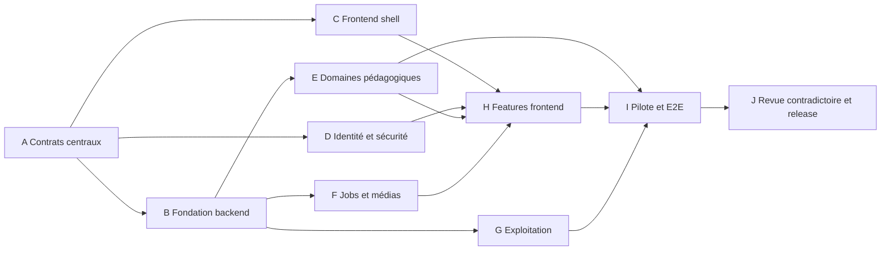

# Polyglot V2 - Tests, quality gates et délégation

## 1. Principe de preuve

Une suite verte ne suffit pas à déclarer Polyglot correct. Chaque exigence
normative doit être reliée à une preuve adaptée : test automatisé, analyse,
capture, exercice de restauration, revue experte ou essai humain. Une preuve
indique l'environnement, la version, la fixture et le résultat.

Tâches couvertes : `L01`, `L02`, `L03`, `L03A`, `L04` et `L05`. Le document
ferme la stratégie ; les fixtures, spikes et plans restent à produire.

La matrice de traçabilité utilise :

```text
requirement_id -> owner -> contract -> fixture -> test_or_review -> gate -> evidence
```

Une exigence sans propriétaire ou sans preuve prévue bloque la planification du
lot concerné.

## 2. Pyramide de tests

| Niveau | Outils recommandés | Objet | Exécution |
|---|---|---|---|
| Unité domaine | pytest, Vitest | valeurs, politiques, reducers, transitions | chaque commit |
| Propriétés | Hypothesis | idempotence, invariants, ordre, bornes, rejeu | chaque PR |
| Intégration | pytest + PostgreSQL/stockage réels en conteneur | transactions, RLS, outbox, migrations, médias | chaque PR |
| Contrat API | OpenAPI diff, Schemathesis, client TypeScript | schémas, erreurs, compatibilité | chaque PR |
| Contrat événements/outils | JSON Schema + golden files | versions, permissions, déterminisme | chaque PR |
| Composants | Testing Library, axe-core | états, clavier, formulaires, contenu extrême | chaque PR |
| E2E | Playwright | parcours critiques et reprise | preview et staging |
| Visuel | Playwright screenshots | desktop/mobile, zoom, thèmes, régressions | preview |
| Sécurité | SAST, SCA, secrets, DAST, tests d'autorisation | menaces applicatives | PR et staging |
| Performance | k6, profils SQL | budgets API, pointe, files, jeu volumétrique | staging avant release |
| Exploitation | scripts/runbooks | backup, restore, rollback, alertes | calendrier et release |
| Pédagogie | validateurs + revue humaine | correction, naturalité, niveau, transfert | pilote et contenu |

Les tests de persistance utilisent la même version majeure PostgreSQL que la
production. SQLite est interdit comme substitut de tests de base.

## 3. Fixtures canoniques

Le répertoire `fixtures/canonical` contient des bundles versionnés, indépendants
et sans donnée réelle :

| Bundle | Contenu minimum |
|---|---|
| `users` | apprenant débutant, faux débutant, intermédiaire, auteur, reviewer, support, comptes croisés |
| `catalogue-it` | langue/variété, sens ambigus, homonymes, formes, structures et prérequis |
| `content` | révisions draft/validée/publiée/retirée, version concurrente et contenu invalide |
| `word-bank` | rencontres, aides, ambiguïtés, dette fusionnée, listes dynamiques et snapshots |
| `exercise-primitives` | une instance positive, négative, ambiguë et inaccessible par primitive prioritaire |
| `three-day-pilot` | module italien humain, budgets 10-60 par pas de 5 hors réseau |
| `assessments` | quatre modalités, reprise, expiration, double soumission et oral simulé |
| `jobs` | succès, timeout, retry, quota, annulation, lease expiré et rejeu x100 |
| `media` | formats valides, MIME trompeur, archive hostile, média absent, voix supprimée |
| `operations` | base volumétrique synthétique, tombstones, backup et version N-1 |

Chaque bundle fournit manifeste, version de schéma, graine, horloge, résultats
attendus et empreintes. Un changement attendu exige une revue du diff de fixture,
jamais une régénération silencieuse des snapshots.

## 4. Scénarios critiques obligatoires

1. Créer un profil, terminer le diagnostic simulé, exécuter fondations et ouvrir
   le premier module sans réseau ni LLM.
2. Composer, interrompre et reprendre un sprint sans perte ni double preuve.
3. Soumettre deux fois la même tentative avec la même clé : un effet ; avec un
   corps différent : conflit explicite.
4. Montrer qu'une réussite isolée ne produit ni état fiable ni maîtrise.
5. Corriger une désambiguïsation sans modifier la réponse ou rencontre brute.
6. Modifier une liste après le démarrage d'un sprint sans changer son snapshot.
7. Évaluer lecture sans créditer écoute, écriture ou oral.
8. Fermer le navigateur pendant une évaluation et reprendre à la section exacte.
9. Exécuter chaque outil avec le runner déterministe, permissions positives et
   négatives, schémas valides et invalides.
10. Livrer cent fois le même job : un seul brouillon ou résultat.
11. Échouer un fournisseur : erreur visible, aucune publication, aucun fallback
    ou retry non autorisé.
12. Importer un média hostile : aucun objet disponible et rapport borné.
13. Vérifier qu'un utilisateur ne lit ni ne modifie les ressources d'un autre,
    y compris via IDs devinés, listes, exports et SSE.
14. Supprimer une langue, restaurer une sauvegarde puis rejouer le tombstone :
    aucune donnée supprimée ne redevient accessible.
15. Déployer une version compatible, exécuter une migration `expand`, revenir au
    digest précédent et maintenir les parcours critiques.

## 5. Gates de qualité par pull request

### Q0 - Hygiène et source

- formatage, Ruff, types backend stricts sur interfaces publiques ;
- ESLint, TypeScript `strict`, formatage frontend ;
- aucun secret détecté, lockfiles cohérents, génération reproductible ;
- aucun fichier généré modifié à la main ;
- ADR requise pour toute modification d'une décision de stack ou frontière.

### Q1 - Tests et couverture utile

- tests ajoutés avant ou avec toute règle modifiée ;
- 100 % des branches d'autorisation, idempotence, suppression, publication et
  calcul de preuve touchées sont couvertes ;
- couverture des lignes modifiées >= 90 %, couverture globale jamais en baisse
  sous 80 % ;
- aucun test ignoré ou snapshot réécrit sans justification approuvée.

Les pourcentages n'autorisent jamais à ignorer une propriété ou un scénario
critique non couvert.

### Q2 - Contrats

- diff OpenAPI non cassant dans `/v1` ;
- client TypeScript régénéré et compilé ;
- événements et outils valides contre leurs versions supportées ;
- exemples positifs et erreurs documentées exécutés ;
- migrations N-1 -> N et compatibilité applicative vérifiées.

### Q3 - Sécurité et confidentialité

- tests d'autorisation croisée et RLS verts ;
- SAST, dépendances, images et secrets sans vulnérabilité critique ou haute non
  corrigée ; une exception exige propriétaire, expiration et contrôle compensant ;
- DAST des routes critiques, CSP et cookies vérifiés en preview ;
- canary de données sensibles absent des logs, traces, métriques et files.

### Q4 - UX et accessibilité

- états loading/vide/erreur/reprise couverts ;
- parcours critique clavier et axe-core sans violation sérieuse ou critique ;
- captures approuvées à 320, 768, 1440 px et zoom 200 % ;
- aucun débordement, recouvrement ou déplacement de mise en page bloquant ;
- état sans audio et contenu extrême vérifiés.

### Q5 - Performance et exploitation

- requêtes SQL nouvelles avec plan examiné sur fixture volumétrique ;
- budgets de latence et taille frontend respectés ;
- métriques, alertes et runbook ajoutés pour un nouveau mode de panne ;
- job rejouable et annulable ; rollback ou kill switch démontré pour le lot.

### Q6 - Pédagogie

- schémas et validateurs passent ;
- aucune règle absolue non sourcée, aucune compétence créditée hors observation ;
- contenu italien revu par le rôle linguistique désigné ;
- pilote humain requis pour toute nouvelle primitive ou protocole d'évaluation.

## 6. Gates de release

| Gate | Condition bloquante | Preuve |
|---|---|---|
| `G0 Spec-ready` | capacités tracées, aucune décision P0 du lot ouverte | matrice et ADR approuvées |
| `G1 Contract-ready` | API, événements, outils, erreurs et états fermés | artefacts versionnés et tests de contrat |
| `G2 Core-ready` | règles déterministes et rejouables | unités, propriétés et replay fixtures |
| `G3 Data-lifecycle-ready` | import, suppression, backup et rollback prouvés | rapport de restauration chronométré |
| `G4 UX-ready` | desktop/mobile/clavier/zoom/WCAG approuvés | captures, axe et revue humaine |
| `G5 Pedagogy-ready` | pilote italien valide pour trois profils | rapport linguistique et scénarios |
| `G6 AI-ready` | produit et outils démontrés hors réseau | transcript du runner déterministe |
| `G7 Release-ready` | canary staging, sécurité, SLO et rollback verts | dossier de release signé |

Une release est `PARTIAL` tant qu'une gate requise n'a pas sa preuve. Un test
unitaire vert ne remplace ni restauration, ni revue visuelle, ni validation
linguistique, ni canary.

## 7. Spikes préalables

Les points suivants exigent un rapport jetable `adopter/rejeter` avant que leur
implémentation de production soit planifiée :

1. parité FSRS sur historiques simulés et fusion/reset ;
2. compositeur sous contraintes avec graine stable et tous les budgets 10-60 par pas de 5 ;
3. correction bornée sans LLM, notamment réponses alternatives ;
4. reprise après crash entre transaction, outbox et accusé frontend ;
5. import lexical volumétrique et conflits ;
6. protocole d'oral simulé ;
7. cycle publication/retrait avec tentative sur ancienne révision ;
8. cache TTS et disparition d'une voix.

Chaque rapport contient hypothèse, fixture, métrique, résultat brut, limites,
décision et conséquence. Aucun code de spike n'est fusionné dans la production.

## 8. Graphe de délégation

La synthèse centrale possède `contracts/`, les ADR, les frontières de modules et
le schéma d'événements. Une équipe déléguée ne modifie pas ces artefacts sans RFC
acceptée avant son travail.



### 8.1 Write sets

| Lot | Write set exclusif | Contrats consommés | Gate de sortie |
|---|---|---|---|
| A Contrats centraux | `contracts/**`, ADR, schémas partagés | spécifications approuvées | G1 |
| B Fondation backend | `backend/src/polyglot/{bootstrap,platform,interfaces}` | A | Q0-Q3 |
| C Frontend shell | `frontend/src/{app,components,generated}` | A | Q0-Q4 |
| D Identité/sécurité | `backend/.../identity`, politiques infra IAM | A, B | Q3 |
| E Domaines métier | un sous-dossier de `backend/.../modules` par délégation | A, B | Q1-Q3, Q6 |
| F Jobs/médias | modules `generation`, `media`, interfaces tasks | A, B | Q1-Q3, Q5 |
| G Exploitation | `infra/**`, observabilité, runbooks | A, B | G3, Q5 |
| H Features frontend | un dossier `frontend/src/features/<feature>` | A, C, domaine concerné | Q2, Q4 |
| I Pilote/E2E | `fixtures/canonical`, `frontend/tests/e2e`, dossiers de preuve | E, F, G, H | G4-G6 |
| J Revue/release | aucun code fonctionnel sans renvoi au lot owner | tous | G7 |

Deux agents ne modifient jamais le même module métier. Les migrations sont
réservées par numéro et propriétaire dans le registre de délégation. Les
fixtures partagées sont ajoutées par I après validation du contrat ; un domaine
peut préparer ses cas dans son propre dossier de test.

### 8.2 Ordre d'intégration

1. Contrats et ADR.
2. Fondation backend, frontend et sécurité en parallèle.
3. Domaines indépendants, jobs/médias et exploitation en parallèle.
4. Features frontend après disponibilité du contrat et du faux serveur.
5. Pilote canonique, E2E et tests non fonctionnels.
6. Relectures contradictoires : architecture, sécurité/privacy, testabilité,
   accessibilité/visuel et pédagogie.
7. Staging, restauration, canary et release.

Chaque PR reste petite, possède un seul owner, liste son write set et référence
les exigences. Une revue de contrat est séparée d'une revue d'implémentation.

## 9. Conditions d'un plan exécutable

Un plan d'implémentation peut être délégué seulement s'il contient : arborescence
exacte, interfaces déjà approuvées, fixtures, étapes TDD courtes, commandes de
preuve, résultats attendus, migrations, observabilité, rollback, write set et
approbateur. L'agent n'a à choisir ni comportement produit, ni permission, ni
format de données partagé.

Si une décision manque, le lot revient à `G0` ou `G1`. Elle n'est pas improvisée
dans le code.
