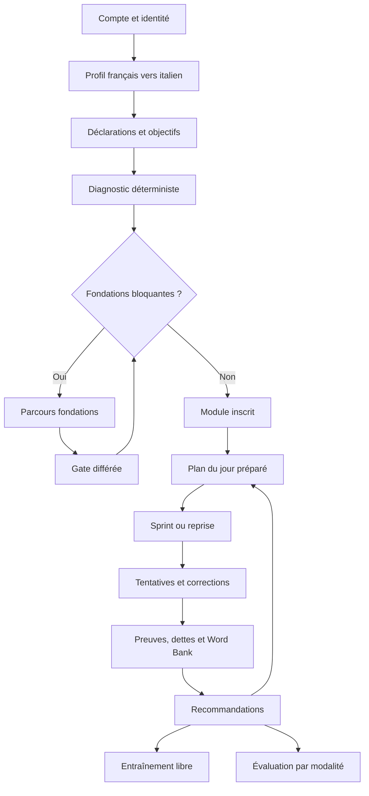

# Polyglot V2 - Personas, parcours et situations limites

## 1. Portée

Ce document ferme `B01`, `B02` et `B07`. Il décrit les états d'entrée et les
parcours observables. Les règles de calcul restent dans les documents 10 à 14 ;
l'UX détaillée reste dans le document 20.

## 2. Personas normatifs

| ID | État initial | Besoin principal | Risque à éviter | Résultat attendu |
|---|---|---|---|---|
| `P-ABS` | aucune preuve, aucune connaissance déclarée exploitable | acquérir les fondations puis réussir un premier échange | lancer un sprint incompréhensible | fondations actives, puis pilote guidé |
| `P-FAUX` | exposition antérieure, réception partielle, production fragile | vérifier ce qui est réellement disponible | recommencer tout ou surévaluer une déclaration | diagnostic différencié et rappels ciblés |
| `P-INT` | fondations solides, preuves sur plusieurs modalités | pratiquer transfert, précision et fluidité | imposer des contenus trop élémentaires | dispense justifiée et module plus dense |
| `P-RETOUR` | historique existant mais ancien, échéances nombreuses | reprendre sans punition ni surcharge | confondre oubli estimé et perte définitive | sprint de reprise borné et plan rééchelonné |
| `P-A11Y` | l'une des situations précédentes avec adaptations | accomplir le même objectif par un accès adapté | diminuer arbitrairement la preuve | modalité réellement mesurée et adaptation sans coût |
| `P-AUTEUR` | rôle éditorial, aucun droit implicite sur les données apprenant | créer et certifier un pack ou module | publication directe ou fuite de données | brouillon validé, revu, approuvé puis publié |

Un utilisateur peut cumuler plusieurs contraintes. Le persona sélectionne une
fixture de preuve ; il ne devient jamais une étiquette permanente du compte.

## 3. Parcours général

## 4. Scénarios de bout en bout

### E2E-01 - Débutant absolu

**Étant donné** un compte neuf, français comme langue d'appui et italien comme
langue cible, sans déclaration positive ; **quand** le diagnostic atteint sa
règle d'arrêt basse ; **alors** le profil passe en `Foundations`, les blocs F1 à
F5 sont planifiés, aucun niveau CECR n'est affirmé et aucun module ouvert n'est
accessible avant la gate. Après deux sessions et le contrôle différé conforme,
le premier module peut être inscrit sans créer de maîtrise rétroactive.

### E2E-02 - Faux débutant

**Étant donné** une exposition déclarée et des réussites réceptives mais une
production insuffisante ; **quand** le diagnostic se termine ; **alors** seules
les fondations non prouvées restent obligatoires. Le premier sprint réutilise
les connaissances vérifiées, teste les zones incertaines et n'accorde aucun
crédit à la seule déclaration.

### E2E-03 - Intermédiaire

**Étant donné** des preuves canoniques satisfaisant `DIAGNOSTIC_V0` ; **quand**
le diagnostic est finalisé ; **alors** les fondations sont dispensées avec une
raison consultable. Le module proposé privilégie transfert, contexte nouveau,
production et réparation ; la dispense n'ajoute aucune nouvelle preuve.

### E2E-04 - Reprise après interruption longue

**Étant donné** un profil ancien, des maîtrises vieillies et plusieurs rappels
dus ; **quand** l'utilisateur revient ; **alors** le produit propose un sprint de
10 à 30 minutes qui borne la dette, conserve les faits historiques et étale le
reste. Un jour manqué n'avance pas le module et une série perdue n'abaisse aucun
score pédagogique.

### E2E-05 - Sprint quotidien

**Étant donné** un module actif, une Word Bank et un budget ; **quand** le plan
est composé avec une graine donnée ; **alors** le snapshot respecte prérequis,
blocs obligatoires, échéances J+1 et budget. Toute sélection possède une raison.
Interrompre puis reprendre restaure le dernier état confirmé ; soumettre deux
fois la même réponse n'ajoute qu'une tentative logique.

### E2E-06 - Liste avant, pendant et après le sprint

**Étant donné** une liste personnelle associée à un module ; **quand** le sprint
démarre ; **alors** un snapshot fige ses membres. Ajouter un mot pendant la
session crée une rencontre et peut ouvrir une dette future, mais ne modifie pas
le plan courant. Modifier ou archiver la liste après la session ne réécrit ni
les instances, ni les tentatives, ni les preuves historiques.

### E2E-07 - Entraînement libre

**Étant donné** une cible, une durée et éventuellement une liste ; **quand** le
profil satisfait les prérequis ; **alors** le même compositeur crée un plan
`free_practice`. Les preuves sont identifiées comme entraînement libre et leur
poids suit la politique. Si un prérequis manque, le système propose une activité
préparatoire ou refuse avec une explication ; il ne contourne pas le graphe.

### E2E-08 - Quatre évaluations

**Étant donné** un profil actif ; **quand** l'utilisateur lance une modalité ;
**alors** protocole, forme, minuteur et versions sont figés. Fermer le navigateur
permet la reprise selon la fenêtre. Finaliser produit uniquement les preuves de
la modalité mesurée. Les quatre résultats restent séparés et leur agrégation ne
masque jamais une modalité absente ou non évaluable.

### E2E-09 - Auteur sans LLM

**Étant donné** un auteur assigné à l'italien ; **quand** il crée une structure,
un exercice et un module ; **alors** les validateurs produisent un rapport. Un
reviewer distinct approuve. La publication atomique épingle les révisions. Une
ancienne session reste interprétable après retrait ou remplacement.

### E2E-10 - Suppression d'une langue

**Étant donné** un profil italien ; **quand** l'utilisateur confirme la purge
après réauthentification ; **alors** nouveaux runs et jobs sont bloqués, les
données privées et médias sont purgés selon leur cycle, un tombstone est créé et
les sauvegardes rejouent ce tombstone après restauration. Le catalogue partagé
et les autres profils du compte ne sont pas supprimés.

## 5. Matrice des situations limites

| Situation | Message/action de sortie | Conservation | Effet pédagogique |
|---|---|---|---|
| aucune langue | créer un profil | compte intact | aucun |
| aucun module disponible | proposer fondations, libre ou attendre contenu | profil intact | aucun |
| aucune carte due | remplacer par nouveauté permise ou raccourcir | plan justifié | aucun échec |
| liste vide | ajouter/importer ou retirer la contrainte | liste conservée | aucun |
| Word Bank vide | démarrer par fondations/pilote | état vide explicite | aucune maîtrise |
| contenu retiré avant départ | recomposer avec révision publiée compatible | ancien plan auditable | aucun |
| contenu retiré pendant run | finir avec snapshot si droits valides, sinon indisponible | tentative conservée | aucune fausse erreur |
| média absent | utiliser seulement une alternative publiée | position conservée | modalité absente non créditée |
| voix TTS retirée | choisir une voix ou continuer sans audio | préférence conservée | aucun fallback |
| correction ambiguë | marquer non évaluable, contester/revoir | réponse brute intacte | preuve suspendue |
| correcteur indisponible | poursuivre sans verdict ou mettre en revue | tentative intacte | aucune preuve |
| réseau lent | sauvegarde visible, même clé rejouée | brouillon local borné | aucun doublon |
| conflit multi-appareil | recharger/choisir après comparaison | deux versions auditées | aucune réécriture silencieuse |
| sprint trop long | enlever d'abord les options, jamais couper une primitive | plan antérieur conservé | priorités respectées |
| dette supérieure au budget | traiter le sous-ensemble prioritaire et étaler | causes conservées | aucune pénalité globale |
| jour/fuseau modifié | appliquer au prochain jour pédagogique | runs passés figés | aucun déplacement rétroactif |
| réponse vide | demander confirmation du saut ou corriger le format | brouillon conservé | distinct d'une erreur |
| fournisseur/LLM absent | runner et contenus humains | job en erreur visible | parcours coeur disponible |
| permission refusée | retour sûr et demande d'accès si pertinente | aucune fuite | aucun |
| session expirée | réauthentifier puis reprendre depuis serveur | dernier accusé conservé | aucun doublon |
| import partiellement invalide | aperçu, rapport, sélection des lignes valides | fichier en quarantaine courte | aucun avant commit |
| suppression en cours | afficher progression et bloquer les mutations | tombstone et audit | projections masquées |

## 6. Critères de fermeture

- Chaque scénario utilise les mêmes commandes, états et contrats que les tests.
- Aucun chemin alternatif ne transforme absence, interruption ou ambiguïté en
  échec pédagogique.
- Chaque écran correspondant possède un état vide, une sortie et une reprise.
- Les parcours fonctionnent avec fixtures locales, sans LLM, TTS ou STT réel.
