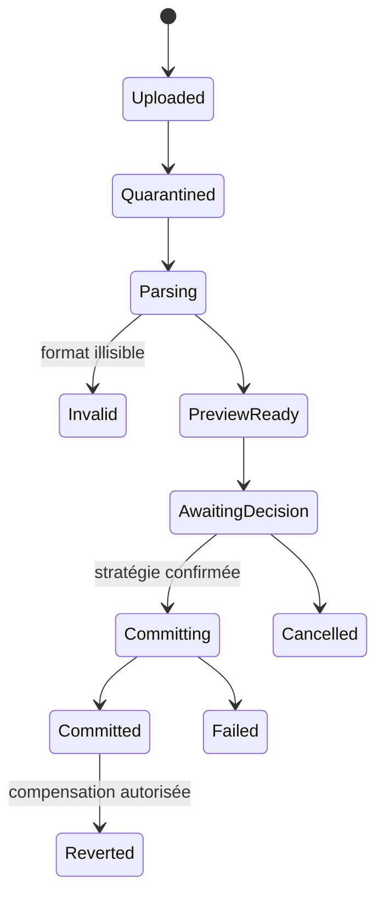
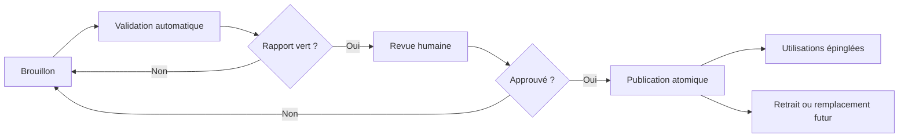

# Polyglot V2 - Imports, gestes lexicaux et cycle éditorial

## 1. Portée

Ce document ferme `E05`, `E06`, `I01`, `I03` et le contrat de `I05`. Il ne
migre aucune donnée V1. Il définit les formats V2, l'effet des gestes utilisateur
et la même chaîne de validation pour un auteur humain, un import ou un LLM.

## 2. Formats d'import initiaux

| ID | Public | Contenu | Usage |
|---|---|---|---|
| `polyglot.lexicon.bundle/v1` | apprenant/auteur | unités, sens, formes, équivalents, listes, tags, provenance | import lexical riche |
| `polyglot.memory.prompts/v1` | apprenant | invites recto-verso, directions et métadonnées | cartes existantes sans historique |
| `polyglot.generic.qa/v1` | apprenant | question, réponse, langue, tags optionnels | compatibilité générique CSV/JSON |
| `polyglot.authoring.bundle/v1` | auteur | artefacts, révisions, dépendances, médias référencés | échange éditorial contrôlé |
| `polyglot.user.export/v1` | propriétaire | manifeste privé complet | réimport/restauration applicative future |

CSV est accepté seulement pour les formats tabulaires lexique et question/réponse.
JSON est requis dès qu'un sens, une forme, une relation ou une provenance doit
être représenté sans ambiguïté. Chaque fichier déclare format, version, encodage,
langues, séparateur éventuel et empreinte.

Un import de cartes ne reprend pas un score SM-2/FSRS externe comme vérité. Il
peut conserver cet historique dans une archive de provenance ; les nouveaux
`MemoryPrompt` démarrent avec une politique V2 explicitement choisie.

## 3. Pipeline transactionnel

1. Réserver puis charger dans le pipeline média hostile.
2. Détecter type réel, taille, encodage, archive et empreinte.
3. Parser vers un modèle intermédiaire versionné sans mutation métier.
4. Valider schéma, langues, limites, références et permissions.
5. Résoudre les candidats de doublon et produire un aperçu stable.
6. Demander une stratégie globale et les arbitrages ligne par ligne nécessaires.
7. Commit atomique par lot borné avec clé d'idempotence.
8. Produire manifeste, rapport par ligne, IDs créés/réutilisés et inverse logique.

Un aperçu expire, mais son empreinte et sa stratégie sont conservés dans l'audit.
Le commit échoue si le fichier, la version du catalogue ou un arbitrage requis a
changé. Un import partiel n'est possible qu'après sélection explicite des lignes
valides ; il ne signifie jamais « ignorer silencieusement les erreurs ».

## 4. Doublons et conflits

Le moteur classe un rapprochement, il ne fusionne pas sur la seule chaîne :

| Classe | Exemple | Choix autorisés |
|---|---|---|
| `exact_identity` | même ID et même révision | ignorer comme rejeu |
| `same_sense` | même variété, sens et cadre | réutiliser, enrichir par nouvelle assertion |
| `same_form_other_sense` | homonyme ou polysémie | créer/relier un sens distinct |
| `same_prompt` | même cible, direction et protocole | fusionner l'intention, jamais les reviews |
| `content_revision_conflict` | même identité, payload différent | nouvelle révision ou rejet |
| `private_public_collision` | candidat privé proche d'un sens partagé | relier, conserver privé ou demander revue |
| `ambiguous` | preuves insuffisantes | conserver en attente, aucune preuve par sens |

Stratégies globales : `fail_on_conflict`, `reuse_exact`, `create_distinct` et
`interactive`. `overwrite` n'existe pas. Une fusion crée une lignée et conserve
les identifiants remplacés. Une erreur de ligne contient code, chemin, valeur
redactée, choix possibles et action de réparation.

## 5. Export et partage

- L'export propriétaire est un job privé, chiffré, avec manifeste, versions,
  checksum et date d'expiration de téléchargement.
- L'export d'une langue peut inclure profil, déclarations, rencontres, listes,
  cartes, reviews, tentatives, productions, corrections, preuves, projections et
  consentements, selon les données encore conservées.
- Les projections sont accompagnées des faits et politiques nécessaires à leur
  explication ; elles ne sont pas présentées comme portables sans recalcul.
- Le partage publie seulement une liste ou un snapshot choisi, avec licence et
  provenance. Il exclut preuves, échéances, dettes et contexte privé.
- Réimporter son propre export n'est pas une fonction MVP. Son format reste
  versionné pour permettre un futur outil contrôlé, jamais une restauration SQL.

## 6. Gestes utilisateur et effets métier

| Geste | Catalogue/sens | Liste | Prompt mémoire | Dette/preuve | Historique |
|---|---|---|---|---|---|
| ajouter un mot | référence un sens ou crée candidat privé | optionnel | optionnel | déclaration sans preuve | rencontre manuelle ajoutée |
| corriger le sens d'une rencontre | ajoute interprétation courante | inchangée sauf choix | cible future recalculée | anciennes preuves invalidées si dépendantes | réponse brute intacte |
| créer/renommer/colorer un tag | aucun | métadonnée personnelle | filtres seulement | aucun | révision de liste/tag |
| déplacer/ajouter à une liste | aucun | membre ajouté/retiré | aucun automatique | aucun | snapshots passés intacts |
| cloner une liste | références réutilisées | nouvelle identité | prompts non clonés par défaut | aucun | provenance du clone |
| fusionner des listes | aucun | nouvelle révision ou liste résultat | aucune fusion implicite | aucun | sources archivables |
| fusionner des sens | lignée éditoriale ou privée | membres redirigés | prompts retargetés par commande | projections recalculées | IDs historiques résolus |
| séparer un sens | nouveaux sens liés | membres demandent arbitrage | prompts suspendus si ambiguïté | preuves non attribuées automatiquement | fait source conservé |
| « je connais déjà » | aucun | filtre d'attention | suspend/reporte selon choix | poids de preuve nul | déclaration auditée |
| créer une carte | aucun | optionnel | nouveau protocole/direction | aucune preuve | événement de création |
| suspendre/reset carte | aucun | aucun | état suspendu/nouvel état | aucune suppression | reviews conservées |
| archiver liste/carte | aucun | masquée | prompt suspendu | dette non résolue | restauration possible |
| supprimer contexte privé | aucun | aucun | aucun direct | invalide preuve non explicable | tombstone, faits minimaux |
| associer liste à module | aucun | rôle et fenêtre | prompts planifiables | aucun immédiat | snapshot au démarrage |
| partager | aucune mutation catalogue | snapshot publié | aucun | aucune donnée personnelle | publication séparée |

Pendant un sprint, tout geste lexical est une commande séparée. Il ne modifie
jamais le snapshot en cours, n'accorde pas de réussite et ne retarde pas la
sauvegarde de la tentative principale.

## 7. Cycle éditorial commun

Types d'artefacts : pack de langue, compétence, fonction, structure, moule,
entrée lexicale, politique, contenu, média, définition d'exercice, module,
journée, protocole d'évaluation et fixture.

- Toute modification de payload crée une révision.
- Le rapport de validation appartient à la révision et à la version des
  validateurs.
- Auteur et approbateur final sont distincts.
- Une publication de pack est un manifeste atomique de révisions exactes.
- Retirer bloque les nouvelles utilisations ; les snapshots historiques restent
  interprétables tant que les droits le permettent.
- Un correctif urgent est une nouvelle révision soumise aux mêmes invariants ;
  l'approbation peut être accélérée mais jamais supprimée.

## 8. Validateurs obligatoires

| Famille | Contrôles bloquants |
|---|---|
| schéma | types, limites, unions fermées, identifiants et versions |
| références | révisions existantes, statut publiable, absence de cycle |
| langue | variété, langue des consignes, script, normalisation et morphologie |
| prérequis | cibles acquérables, ordre et difficulté autorisée |
| pédagogie | objectif observable, alignement leçon/exercice/preuve, charge de nouveauté |
| exercice | primitive certifiée, aides, correction, observations, accessibilité |
| correction | réponses acceptées, contrastes, ambiguïtés, panne non évaluable |
| sprint/module | budgets, noyau, J+1, cohérence lexique/structures/contextes |
| évaluation | couverture, indépendance modalité, fuite de réponse, grille |
| média | droits, provenance, transcript, checksum, alternative et disponibilité |
| sécurité | contenu hostile, données privées, injection d'outil, limites |
| qualité | naturalité, registre, stéréotypes, règle absolue et explication trompeuse |
| déterminisme | même entrée, versions, horloge et graine donnent le même artefact dérivé |

Les défauts V1 deviennent des fixtures de rejet, notamment une prononciation
réduite à du vocabulaire, « le pronom sujet est toujours avant le verbe », une
confusion `essere/stare`, une correction en panne comptée juste, un dialogue où
une même personne enchaîne artificiellement `Grazie, prego`, et une règle
`andare + infinitif` présentée comme équivalent général du futur proche français.

Les contrôles de naturalité et d'exactitude linguistique peuvent être marqués
`human_required`; ils ne sont pas simulés par un booléen automatique. Un rapport
distingue erreur bloquante, avertissement, information et contrôle manuel.

## 9. Façade auteur et LLM

L'Atelier et les outils utilisent les mêmes commandes. Un auteur ou un modèle
peut lire un contexte borné, soumettre un brouillon, demander une validation et
lire le rapport. Il ne peut ni modifier une preuve utilisateur, ni contourner
un prérequis, ni approuver son propre contenu, ni publier directement.

Chaque tâche de génération fixe : artefact attendu, schéma, pack et révisions,
cibles, lexique autorisé/interdit, difficulté, limites, exemples, validateurs,
budget d'appels/coût, timeout, fournisseur explicite et politique de données.
Une sortie invalide est conservée comme tentative échouée ; aucun autre modèle
n'est appelé automatiquement.

## 10. Évaluation future d'un LLM

Le branchement d'un modèle exige un benchmark versionné, séparé de la validation
d'un artefact individuel :

1. corpus de tâches couvrant structures, exercices, modules, corrections et cas
   adversariaux ;
2. références humaines et rubriques par critère ;
3. au moins trois répétitions par tâche avec paramètres et graines conservés ;
4. mesures de conformité schéma, validité des références, taux de rejet,
   exactitude linguistique, naturalité, couverture, diversité, stabilité,
   latence, tokens et coût ;
5. zéro erreur critique de sécurité, confidentialité, prérequis ou publication ;
6. revue aveugle humaine sur l'échantillon publié ;
7. comparaison au runner humain et à la version de modèle précédente ;
8. seuils inscrits dans une politique `MODEL_ACCEPTANCE_*` après calibration.

Un modèle accepté pour créer un exemple ne l'est pas automatiquement pour une
correction, un diagnostic ou une évaluation. Chaque capacité possède son propre
allowlist et peut être désactivée sans affecter le produit déterministe.

## 11. Tests normatifs

- rejeu d'import identique : un effet ; corps différent avec même clé : conflit ;
- CSV valide, partiellement invalide, encodage faux et archive hostile ;
- homonyme, polysémie, forme syncrétique et expression multi-mots ;
- aperçu devenu obsolète avant commit ;
- rollback d'un import sans suppression d'un objet ensuite réutilisé ;
- correction tardive d'un sens sans réécriture d'une tentative ;
- snapshot de liste stable avant/pendant/après sprint ;
- auteur ne pouvant approuver son brouillon ;
- révision publiée immuable et ancienne tentative toujours interprétable ;
- chaque défaut V1 connu rejeté par validateur ou revue requise ;
- outil LLM invalide, timeout, quota et double appel sans publication ;
- export privé isolé et partage limité au snapshot choisi.
