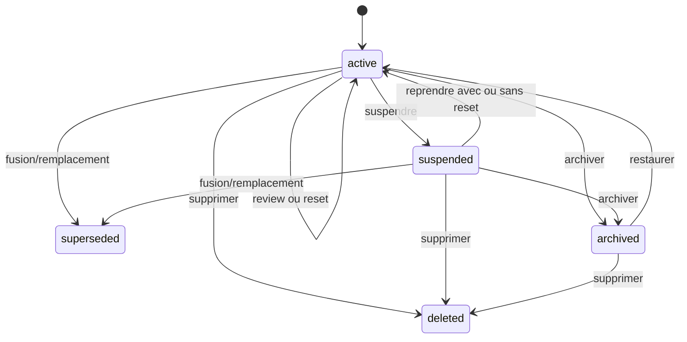

# Polyglot V2 - Mémoire planifiée et contrat FSRS

## 1. Décision

Ce document ferme `E03`. FSRS planifie uniquement des rappels comparables ; il
ne calcule ni maîtrise de compétence, ni niveau de langue. Polyglot utilise une
bibliothèque FSRS maintenue derrière `MemorySchedulerPort`, avec version,
paramètres et résultats épinglés. Il ne réimplémente pas les formules.

FSRS modélise notamment difficulté, stabilité et rappel attendu ; le contrat
Polyglot conserve ces valeurs sans en faire des scores pédagogiques visibles.
Sources : [projet officiel FSRS](https://github.com/open-spaced-repetition/free-spaced-repetition-scheduler),
[manuel Anki sur FSRS](https://docs.ankiweb.net/deck-options.html#fsrs).

## 2. Unité planifiée

`MemoryPrompt` possède :

- `prompt_id`, `profile_id`, `target_ref` et révision de cible ;
- `direction` : `target_to_support`, `support_to_target`, `audio_to_meaning`,
  `meaning_to_audio`, `form_to_lemma` ou autre valeur certifiée par le pack ;
- `modality`, `operation` et `protocol_id` ;
- stimulus/réponse construits depuis des révisions, jamais copiés comme vérité ;
- `scheduler_policy_id`, `desired_retention`, fuseau et règle de due ;
- état courant et historique append-only ;
- statut `active`, `suspended`, `superseded`, `archived` ou `deleted`.

Deux directions sont deux prompts. Reconnaître `treno -> train` ne planifie pas
automatiquement produire `train -> treno`. Une expression multi-mots et ses
composants restent indépendants.

## 3. État du planificateur

`MemoryScheduleState` est une projection :

| Champ | Règle |
|---|---|
| `scheduler_kind` | `fsrs` initialement |
| `scheduler_version` | version exacte de bibliothèque/algorithme |
| `parameter_set_id` | paramètres immuables et provenance |
| `state` | `new`, `learning`, `review` ou `relearning` |
| `difficulty`, `stability` | décimaux du moteur, bornés/validés par adaptateur |
| `last_review_at`, `due_at` | UTC, jour pédagogique dérivé séparément |
| `reps`, `lapses` | compteurs reconstruits depuis reviews éligibles |
| `last_rating` | `again`, `hard`, `good`, `easy` |
| `desired_retention` | politique du profil, défaut `0.90`, bornes `0.80..0.97` |
| `projection_version` | contrôle de concurrence |

La récupérabilité à un instant est calculée par l'adaptateur depuis l'état et
l'horloge ; elle n'est pas persistée comme vérité durable. Les échéances sont
arrondies selon la politique de journée puis éventuellement décalées par un
fuzz déterministe. Un rappel `after_24h` ne peut pas être avancé sous 24 heures.

## 4. Review éligible et notation

`MemoryReview` conserve prompt/révision, opportunité, réponse brute éventuelle,
correction, aides, temps actif, note, instant réel, instant prévu, état avant,
état après, version moteur/paramètres et clé d'idempotence.

Seul un exercice certifié avec opération de rappel compatible peut créer une
review FSRS. Exposition, QCM de reconnaissance, production incidente, Gym où la
réponse est fournie et auto-déclaration n'en créent aucune.

Contraintes de note :

| Résultat observable | Notes autorisées |
|---|---|
| incorrect ou oubli déclaré | `again` |
| correct après H3/H4 | `again`, `hard` |
| correct après H1/H2 | `hard`, `good` |
| correct sans aide | `hard`, `good`, `easy` |
| correction ambiguë/non évaluable | aucune review |

Avec réponse automatiquement vérifiable, le moteur propose la note maximale
autorisée ; l'utilisateur peut choisir une note plus prudente. Sans réponse
vérifiable, l'auto-note est conservée avec confiance faible et ne devient pas
une preuve de maîtrise, même si elle met à jour le calendrier mémoire.

## 5. Transitions et commandes

Le statut produit ci-dessus est indépendant de `memory_state` (`new`,
`learning`, `review`, `relearning`) porté par `MemoryScheduleState`. Reprendre
sans reset conserve cet état et son calendrier ; reprendre après reset recrée un
état `new`. `superseded` et `deleted` sont terminaux.

Commandes : `CreateMemoryPrompt`, `SubmitMemoryReview`, `SuspendMemoryPrompt`,
`ResumeMemoryPrompt`, `ResetMemoryPrompt`, `MergeMemoryPrompts`,
`ArchiveMemoryPrompt`, `RestoreMemoryPrompt` et `DeleteMemoryPrompt`.

- **Suspendre** retire des files dues sans changer reviews ou état calculé.
- **Reprendre** recalcule la due depuis la même politique et l'instant courant ;
  le retard n'est pas transformé en échec.
- **Reset** ajoute `MemoryScheduleReset`, conserve toutes les reviews, crée une
  nouvelle lignée `new` et exige une raison.
- **Archiver** est réversible et suspend implicitement.
- **Supprimer** suit la politique privée ; les faits nécessaires à une preuve
  conservée doivent être anonymisés ou la preuve invalidée.

## 6. Fusion, séparation et import

Deux prompts sont fusionnables automatiquement seulement s'ils ont même profil,
cible résolue, direction, modalité, protocole et sémantique de notes. Le moteur :

1. choisit ou crée un prompt canonique ;
2. déduplique les reviews par `opportunity_id` et idempotency key ;
3. trie par instant causal ;
4. rejoue toutes les reviews compatibles avec une version de politique choisie ;
5. marque les sources `superseded` et conserve la lignée.

Des protocoles incompatibles ne sont pas moyennés. Ils restent séparés ou sont
réinitialisés après décision explicite. Séparer un sens suspend les prompts
ambigus ; les reviews ne sont attribuées à un nouveau sens que si leur stimulus
et leur réponse le déterminent sans ambiguïté.

Un historique importé est archivé par défaut. Il devient rejouable seulement si
format, dates, notes, directions et protocole sont vérifiables. Aucun champ SM-2
ou état V1 n'est injecté directement dans un état FSRS V2.

## 7. Paramètres et optimisation

- Le pack publie un jeu par défaut ; le profil peut choisir une rétention dans
  les bornes autorisées.
- Learning/relearning steps restent sous un jour pédagogique et sont versionnés.
- Toute modification de paramètres crée `parameter_set_id` et une projection
  parallèle ou recalculée ; les reviews restent immuables.
- Une optimisation personnalisée est différée jusqu'à un minimum documenté de
  reviews exploitables et un benchmark de parité. Sans données suffisantes, le
  jeu par défaut reste actif.
- La version exacte du moteur est verrouillée. Une montée de version exige
  golden histories, comparaison des due, bornes et rollback de projection.

## 8. File due et composition

La requête due retourne prompt, échéance, retard, cible, direction, coût estimé,
priorité et raison. Elle est paginée, isolée par profil et stable pour un instant
de coupure. Le sprint snapshotte les prompts sélectionnés ; une review sur un
autre appareil après la coupure provoque un conflit ou une recomposition avant
démarrage, jamais une double review silencieuse.

La priorité du sprint peut utiliser retard et risque fournis, mais ne modifie
jamais directement l'état FSRS. Terminer une dette grammaticale ne ferme pas une
carte lexicale et inversement.

## 9. Propriétés et fixtures

1. même historique, horloge, moteur, paramètres et rétention donnent même état ;
2. même review rejouée donne un effet ; payload divergent donne conflit ;
3. chaque direction évolue indépendamment ;
4. suspension ne modifie ni stabilité ni historique ;
5. reset conserve reviews et crée une nouvelle lignée ;
6. retard n'est jamais une note `again` implicite ;
7. révélation H4 ne peut produire `good` ou `easy` ;
8. correction non évaluable ne met pas à jour le calendrier ;
9. fusion compatible équivaut au rejeu dédupliqué ;
10. fusion incompatible exige décision explicite ;
11. import SM-2 n'alimente aucun champ FSRS sans conversion certifiée ;
12. changement de fuseau ne déplace pas rétroactivement les reviews ;
13. propriété et RLS empêchent toute lecture croisée ;
14. corpus extrême respecte le p95 de file due du document 06.

Fixtures `FX-MEMORY` : prompt neuf, deux directions, suite
`again/good/good/easy`, review anticipée, retardée, dupliquée, suspendue,
reset, fusion compatible/incompatible, import SM-2 archivé et changement de
version du moteur.
