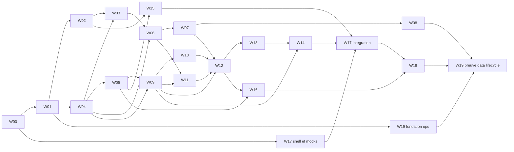

# Polyglot V2 - Plan d'implementation detaille W00-W19

> **Pour les agents d'implementation :** utiliser `superpowers:subagent-driven-development`
> ou `superpowers:executing-plans` pour executer ce plan lot par lot. Les cases
> `- [ ]` suivent le travail reel. Elles ne doivent etre cochees qu'apres obtention
> de la preuve indiquee.

**Objectif :** construire Polyglot V2 dans un nouveau depot, depuis les contrats
jusqu'a une release reversible, en conservant une separation stricte entre
specification, implementation et preuve.

**Architecture :** monolithe modulaire Python/FastAPI/PostgreSQL avec API et
worker partageant le meme coeur metier, frontend React/TypeScript, contrats
OpenAPI/JSON Schema versionnes, outbox transactionnelle et adaptateurs externes
optionnels. Les workstreams `W00-W19` ont des write sets exclusifs et convergent
par interfaces publiques plutot que par lecture des tables d'un autre module.

**Stack cible :** Python, FastAPI, Pydantic, SQLAlchemy, Alembic, PostgreSQL,
`uv`, React, TypeScript strict, Vite, TanStack Query, React Hook Form, Zod,
Vitest, Testing Library, Playwright, axe-core, Hypothesis, Schemathesis,
OpenTelemetry, images OCI, OpenTofu et GCP.

## 1. Statut et sources

Ce fichier est un **plan**, pas une preuve d'implementation. A sa creation :

- les specifications existent dans `docs/v2` ;
- le depot cible `polyglot-v2` n'est pas cree par ce document ;
- les migrations, fixtures executables, tests, rapports et captures mentionnes
  ci-dessous ne sont pas reputes exister ;
- chaque resultat attendu de commande est une condition de sortie future, pas le
  compte rendu d'une execution deja realisee.

Sources normatives principales :

- document 15 : stack, modules, structure cible, transactions et outils ;
- document 19 : niveaux de preuve, gates, fixtures et delegation ;
- document 23 : ownership `W00-W19`, exigences, fixtures et approbateurs ;
- document 25 : enums, commandes, routes, erreurs et idempotence canoniques.

En cas d'ecart, le registre 25 prevaut pour les noms techniques et le document 15
pour les frontieres applicatives. Une incoherence non resolue renvoie le lot a
`GATE-G0` ou `GATE-G1`; elle n'est pas arbitree dans le code.

## 2. Trois natures de travail

| Nature | Definition | Etat initial | Condition de changement d'etat |
|---|---|---|---|
| Specification | decision, invariant, contrat ou scenario normatif | `specified` | revue documentaire et approbateur nomme |
| Implementation | code, migration, fixture executable ou configuration | `not_started` | diff integre avec write set respecte |
| Preuve | resultat reproductible d'un test, rapport, capture ou exercice | `missing` | commande executee sur revision/environnement identifies |

Une PR peut donc etre `implemented` sans etre `verified`, et `verified` sans etre
`accepted`. Les validations linguistiques, visuelles, de restauration, de canary
et d'usage humain restent des preuves distinctes.

## 3. Contraintes globales

1. Nouveau depot et base V2 vide ; aucune migration de donnees V1.
2. PostgreSQL est l'unique source de verite metier ; SQLite est interdit pour les
   tests de persistance.
3. Le domaine ne depend ni de FastAPI, ni de SQLAlchemy, ni d'un SDK fournisseur.
4. Les modeles domaine, ORM, API et frontend sont distincts et convertis
   explicitement.
5. Toute creation, soumission, import et creation de job exige une cle
   d'idempotence ; toute mutation non commutative exige une version attendue.
6. Les faits pedagogiques et reponses confirmees sont append-only.
7. Les evenements sortants passent par une outbox ecrite dans la transaction.
8. Aucune publication n'est provoquee directement par un LLM ou un job.
9. Aucun fournisseur externe n'est requis pour le parcours de reference.
10. Aucun retry payant/non deterministe ni fallback fournisseur n'est implicite.
11. Les donnees privees ne figurent ni dans URL, logs, metriques, files ou
    artefacts de preuve generaux.
12. Toute collection est paginee ; toute traversee de graphe est bornee.
13. Toute PR cite les `CapabilityId`/`REQ-*`, son workstream et son write set.
14. Les seuils Q0-Q6 du document 19 s'appliquent sans transformer une couverture
    chiffree en preuve suffisante.
15. Une migration est additive ou suit `expand -> migrate -> switch -> contract`.
    Un rollback applicatif ne tente pas d'annuler automatiquement une migration
    destructive.

## 4. Arborescence cible et ownership

```text
polyglot-v2/
  backend/
    pyproject.toml
    uv.lock
    src/polyglot/
      bootstrap/
      interfaces/{http,tasks,tools}/
      modules/
        identity/
        language_profiles/
        catalogue/{core,grammar}/
        content/
        lexicon/{core,memory,exchange}/
        exercises/{core,gym}/
        curriculum/
        sprints/
        progress/
        assessments/
        media/
        generation/
      platform/
    migrations/versions/
    tests/{unit,property,integration,contract}/
  frontend/
    src/{app,components,features,generated,lib}/
    tests/{component,e2e,visual}/
  contracts/{registry,openapi,events,tools,fixtures}/
  fixtures/canonical/
  infra/{modules,environments}/
  docs/{adr,runbooks,evidence}/
  compose.yaml
```

Regles de write set :

- seul `W00` modifie manuellement `contracts/registry/**`, `contracts/events/**`,
  `contracts/tools/**`, `contracts/fixtures/**` et les ADR de contrat ;
- `contracts/openapi/v1.json` et `frontend/src/generated/**` sont generes, jamais
  modifies manuellement. Chaque PR metier execute une generation temporaire
  `--check`; le bot d'integration `W00/W01` commet l'OpenAPI, puis le bot `W17`
  regenere le client dans un commit compagnon avant merge. Ces commits generes
  sont les seuls ecarts autorises aux write sets ;
- un workstream metier ne modifie que son sous-dossier de module, ses tests, sa
  migration reservee et ses fixtures canoniques ;
- les changements d'interface partagee passent par une RFC/PR `W00` avant le lot
  consommateur ;
- les numeros de migration ci-dessous sont reserves. Aucun agent ne reutilise un
  numero ou ne cree une seconde tete Alembic.

## 5. Commandes de preuve communes

Ces commandes sont les interfaces de verification a rendre executables par
`W01`. Elles ne sont pas declarees vertes avant execution dans le depot cible.

```bash
# Qualite backend
cd backend && uv run ruff check src tests
cd backend && uv run mypy src
cd backend && uv run pytest tests/unit tests/property -q

# Persistance et contrats
docker compose up -d postgres object-storage
cd backend && uv run alembic upgrade head
cd backend && uv run pytest tests/integration tests/contract -q
cd backend && uv run python -m polyglot.interfaces.http.export_openapi \
  --check ../contracts/openapi/v1.json

# Frontend
pnpm --dir frontend lint
pnpm --dir frontend typecheck
pnpm --dir frontend test --run
pnpm --dir frontend exec playwright test

# Verification globale hors fournisseurs
(cd backend && POLYGLOT_NETWORK_DISABLED=1 uv run pytest \
  tests/contract/test_offline_reference_path.py -q)
```

Chaque commande de preuve archive dans `docs/evidence/<workstream>/` un manifeste
contenant commit, environnement, versions, fixture, commande, code de sortie et
liens vers les artefacts. Les sorties volumineuses restent dans le systeme CI ou
le stockage de preuves, pas dans Git.

## 6. Politique migrations et fixtures

| Revision reservee | Workstream | Objet |
|---|---|---|
| `0001_platform` | W01 | commandes, jobs generiques, provenance, idempotence, evenements, outbox/inbox, audit, flags, suppression/tombstones |
| `0002_identity` | W02 | comptes, identites, sessions, consentements |
| `0003_catalogue` | W04 | packs, competences, structures, lexique partage minimal |
| `0004_language_profiles` | W03 | profils, diagnostics, fondations |
| `0005_content` | W05 | contenus, revisions, validations, publications |
| `0006_lexicon_core` | W06 | rencontres, sens personnels, relations et projections WB |
| `0007_memory` | W07 | prompts, reviews et etats de planification |
| `0008_exchange` | W08 | listes, snapshots, imports et exports |
| `0009_exercises` | W09 | definitions, instances, tentatives et corrections |
| `0010_gym` | W10 | plans Gym, etapes ordonnees et cycles de structures |
| `0011_curriculum` | W11 | modules, revisions, journees et inscriptions |
| `0012_sprints` | W12 | snapshots, plans, runs et blocs |
| `0013_progress` | W13 | observations, preuves, dettes et projections |
| `0014_assessments` | W14 | protocoles, runs, sections et resultats |
| `0015_media` | W15 | actifs, variantes, uploads et droits |
| `0016_generation` | W16 | specialisations de generation, tentatives, contrats d'outils et rapports |

Chaque fixture canonique possede `fixture_id`, `schema_version`, horloge, graine,
manifeste, empreintes et oracles. Le workstream prepare d'abord ses cas dans son
dossier de test ; il ne publie dans `fixtures/canonical/<FX-ID>/` qu'apres
validation du schema `W00`.

Les migrations n'introduisent une cle etrangere que vers une table deja creee.
Une reference vers un lot aval est d'abord un UUID opaque valide par le port du
module owner ; le lot aval ajoute ensuite sa table de liaison et sa contrainte.
Ainsi W09 ne reference pas `SessionPlan` : W12 cree
`session_plan_exercise_instance`. Les liens causaux polymorphes de rencontres,
reviews et audit restent des references typees sans FK inter-module. Aucun lot
ne cree une seconde tete Alembic.

## 7. Parallellisme et chemin critique



Vagues autorisees :

- vague 0 : `W00` seul ;
- vague 1 : `W01` seul sur la fondation partagee ;
- vague 2 : `W02`, `W04`, `W17-shell` et `W19-fondation` en parallele ;
- vague 3 : `W03`, `W05` puis `W06`, `W09`, `W15` selon leurs dependances ;
- vague 4 : `W07`, `W10`, `W11` en parallele ; `W08` des que `W07` sort ;
- vague 5 : `W12`, puis `W13` ;
- vague 6 : `W14`, `W16` et integration progressive `W17` ;
- vague 7 : `W18`, puis fermeture `W19`.

Chemin critique fonctionnel :

```text
W00 -> W01 -> (W02 + W04) -> W03 -> W06 -> W07
     -> (W09 + W10 + W11) -> W12 -> W13 -> W14
     -> W17 integration -> W18 -> W19
```

`W08`, `W15` et `W16` sont hors du chemin central tant qu'ils ne retardent pas
respectivement `GATE-G3`, l'interface audio et l'Atelier. Toute modification de
`contracts/**` remet les consommateurs concernes derriere une nouvelle gate
`W00`.

### 7.1 Spikes bloquants avant production

Un spike est un rapport jetable `adopter|rejeter`, jamais du code de production.
Il est execute apres les fixtures minimales et avant le premier code du mecanisme
qu'il tranche : `SPK-CRASH` avant W01 (outbox/reprise), `SPK-PUBLISH` avant W05,
`SPK-FSRS` avant W07, `SPK-IMPORT` avant W08, `SPK-CORRECTION` avant W09,
`SPK-COMPOSER` avant W12, `SPK-ORAL` avant W14 et `SPK-TTS` avant W15. Chaque
rapport fige hypothese, fixture, mesures, limites et decision. Un resultat absent
bloque le lot concerne, mais pas la baseline documentaire G0.

---

## W00 - Baseline, ADR et contrats centraux

**Etat initial :** specification disponible ; implementation et preuves absentes.

**Objectif :** creer le depot cible, figer les decisions partagees et fournir les
schemas que tous les lots consomment sans inventer de noms, routes ou enums.

**Write set exact :**

- `.gitignore`, `README.md`, `CONTRIBUTING.md` ;
- `docs/adr/0001-modular-monolith.md` a `docs/adr/0008-data-and-ai-boundaries.md` ;
- `contracts/registry/{enums.yaml,commands.yaml,queries.yaml,errors.yaml}` ;
- `contracts/events/{envelope.schema.json,event-catalogue.yaml}` ;
- `contracts/tools/{manifest.yaml,*.input.schema.json,*.output.schema.json}` ;
- `contracts/fixtures/manifest.schema.json` ;
- `contracts/tests/**` ;
- `scripts/validate_contract_registry.py`.

**Dependances :** documents 15, 19, 23, 25, 30 et 31 approuves. Aucun workstream code.

**Livrables d'implementation :** depot `polyglot-v2`, ADR de stack/frontieres,
registre machine-readable des enums/commandes/erreurs, enveloppes d'evenement et
schemas de fixtures/outils. L'OpenAPI executable reste produit par `W01`.

**Migrations :** aucune.

**Fixtures :** exemples minimaux valides/invalides dans `contracts/tests/fixtures`;
aucune fixture pedagogique canonique.

**Etapes TDD :**

- [ ] Ecrire les tests de schema qui echouent sur enum inconnu, route dupliquee,
  evenement sans `schema_version` et outil sans limites.
- [ ] Executer le validateur de contrats et constater les echecs attendus.
- [ ] Ajouter les registres canoniques issus du document 25.
- [ ] Ajouter les enveloppes JSON Schema et exemples positifs/negatifs.
- [ ] Executer les tests de coherence commandes/routes/evenements.
- [ ] Verifier que toute famille du document 23 possede owner, fixture, preuve et
  approbateur.
- [ ] Faire approuver les ADR ; seulement ensuite autoriser `W01`.

**Commandes de preuve cibles :**

```bash
python3 scripts/validate_contract_registry.py contracts/registry contracts/tests
```

Le validateur W00 utilise uniquement la bibliotheque standard. `pytest`, Ruff,
Mypy et les dependances applicatives n'existent qu'apres le bootstrap W01.

**Entree :** zero decision P0 ouverte. **Sortie :** schemas valides, aucune collision
de nom, ADR approuvees, commit de baseline immuable. Cela prouve la preparation
`GATE-G0`, pas encore `GATE-G1`.

**Risques/rollback :** une erreur de contrat contamine tous les lots. Rollback par
revert du commit de contrat avant demarrage des consommateurs ; apres consommation,
nouvelle version/RFC et compatibilite explicite, jamais modification silencieuse.

**Approbateur :** architecte + produit + securite. **Parallele :** aucun.
**Chemin critique :** oui, premier noeud.

## W01 - Fondation applicative et plateforme

**Etat initial :** planifie uniquement.

**Objectif :** rendre executables le backend, PostgreSQL, Alembic, le transport
HTTP, les transactions, l'idempotence, l'outbox, le worker et les commandes de
preuve communes.

**Write set exact :**

- `backend/{pyproject.toml,uv.lock,alembic.ini}` ;
- `backend/src/polyglot/bootstrap/**` ;
- `backend/src/polyglot/platform/**` ;
- `backend/src/polyglot/interfaces/http/{app.py,errors.py,dependencies.py,export_openapi.py}` ;
- `backend/src/polyglot/interfaces/tasks/**` ;
- `backend/migrations/versions/0001_platform.py` ;
- `backend/tests/{unit,property,integration,contract}/platform/**` ;
- `compose.yaml`, `.github/workflows/ci.yml` ;
- fichier genere `contracts/openapi/v1.json`.

**Dependances :** `W00`. **Livrables :** application healthcheck, session de
transaction, repository abstrait, horloge/UUIDv7, idempotency store, outbox/inbox,
dispatcher local, problem details et export OpenAPI reproductible.

**Migration :** `0001_platform` cree commandes/receipts, `domain_event`, outbox,
inbox, checkpoints, jobs generiques, provenance, audit, flags, demandes de
suppression et tombstones, avec index d'expiration et unicite. W16 ne recree pas
ces tables ; il ajoute seulement les specialisations de generation.

**Fixtures :** squelette manifeste et base `FX-OPS` locale minimale, sans donnees
metier.

**Etapes TDD :**

- [ ] Ecrire les tests unitaires de `Clock`, UUIDv7, erreurs et empreinte canonique.
- [ ] Executer et verifier leur echec avant les implementations.
- [ ] Implementer les types plateforme purs et les ports de transaction.
- [ ] Ecrire les tests PostgreSQL d'idempotence et d'outbox atomique.
- [ ] Ajouter `0001_platform`, repositories SQLAlchemy et dispatcher local.
- [ ] Ecrire le test HTTP d'erreur RFC 9457 et de correlation.
- [ ] Monter FastAPI et le worker sans module metier.
- [ ] Generer l'OpenAPI, comparer au registre W00 et executer la suite plateforme.

**Commandes de preuve cibles :** commandes backend communes de la section 5, plus
`uv run pytest tests/integration/platform -q`.

**Entree :** W00 approuve. **Sortie :** bootstrap reproductible, migration sur base
vide, rejeu x100 sans double effet, OpenAPI generee et CI Q0-Q3 verte.

**Risques/rollback :** mauvaise abstraction de transaction ou double-write. Kill
switch du dispatcher, conservation des lignes outbox, revert applicatif ; la
migration additive reste en place. **Approbateur :** architecture + exploitation.
**Parallele :** aucun pendant la creation du socle. **Chemin critique :** oui.

## W02 - Identite, sessions et consentements

**Objectif :** implementer comptes, mot de passe local, faux OIDC contractuel,
sessions opaques, preferences, consentements et autorisations de base.

**Write set exact :** `backend/src/polyglot/modules/identity/**`,
`backend/src/polyglot/interfaces/http/routes/identity.py`,
`backend/migrations/versions/0002_identity.py`,
`backend/tests/{unit,property,integration,contract}/identity/**`,
`fixtures/canonical/{FX-USERS,FX-AUTH}/**`.

**Dependances :** W01. **Livrables :** commandes `RegisterAccount`,
`AuthenticateSession`, `RevokeSession`, `ChangePassword`,
`UpdateUserPreferences`, lecture `/session`, cookies/CSRF et politiques owner.

**Migration :** comptes, identites, hashes Argon2id, sessions, roles,
consentements et preferences ; RLS sur donnees personnelles.

**Fixtures :** deux comptes croises, six roles, mot de passe, faux OIDC, session
expiree, CSRF invalide et changement de role.

**Etapes TDD :**

- [ ] Ecrire les tests de domaine des transitions compte/session/consentement et
  constater leur echec pour la raison attendue.
- [ ] Implementer les agregats, politiques de mot de passe, sessions opaques et
  autorisations sans dependance HTTP/ORM.
- [ ] Ecrire les tests PostgreSQL de migration, unicite, expiration et RLS avant
  les repositories.
- [ ] Ajouter `0002_identity`, les repositories et la rotation/revocation.
- [ ] Ecrire puis implementer les contrats HTTP, cookies, CSRF et erreurs du
  registre W00.
- [ ] Ajouter les cas IDOR, role modifie, rejeu idempotent et concurrence.
- [ ] Publier `FX-USERS`/`FX-AUTH`, puis executer les preuves Q0-Q3 du lot.

**Preuves cibles :**
`uv run pytest tests/unit/identity tests/integration/identity tests/contract/identity -q`
et scan dynamique des cookies/en-tetes en preview.

**Entree :** W01 stable. **Sortie :** chaque ligne identite du registre 25 possede
cas positif, negatif, autorisation, idempotence et evenement. **Risques/rollback :**
verrouillage de comptes ou fuite inter-user ; flag d'inscription/OIDC, revocation
globale des sessions et revert applicatif. **Approbateur :** securite + produit.
**Parallele :** W04, W17-shell, W19-fondation. **Chemin critique :** oui via W03.

## W03 - Profils, diagnostic et fondations

**Objectif :** placer un utilisateur dans une langue, executer le diagnostic
deterministe et imposer/lever les fondations italiennes sans credit implicite.

**Write set exact :** `backend/src/polyglot/modules/language_profiles/**`,
`backend/src/polyglot/interfaces/http/routes/language_profiles.py`,
`backend/migrations/versions/0004_language_profiles.py`,
`backend/tests/{unit,property,integration,contract}/language_profiles/**`,
`fixtures/canonical/{FX-PERSONAS,FX-IT-FOUND}/**`.

**Dependances :** W02 + W04. **Livrables :** profil et statuts canoniques,
diagnostic/reprise/regles d'arret, fondations F1-F5, gate differee et commandes du
registre 25.

**Migration :** profils linguistiques, experiences declarees, runs/items de
diagnostic, runs/gates de fondation et index d'unicite compte-variete active.

**Fixtures :** six personas, classifications debutant/faux debutant/intermediaire,
couverture insuffisante, audio absent et gate 24 h.

**Etapes TDD :**

- [ ] Ecrire les golden cases de classification et de fondations, puis constater
  l'echec initial.
- [ ] Implementer la politique pure de diagnostic, arret, reprise et gate.
- [ ] Ajouter les tests de transitions, reprise 24 h et couverture insuffisante.
- [ ] Ecrire les tests PostgreSQL, puis ajouter `0004_language_profiles` et les
  repositories.
- [ ] Brancher commandes, queries et routes en respectant les enums W00.
- [ ] Prouver qu'une declaration, une dispense ou un audio absent ne cree aucun
  credit de maitrise implicite.
- [ ] Publier `FX-PERSONAS`/`FX-IT-FOUND` et executer la suite du lot.

**Preuves cibles :** `uv run pytest tests/unit/language_profiles
tests/property/language_profiles tests/integration/language_profiles -q`.

**Entree :** identite et pack minimal disponibles. **Sortie :** scenarios P-ABS,
P-FAUX, P-INT et P-RETOUR deterministes hors reseau. **Risques/rollback :** mauvais
placement ; versionner la politique, recalculer la projection, conserver les
reponses et permettre revue manuelle. **Approbateur :** pedagogie + produit.
**Parallele :** W05. **Chemin critique :** oui via W06.

## W04 - Catalogue, packs et graphe de competences

**Objectif :** publier le catalogue italien minimal, les packs, cibles,
prerequis, fonctions, structures, formes et validateurs sans logique utilisateur.

**Write set exact :** `backend/src/polyglot/modules/catalogue/core/**`,
`backend/src/polyglot/interfaces/http/routes/catalogue.py`,
`backend/migrations/versions/0003_catalogue.py`,
`backend/tests/{unit,property,integration,contract}/catalogue/**`,
`fixtures/canonical/FX-CATALOGUE-IT/**`.

**Dependances :** W01. **Livrables :** `LanguagePack`, revisions, varietes,
competences, DAG, structures et formes ; lectures `/language-packs`,
`/catalogue/targets`, `/lexicon/search` partage.

**Migration :** tables catalogue versionnees, prerequis typés, formes, sens
partages et contraintes d'immuabilite des revisions publiees.

**Fixtures :** `it-IT`, fonctions/moules du pilote, formes `sono`, `puo/può`,
polysémie `piano`, expressions multi-mots et cycle DAG invalide.

**Etapes TDD :**

- [ ] Ecrire les tests de schemas, identifiants et cycle DAG invalide, puis
  constater les echecs.
- [ ] Implementer les valeurs domaine, revisions et regles de prerequis.
- [ ] Ajouter les proprietes d'acyclicite, bornes de traversee et immuabilite
  d'une revision publiee.
- [ ] Ecrire les tests PostgreSQL, puis ajouter `0003_catalogue` et repositories.
- [ ] Exposer les queries catalogue et recherche lexicale partagee.
- [ ] Implementer les validateurs de pack et les cas italiens positifs/negatifs.
- [ ] Construire `FX-CATALOGUE-IT` et verifier son manifeste hors reseau.

**Preuves cibles :** `uv run pytest tests/unit/catalogue tests/property/catalogue
tests/integration/catalogue tests/contract/catalogue -q`, puis revue `P-LING` a
archiver sans la presumer acquise.

**Entree :** W01. **Sortie :** pack minimal publiable, references stables et aucun
cycle requis. **Risques/rollback :** donnees linguistiques erronees ; retrait de
revision, nouvelle revision corrigee, jamais mutation historique. **Approbateur :**
architecte + linguiste. **Parallele :** W02. **Chemin critique :** oui.

Le périmètre W04/W10/W11 est le catalogue minimal certifié du pilote du document
13. Les taxonomies italiennes exhaustives D02X-D04X sont un chantier éditorial
postérieur : elles ne bloquent ni G0, ni le moteur générique, ni le pilote G5.
Leur revue et leur couverture bloquent `GATE-IT-FULL` et toute annonce de pack
italien complet.

## W05 - Contenu, validation et publication

**Objectif :** implementer le cycle draft -> validated -> approved -> published,
la separation auteur/reviewer et l'interpretation des usages historiques.

**Write set exact :** `backend/src/polyglot/modules/content/**`,
`backend/src/polyglot/interfaces/http/routes/content.py`,
`backend/migrations/versions/0005_content.py`,
`backend/tests/{unit,property,integration,contract}/content/**`,
`fixtures/canonical/FX-CONTENT/**`.

**Dependances :** W04. **Livrables :** commandes de contenu du registre 25,
validateurs orchestrés, publication atomique, retrait/remplacement et provenance.

**Migration :** identites de contenu, revisions immuables, rapports, approbations,
manifestes de publication et relations de remplacement.

**Fixtures :** tous statuts, conflit concurrent, auto-approbation interdite,
ancienne revision encore referencee et contenu invalide.

**Etapes TDD :**

- [ ] Ecrire les tests des transitions editoriales interdites et constater leur
  echec.
- [ ] Implementer agregats, revisions immuables et machine d'etat editoriale.
- [ ] Ajouter les cas de concurrence, version attendue et idempotence.
- [ ] Ecrire les tests PostgreSQL, puis ajouter `0005_content` et contraintes.
- [ ] Implementer validateurs et politiques auteur/reviewer separees.
- [ ] Prouver la publication atomique avec outbox dans la meme transaction.
- [ ] Tester retrait, historique et ancienne revision encore referencee.
- [ ] Publier la fixture canonique apres validation par W00.

**Preuves cibles :** `uv run pytest tests/unit/content tests/property/content
tests/integration/content tests/contract/content -q`.

**Entree :** catalogue disponible. **Sortie :** chaque commande produit exactement
l'evenement/erreur 25 et aucun auteur ne publie seul. **Risques/rollback :** contenu
defectueux publie ; retrait, publication d'une revision corrigee et maintien des
snapshots historiques. **Approbateur :** reviewer editorial. **Parallele :** W03.
**Chemin critique :** oui via W09/W16.

## W06 - Lexique personnel et Word Bank

**Objectif :** conserver rencontres, resolutions, preferences et relations par
sens, puis fournir recherche, voisinage et overview factuel sans faux pourcentage.

**Write set exact :** `backend/src/polyglot/modules/lexicon/core/**`,
`backend/src/polyglot/interfaces/http/routes/word_bank.py`,
`backend/migrations/versions/0006_lexicon_core.py`,
`backend/tests/{unit,property,integration,contract}/lexicon_core/**`,
`fixtures/canonical/{FX-LEXICON,FX-WB}/**`.

**Dependances :** W03 + W04. **Livrables :** rencontres idempotentes,
desambiguisation, relations/preferences personnelles, requetes Word Bank et
suppression de contexte prive. Les facettes de maitrise et dettes appartiennent
a W13 ; W06 n'en cree aucune table.

**Migration :** rencontres append-only, mentions/candidats, resolutions,
relations, annotations, preferences et index profil-langue-sens-date.

**Fixtures :** homonymes, polysémie, syncretisme, MWE, 0/10/100k sens, ambiguite,
correction tardive et contexte supprime.

**Etapes TDD :**

- [ ] Ecrire les tests d'identite lexicale, sens, forme, MWE et relations.
- [ ] Ajouter les proprietes d'ingestion idempotente et de rencontre append-only.
- [ ] Ecrire les tests PostgreSQL/RLS, puis ajouter `0006_lexicon_core`.
- [ ] Implementer repositories, recherche paginee et voisinage borne.
- [ ] Construire la projection Word Bank et sa reconstruction deterministe.
- [ ] Tester la suppression d'un contexte sans effacer les faits pedagogiques
  conservables.
- [ ] Executer les cas SQL volumetriques sur donnees synthetiques explicites.
- [ ] Publier `FX-LEXICON` et `FX-WB` avec leurs oracles.

**Preuves cibles :** `uv run pytest tests/unit/lexicon_core
tests/property/lexicon_core tests/integration/lexicon_core -q` et profil SQL sur
le volume 100k de `FX-WB`.

**Entree :** profils/catalogue. **Sortie :** WB-01 a WB-12 observables, isolation
cross-user et budgets p95 mesures. **Risques/rollback :** explosion de volume ou
attribution au mauvais sens ; desactiver projection/recommandation concernee,
conserver faits et reconstruire. **Approbateur :** architecture donnees + produit.
**Parallele :** W09 et W15 apres leurs propres dependances. **Chemin critique :**
oui via W07/W11.

## W07 - Cartes, planification memoire et FSRS

**Objectif :** fournir les deux directions de rappel, calendrier deterministe,
reviews append-only, suspension, reset et fusion sans modifier l'historique.

**Write set exact :** `backend/src/polyglot/modules/lexicon/memory/**`,
`backend/src/polyglot/interfaces/http/routes/memory.py`,
`backend/migrations/versions/0007_memory.py`,
`backend/tests/{unit,property,integration,contract}/memory/**`,
`fixtures/canonical/FX-MEMORY/**`.

**Dependances :** W06. **Livrables :** commandes `CreateMemoryPrompt`,
`SubmitMemoryReview`, `SuspendMemoryPrompt`, `ResetMemoryPrompt`,
`MergeMemoryPrompts`, requete due et politique FSRS versionnee.

**Migration :** prompts, directions/protocoles, etats de calendrier, reviews,
resets et lignées de fusion.

**Fixtures :** deux directions, new/learning/review/relearning, due, suspendu,
reset, fusion compatible/incompatible et historique importe en provenance seule.

**Etapes TDD :**

- [ ] Ecrire les golden cases de calendrier et constater l'absence du moteur.
- [ ] Ajouter les proprietes d'ordre, bornes, fuseau et horloge injectee.
- [ ] Definir le port de planification, puis implementer l'adaptateur FSRS choisi.
- [ ] Ecrire les cas reset, fusion compatible/incompatible et provenance importee.
- [ ] Ecrire les tests PostgreSQL, puis ajouter `0007_memory` et repository.
- [ ] Brancher commandes/routes et prouver l'idempotence du rejeu des reviews.
- [ ] Produire le spike de parite comme preuve distincte, sans le confondre avec
  les tests automatises.
- [ ] Publier `FX-MEMORY` avec horloge et sequence de reviews figees.

**Preuves cibles :** `uv run pytest tests/unit/memory tests/property/memory
tests/integration/memory -q`. Le rapport de spike FSRS est une preuve future
distincte, pas remplacee par cette suite.

**Entree :** W06 stable et politique memoire approuvee. **Sortie :** memes faits et
version donnent memes echeances ; aucun reset/fusion ne supprime une review.
**Risques/rollback :** derive de calendrier ; versionner politique, suspendre la
planification, restaurer projection depuis reviews. **Approbateur :** pedagogie +
donnees. **Parallele :** W10/W11 seulement apres leurs dependances.
**Chemin critique :** oui.

## W08 - Listes, imports et exports

**Objectif :** gerer listes/snapshots et pipeline preview -> commit/revert avec
conflits explicites, fichiers hostiles et export prive.

**Write set exact :** `backend/src/polyglot/modules/lexicon/exchange/**`,
`backend/src/polyglot/interfaces/http/routes/exchange.py`,
`backend/migrations/versions/0008_exchange.py`,
`backend/tests/{unit,property,integration,contract}/exchange/**`,
`fixtures/canonical/FX-IMPORTS/**`.

**Dependances :** W06 + W07, port upload W15 simulable. **Livrables :** listes,
membres/snapshots, formats JSON/CSV, preview, arbitrage, commit, revert, partage
borne et export chiffre.

**Migration :** listes/revisions/membres/snapshots, imports/lignes/conflits,
exports et manifestes d'inverse logique.

**Fixtures :** valide, partiel, conflit, obsolescence preview, zip hostile,
homonyme, MWE, revert impossible apres reutilisation.

**Etapes TDD :**

- [ ] Ecrire les tests du parser pur et des limites de format, puis constater
  leurs echecs.
- [ ] Implementer le preview sans mutation et la classification des conflits.
- [ ] Ecrire les tests PostgreSQL, puis ajouter `0008_exchange`.
- [ ] Implementer le commit idempotent et le journal de provenance.
- [ ] Tester le revert compensatoire, y compris le refus apres reutilisation.
- [ ] Ajouter scan hostile, quotas, pagination et autorisation d'export.
- [ ] Publier `FX-IMPORTS`, puis executer le cas volumetrique synthetique.

**Preuves cibles :** `uv run pytest tests/unit/exchange tests/property/exchange
tests/integration/exchange tests/contract/exchange -q` plus rapport du spike import.

**Entree :** W07. **Sortie :** imports positifs/partiels/conflictuels et rollback
prouves, aucun objet utilisateur croise. **Risques/rollback :** import massif
incorrect ; commit par lots atomiques, inverse logique, quarantaine et kill switch
imports. **Approbateur :** securite + produit. **Parallele :** W10/W11/W15.
**Chemin critique :** non fonctionnel, oui pour GATE-G3.

## W09 - Moteur d'exercices, aides et corrections

**Objectif :** executer toutes les primitives core avec contrat commun,
tentatives idempotentes, aides H0-H4 et correction jamais silencieusement juste.

**Write set exact :** `backend/src/polyglot/modules/exercises/core/**`,
`backend/src/polyglot/interfaces/http/routes/exercises.py`,
`backend/migrations/versions/0009_exercises.py`,
`backend/tests/{unit,property,integration,contract}/exercises_core/**`,
`fixtures/canonical/FX-PRIMITIVES/**`.

**Dependances :** W04 + W05. **Livrables :** definitions/instances/answers,
tentatives et correction cases selon enums 25, strategies exact/set/morphologie/
contraintes/grille et adaptateurs de primitive.

**Migration :** definitions/revisions, instances, tentatives, hint uses,
corrections versionnees, correction cases et liens d'observation sortants.

**Fixtures :** positif, negatif, ambigu, non evaluable, H0-H4, alternative a11y,
rejeu, saut, abandon et indisponibilite par primitive core.

**Etapes TDD :**

- [x] Ecrire le contrat executable d'une primitive minimale et son echec initial.
- [x] Implementer le cycle canonique `ExerciseDefinition`/`Attempt`.
- [x] Ajouter les strategies de correction et leurs sorties non ambigues.
- [x] Tester aide, revelation, saut, abandon et soumission forcee sans credit
  indu.
- [x] Ecrire les tests PostgreSQL, puis ajouter `0009_exercises`.
- [x] Brancher handlers/routes avec idempotence et concurrence optimiste.
- [x] Certifier chaque primitive core sur cas positif, erreur et indisponibilite.
- [x] Publier `FX-PRIMITIVES` et ses oracles de correction.

La preuve technique est consignée dans `docs/evidence/W09/technical-verification.md`.
Le gate `P-LING` reste explicitement en attente d'une revue linguistique humaine.

**Preuves cibles :** `uv run pytest tests/unit/exercises_core
tests/property/exercises_core tests/integration/exercises_core
tests/contract/exercises_core -q`.

**Entree :** catalogue et publication. **Sortie :** toute primitive core passe ses
cas et aucune panne/ambiguite ne devient reussite. **Risques/rollback :** correcteur
defectueux ; marquer version retiree, invalider observations derivees, ajouter une
correction sans toucher reponse brute. **Approbateur :** moteur + pedagogie.
**Parallele :** W06/W15. **Chemin critique :** oui.

## W10 - Boite grammaticale et Gym italienne

**Objectif :** relier fonctions/moules italiens aux transformations et executer le
cycle explication -> production -> J+1 -> espace -> transfert.

**Write set exact :** `backend/src/polyglot/modules/catalogue/grammar/**`,
`backend/src/polyglot/modules/exercises/gym/**`,
`backend/migrations/versions/0010_gym.py`,
`backend/tests/{unit,property,integration,contract}/gym/**`,
`fixtures/canonical/FX-GYM-IT/**`.

**Dependances :** W04 + W09. **Livrables :** registre GYM-01..15, preconditions,
invariants de transformation, `GymPlan`, cycle G0-G4 et correcteurs italiens.

**Migration :** `gym_plan` et `gym_step` sont persistes pour audit, reprise et
rejeu deterministe. Ils referencent definitions W09 et cibles W04 deja presentes.

**Fixtures :** `Sono/Ecco`, `Vorrei`, `c'e/ci sono`, `Può/Posso`, calque
`andare + infinitif`, J+1, transfert et prerequis absent.

**Etapes TDD :**

- [x] Ecrire les tests des transformations pures et calques interdits.
- [x] Implementer preconditions, invariants et registre GYM-01..15.
- [x] Ajouter les proprietes de generation deterministe par graine.
- [x] Ecrire les correcteurs et prouver que le lexique support n'est pas credite.
- [x] Ecrire les tests PostgreSQL puis ajouter `0010_gym`, `gym_plan` et
  `gym_step` avec ordre unique et references versionnees.
- [x] Integrer le Gym aux ports catalogue/exercices sans lecture de tables tierces.
- [x] Tester G0-G4 avec horloge injectee, J+1 et transfert.
- [x] Publier `FX-GYM-IT` comme fixture canonique hors reseau.
- [ ] Obtenir la signature humaine `P-LING` sur les sorties italiennes.

**Preuves cibles :** `uv run pytest tests/unit/gym tests/property/gym
tests/integration/gym -q`; `P-LING` reste a signer par le linguiste.

**Entree :** pack et moteur exercices. **Sortie :** meme entree/graine donne meme
chaine, prerequis absent bloque et lexique support n'est pas credite. **Risques/
rollback :** regle italienne fausse ; retirer revision de structure/Gym, replanifier
sans reecrire preuves. **Approbateur :** linguiste italien. **Parallele :** W07 et
W11. **Chemin critique :** oui via W12.

## W11 - Curriculum, modules et pilote italien

**Objectif :** construire/publier des modules 3-30 jours et le pilote italien de
trois jours avec objectifs, scenes, listes, rappels et mission finale.

**Write set exact :** `backend/src/polyglot/modules/curriculum/**`,
`backend/src/polyglot/interfaces/http/routes/curriculum.py`,
`backend/migrations/versions/0011_curriculum.py`,
`backend/tests/{unit,property,integration,contract}/curriculum/**`,
`fixtures/canonical/FX-MODULE-IT/**`.

**Dependances :** W04 + W05 + W06 + W09 ; W10 requis pour publier les jours Gym.
**Livrables :** module/revision/day/enrollment, validateur de couverture, adaptation
sans nouveaute et contenus humains du pilote.

**Migration :** modules/revisions, jours ordonnes, objectifs, bindings lexicaux,
prerequis, inscriptions et correspondances de revisions.

**Fixtures :** dialogues J1-J3, listes, mission, profils admissibles, revision
concurrente et regeneration partielle sans mutation du passe.

**Etapes TDD :**

- [ ] Ecrire le contrat de module et les echecs 3-30 jours/DAG/couverture.
- [ ] Implementer agregats module, revision, jour et inscription.
- [ ] Ecrire les tests PostgreSQL, puis ajouter `0011_curriculum`.
- [ ] Construire le plan editorial et le validateur de manifeste.
- [ ] Tester enrolement, pause et epinglage de revision.
- [ ] Encoder le pilote italien de trois jours comme contenu versionne.
- [ ] Prouver qu'une regeneration partielle ne mute aucun passe publie.
- [ ] Publier `FX-MODULE-IT`, puis demander les revues linguistique/pedagogique.

**Preuves cibles :** `uv run pytest tests/unit/curriculum
tests/property/curriculum tests/integration/curriculum -q`. Les revues `P-LING`
et `P-PED` restent des preuves a produire.

**Entree :** catalogue, lexique, exercices, Gym. **Sortie :** pilote chargeable
hors reseau et anciennes inscriptions epinglees. **Risques/rollback :** module
incoherent ; retirer la revision, conserver inscriptions, publier remplacement.
**Approbateur :** pedagogie + produit. **Parallele :** W07/W10. **Chemin critique :**
oui.

## W12 - Compositeur de sprint et entrainement libre

**Objectif :** composer et executer des plans deterministes de 10 a 60 minutes par
pas de cinq, avec dette, J+1, budget, reprise et justification de chaque bloc.

**Write set exact :** `backend/src/polyglot/modules/sprints/**`,
`backend/src/polyglot/interfaces/http/routes/sprints.py`,
`backend/migrations/versions/0012_sprints.py`,
`backend/tests/{unit,property,integration,contract}/sprints/**`,
`fixtures/canonical/FX-SPRINTS/**`.

**Dependances :** W07 + W09 + W10 + W11. **Livrables :** `PlanningSnapshot`,
compositeur, plans daily/free, preparation, runs/blocs, interruption/reprise,
completion et raisons de selection.

**Migration :** plans/revisions/snapshots, blocs, liaison ordonnée
`session_plan_exercise_instance` vers W09, runs, jour pedagogique et contraintes
d'unicite run actif. Aucune « progression confirmee » n'est persistee ici : W13
la projette depuis les evenements du run.

**Fixtures :** chaque budget 10..60, dette vide/saturee, jour manque, changement
fuseau, media absent, contenu indisponible et reprise.

**Etapes TDD :**

- [x] Ecrire les proprietes budget, duree et determinisme par snapshot/graine.
- [x] Implementer les contraintes dures avant toute priorisation souple.
- [x] Ajouter dette, J+1, contenu indisponible et raisons de selection.
- [x] Ecrire les tests PostgreSQL, puis ajouter `0012_sprints`.
- [x] Brancher commandes/routes et snapshots immuables.
- [x] Tester interruption, reprise, double completion et concurrence.
- [x] Implementer l'entrainement libre sans contourner prerequis ni preuves.
- [x] Executer le pilote trois jours et tous les budgets 10..60 sur fixture.
- [x] Publier `FX-SPRINTS` avec les plans attendus.

**Preuves cibles :** `uv run pytest tests/unit/sprints tests/property/sprints
tests/integration/sprints tests/contract/sprints -q` et rapport du spike
compositeur. Le rapport n'est pas presume exister.

**Entree :** toutes dependances vertes. **Sortie :** tous budgets respectes, meme
snapshot/graine meme plan, aucun jour manque consomme. **Risques/rollback :** plan
invalide ou trop long ; desactiver politique, conserver snapshot, recomposer une
nouvelle revision sans muter le run. **Approbateur :** produit + pedagogie.
**Parallele :** aucun sur le compositeur ; W08/W15 peuvent continuer.
**Chemin critique :** oui.

## W13 - Observations, maitrise, dette et recommandations

**Objectif :** transformer les tentatives en preuves atomiques et projections
explicables sans propagation inter-modalites ni maitrise prematuree.

**Write set exact :** `backend/src/polyglot/modules/progress/**`,
`backend/src/polyglot/interfaces/http/routes/progress.py`,
`backend/migrations/versions/0013_progress.py`,
`backend/tests/{unit,property,integration,contract}/progress/**`,
`fixtures/canonical/FX-EVIDENCE/**`.

**Dependances :** W06-W12, directement W12 et contrats d'evenements precedents.
**Livrables :** observations/preuves append-only, invalidation/remplacement,
`MasteryProjection`, `PersonalSenseFacet`, `LearningNeed`, recommandations et
endpoints d'explication.

**Migration :** observations, preuves, causes de dette, projections, versions de
politique et curseurs de consommateurs.

**Fixtures :** faits ordonnes/desordonnes, doublons, aide/revelation, correction
revisee, oubli, contradictions et modalites separees.

**Etapes TDD :**

- [x] Ecrire les golden cases `MASTERY_V0` et constater les divergences initiales.
- [x] Ajouter les proprietes de rejeu, ordre, doublon et isolation des modalites.
- [x] Implementer eligibilite des preuves, invalidation et remplacement.
- [x] Implementer dette et recommandations avec raisons explicites.
- [x] Ecrire les tests PostgreSQL, puis ajouter `0013_progress`.
- [x] Brancher les consommateurs d'evenements avec inbox/cursor.
- [x] Exposer projections et requetes d'explication paginees.
- [x] Reconstruire integralement depuis les faits et comparer les empreintes.

**Preuves cibles :** `uv run pytest tests/unit/progress tests/property/progress
tests/integration/progress tests/contract/progress -q`.

**Entree :** evenements sources stables. **Sortie :** REQ-EVD-001/002 et
REQ-DAT-001 prouves, projection reconstructible. **Risques/rollback :** politique
fausse ; geler consumer, versionner politique, reconstruire depuis faits, ne
jamais editer les faits. **Approbateur :** pedagogie + data. **Parallele :** W15.
**Chemin critique :** oui.

## W14 - Evaluations des quatre modalites

**Objectif :** executer lecture, ecoute, ecriture et oral simule avec formes
figees, minuteur serveur, reprise et preuves limitees a la modalite mesuree.

**Write set exact :** `backend/src/polyglot/modules/assessments/**`,
`backend/src/polyglot/interfaces/http/routes/assessments.py`,
`backend/migrations/versions/0014_assessments.py`,
`backend/tests/{unit,property,integration,contract}/assessments/**`,
`fixtures/canonical/FX-ASSESS/**`.

**Dependances :** W09 + W13 ; media W15 via port simulable. **Livrables :**
definitions/formes, runs/sections/reponses, pause/reprise/expiration, scoring,
review required et resultats par modalite.

**Migration :** definitions/revisions, runs, items figes, reponses, minuteurs,
scores/grilles et preuves d'evaluation.

**Fixtures :** quatre protocoles, pause permise/interdite, expiration, double
soumission, item defectueux, audio absent et oral simule.

**Etapes TDD :**

- [x] Ecrire les contrats des quatre protocoles et leurs erreurs.
- [x] Implementer la machine de run et le minuteur fonde sur l'heure serveur.
- [x] Ecrire les tests PostgreSQL, puis ajouter `0014_assessments`.
- [x] Tester sauvegarde, reprise, pause interdite, expiration et double soumission.
- [x] Implementer scoring/grilles avec versions figees.
- [x] Prouver l'isolation stricte des preuves par modalite.
- [x] Ajouter les degradations media absent et oral simule.
- [x] Publier `FX-ASSESS`; garder le pilote humain comme preuve future separee.

**Preuves cibles :** `uv run pytest tests/unit/assessments
tests/property/assessments tests/integration/assessments -q`; le pilote humain
reste `P-PED` futur.

**Entree :** exercices/progression. **Sortie :** reprise exacte, idempotence et
aucun credit croise. **Risques/rollback :** item/correcteur defectueux ; exclure
item, recalculer couverture, mettre run en review sans sanction. **Approbateur :**
pedagogie + produit. **Parallele :** W16 et integration W17. **Chemin critique :**
oui pour frontend complet.

## W15 - Medias, TTS/STT ports et shadowing

**Objectif :** gerer uploads prives, droits, quarantaine, derives, capacites TTS,
fixtures audio et degradation sans fournisseur.

**Write set exact :** `backend/src/polyglot/modules/media/**`,
`backend/src/polyglot/interfaces/http/routes/media.py`,
`backend/migrations/versions/0015_media.py`,
`backend/tests/{unit,property,integration,contract}/media/**`,
`fixtures/canonical/FX-MEDIA/**`.

**Dependances :** W02 + W05. **Livrables :** `MediaAsset`, upload reserve/complete,
scan/derive/delete, URL signee, catalogue TTS et faux ports TTS/STT/media.

**Migration :** actifs, objets/variantes, droits, transcriptions, uploads et
statuts de traitement.

**Fixtures :** audio/transcript fixe, voix retiree, media absent, MIME trompeur,
archive hostile, droits expires et checksum faux.

**Etapes TDD :**

- [x] Ecrire les tests de machine media, limites, MIME et checksum.
- [x] Implementer reservations d'upload et politiques de quarantaine.
- [x] Ecrire les tests PostgreSQL, puis ajouter `0015_media`.
- [x] Integrer le stockage objet local et les URLs signees.
- [x] Definir les ports TTS/STT/media et leurs faux deterministes.
- [x] Tester catalogue de capacites et disparition d'une voix.
- [x] Tester suppression, derives, droits expires et objets orphelins.
- [x] Executer le shadowing hors fournisseur avec audio/transcript fixe.
- [x] Publier `FX-MEDIA`, y compris les fixtures hostiles.

**Preuves cibles :** `uv run pytest tests/unit/media tests/property/media
tests/integration/media tests/contract/media -q`, scan hostile et test sans reseau.

**Entree :** identite/contenu. **Sortie :** aucun bucket public, disparition voix
explicite, parcours sans audio fonctionnel. **Risques/rollback :** fichier hostile
ou droits invalides ; quarantaine, suppression objet/derives, retrait media et
alternative publiee seulement. **Approbateur :** securite + accessibilite.
**Parallele :** W06-W13. **Chemin critique :** seulement pour audio/UI et GATE-G4.

## W16 - Generation, outils et runner deterministe

**Objectif :** fournir les outils fermes, jobs/tentatives et runner hors reseau,
sans connecter de LLM reel ni autoriser de publication directe.

**Write set exact :** `backend/src/polyglot/modules/generation/**`,
`backend/src/polyglot/interfaces/tools/**`,
`backend/src/polyglot/interfaces/http/routes/generation.py`,
`backend/migrations/versions/0016_generation.py`,
`backend/tests/{unit,property,integration,contract}/generation/**`,
`fixtures/canonical/FX-TOOLS/**`.

**Dependances :** W04 + W05 + W09-W12. **Livrables :** generation jobs,
attempts, quotas, outils document 15, validation de schemas, transcript JSONL et
faux adaptateurs.

**Migration :** specialisations `GenerationJob`/`GenerationAttempt`, versions de
prompts/outils, empreintes, couts, erreurs et brouillons resultants. `Job`,
`JobAttempt`, provenance et audit appartiennent a W01 et sont seulement references.

**Fixtures :** appels valides/invalides, permissions, timeout, quota, rejeu x100,
sortie hostile et fournisseur absent.

**Etapes TDD :**

- [ ] Ecrire les tests du registre outils et des schemas d'entree/sortie.
- [ ] Ajouter validation de permission, taille, timeout et quota.
- [ ] Implementer la machine de job/tentative sans retry fournisseur implicite.
- [ ] Ecrire les tests PostgreSQL, puis ajouter `0016_generation`.
- [ ] Implementer handlers et faux adaptateurs hors reseau.
- [ ] Construire le runner de scenario avec graine et horloge explicites.
- [ ] Produire transcript JSONL et diff reproductible.
- [ ] Prouver qu'aucun outil/job ne peut publier directement.
- [ ] Executer `FX-TOOLS` avec reseau explicitement desactive.

**Preuves cibles :** `POLYGLOT_NETWORK_DISABLED=1 uv run pytest
tests/unit/generation tests/integration/generation tests/contract/generation -q`.

**Entree :** domaines consommateurs stables. **Sortie :** tous outils simules hors
reseau, un seul effet par rejeu, zero publication. **Risques/rollback :** cout ou
fuite ; adaptateurs desactives, quotas a zero, annulation jobs, conservation audit.
**Approbateur :** architecture + reviewer. **Parallele :** W14/W17.
**Chemin critique :** oui pour W18/GATE-G6, non pour apprentissage coeur.

## W17 - Frontend apprenant et lecteur universel

**Objectif :** livrer shell, onboarding, Aujourd'hui, lecteur, Word Bank,
entrainement, progression et evaluations avec contrats generes, reprise et a11y.

**Write set exact :** `frontend/{package.json,pnpm-lock.yaml,vite.config.ts}`,
`frontend/src/{app,components,generated,lib}/**`,
`frontend/src/features/{today,learn,practice,vocabulary,progress,assessments,profile}/**`,
`frontend/tests/{component,e2e,visual}/learner/**`,
`fixtures/canonical/FX-UI/**`.

**Dependances :** shell/mocks apres W00 ; integration finale W02-W15. **Livrables :**
client OpenAPI genere, router, session/error boundaries, shell exercice, renderers,
autosave, reprise et etats globaux.

**Migrations :** aucune. **Fixtures :** vide/10/100k, texte long, reseau lent,
conflit, audio absent, 320/768/1440 px, zoom 200 %, clavier.

**Etapes TDD :**

- [ ] Monter le shell sur faux serveur genere depuis les contrats W00.
- [ ] Ecrire les tests composants des etats vide/loading/error/conflit.
- [ ] Implementer les renderers du lecteur universel sans logique de correction.
- [ ] Ajouter navigation, session et onboarding par tranches verticales.
- [ ] Integrer chaque feature uniquement apres stabilisation de son contrat API.
- [ ] Tester autosave, reprise, double clic, lenteur et perte reseau.
- [ ] Ajouter tests clavier, focus, zoom 200 % et axe.
- [ ] Executer l'E2E nouveau user sur faux serveur, puis sur API reelle locale.
- [ ] Produire les captures 320/768/1440 sans les declarer approuvees.

**Preuves cibles :** commandes frontend de la section 5, puis Playwright projets
`chromium-desktop`, `webkit-mobile`, `keyboard` et `zoom-200`. Les captures ne
sont acceptees qu'apres revue humaine.

**Entree :** W00 pour shell, chaque domaine pour sa feature. **Sortie :** parcours
critique hors reseau avec faux serveur puis API, axe sans violation serieuse,
captures produites mais pas auto-approuvees. **Risques/rollback :** divergence
client/API ou perte brouillon ; diff OpenAPI bloquant, feature flags serveur,
reprise depuis dernier accuse. **Approbateur :** produit + design/accessibilite.
**Parallele :** shell des vague 2, integration continue. **Chemin critique :** oui
pour GATE-G4 et W18.

## W18 - Atelier auteur

**Objectif :** permettre a un auteur/reviewer de creer, comparer, valider,
approuver, publier/retirer et executer le runner sans acces indu aux donnees privees.

**Write set exact :** `frontend/src/features/authoring/**`,
`frontend/tests/{component,e2e,visual}/authoring/**`,
`fixtures/canonical/FX-AUTHORING/**`.

**Dependances :** W05 + W16 + W17. **Livrables :** vues catalogue/brouillons,
formulaires typés, diff, rapports, preview fixture, jobs/outils et separation des
roles.

**Migrations :** aucune ; toute permission manquante revient au module owner et a
une RFC, pas a une table creee par le frontend.

**Fixtures :** auteur/reviewer distincts, validation rouge/verte, conflit de
version, auto-approbation refusee, retrait et historique.

**Etapes TDD :**

- [ ] Ecrire les tests de routes et protections auteur/reviewer/learner.
- [ ] Implementer les formulaires a partir des schemas generes.
- [ ] Ajouter diff, rapports et conflits de version attendue.
- [ ] Tester les actions idempotentes et l'auto-approbation refusee.
- [ ] Implementer preview de fixture et consultation du runner.
- [ ] Executer l'E2E de separation des roles et d'historique/retrait.
- [ ] Ajouter les preuves accessibilite et captures a revue humaine.
- [ ] Executer le parcours de publication avec faux contenu, sans LLM reel.

**Preuves cibles :** `pnpm --dir frontend test --run authoring` et
`pnpm --dir frontend exec playwright test authoring` plus tests authz backend W05.

**Entree :** cycle editorial, runner et shell. **Sortie :** auteur ne peut pas
s'auto-approuver/publier hors politique et aucun learner n'accede aux outils.
**Risques/rollback :** publication involontaire ; desactiver routes Atelier et
publication, retirer revision, conserver audit. **Approbateur :** editorial +
securite. **Parallele :** fermeture W19 peut preparer staging. **Chemin critique :**
oui pour GATE-G6/release complete.

## W19 - Exploitation, preuves transversales et release

### Split approuve W19L/W19C

`W19L` couvre la readiness de release locale reproductible et les preuves hors
cloud. `W19C`, distinct et differe, couvre la livraison cloud: infrastructure
geree, IAM/secrets, observabilite hebergee, sauvegarde/restauration et canary.
Une preuve W19L ne constitue jamais une preuve W19C. Cette separation est
enregistree dans `docs/adr/0007-w19-release-split.md`.

**Objectif :** rendre la livraison observable, restaurable, reversible et
qualifiable sans confondre suite verte, canary, UX ou validation pedagogique.

**Write set exact :** `infra/**`, `.github/workflows/release.yml`,
`docs/runbooks/**`, `docs/evidence/**`, `fixtures/canonical/FX-OPS/**`,
`backend/tests/performance/**`, `frontend/tests/e2e/reference-path/**`,
`scripts/restore-rehearsal.sh`.

**Dependances :** fondation des W00-W01 ; fermeture finale W02-W18. **Livrables :**
environnements local/test/preview/staging/prod, secrets/IAM, observabilite,
backups/PITR, restauration, pipeline OCI, SBOM/signature, flags, canary et dossier
de release.

**Migrations :** aucune migration metier. Le pipeline execute et prouve toutes les
migrations `0001-0016` sur base vide et N-1 selon `expand/migrate/switch/contract`.

**Fixtures :** charge synthetique, outbox bloquee, backup, tombstones, version N-1,
fournisseur indisponible et media orphelin.

**Etapes TDD/preuve :**

- [ ] Ecrire les validations statiques/IaC et les executer en preview isolee.
- [ ] Definir chaque alerte avec une panne synthetique et un runbook associe.
- [ ] Executer la charge sur donnees synthetiques et archiver le manifeste.
- [ ] Produire un backup, le restaurer dans un environnement isole et verifier
  integrite, tombstones et absence de resurrection.
- [ ] Repeter les migrations base vide et N-1, puis le rollback applicatif.
- [ ] Executer le parcours E2E de reference avec reseau fournisseur desactive.
- [ ] Produire scans dependances, image, SBOM, signature et rapport de secrets.
- [ ] Assembler le dossier G0-G7 sans convertir les preuves manquantes en succes.
- [ ] Demarrer un canary uniquement apres approbation explicite et preuve de
  rollback disponible.

**Commandes de preuve cibles :**

```bash
tofu -chdir=infra/environments/preview validate
cd backend && uv run pytest tests/performance -q
pnpm --dir frontend exec playwright test reference-path
./scripts/restore-rehearsal.sh --fixture FX-OPS --report docs/evidence/W19/restore.json
```

Ces commandes/scripts sont des livrables futurs ; aucun rapport n'est affirme
present par ce plan.

**Entree :** fondation pour preparer l'infra ; tous lots acceptes pour release.
**Sortie :** GATE-G3 a GATE-G7 possedent chacune artefact, environnement, revision,
approbateur et rollback prouve. Sans restauration, revue visuelle, revue
linguistique ou canary requis, le statut reste `PARTIAL`.

**Risques/rollback :** corruption, fuite, migration ou canary defectueux ; geler
promotion, couper flags/jobs, remettre digest precedent, restaurer seulement sur
corruption averee apres conservation des preuves. **Approbateur :** architecture +
exploitation + securite + produit selon gate. **Parallele :** fondation des W01,
fermeture apres tous. **Chemin critique :** dernier noeud.

## 8. Gates d'entree et de sortie globales

### 8.1 Couverture des capacités par workstream

Le document 23 est le registre non dupliqué reliant chaque `CapabilityId` de la
matrice 05 à une famille. Cette table rend le plan exécutable sans recopier 128
lignes ; chaque PR résout ensuite les IDs exacts de sa famille dans le rapport de
traçabilité généré.

| Workstream | Famille du document 23 | Exigences transversales minimales |
|---|---|---|
| W00-W01 | plateforme/ops | `REQ-DET-001`, `REQ-DAT-001`, `REQ-OPS-001` |
| W02 | identité/session | `REQ-SEC-001` |
| W03-W04 | profil/fondations et catalogue/pack | `REQ-EVD-002` |
| W05 | contenu/publication | `REQ-CNT-001` |
| W06-W08 | Word Bank, mémoire, échanges | `REQ-WB-001`, `REQ-WB-002` |
| W09-W10 | exercices/correction et Gym | `REQ-EX-001`, `REQ-EX-002` |
| W11-W12 | curriculum et sprint | `REQ-SPR-001`, `REQ-SPR-002`, `REQ-DET-002` |
| W13-W14 | progression et évaluations | `REQ-EVD-001`, `REQ-EVD-002` |
| W15-W16 | médias et génération | `REQ-SEC-002`, `REQ-DET-001` |
| W17-W18 | frontend et Atelier | `REQ-UX-001`, `REQ-UX-002`, `REQ-CNT-001` |
| W19 | exploitation/release | toutes les exigences et preuves de leurs familles |

| Gate | Entree | Sortie minimale | Ce qui ne suffit pas |
|---|---|---|---|
| G0 Spec-ready | docs approuves | contrats traces, aucune decision P0 ouverte | presence d'un plan |
| G1 Contract-ready | W00-W01 | schemas/API/evenements/outils valides | fichier JSON non execute |
| G2 Core-ready | W02-W16 requis | tests deterministes et replay fixtures | unit tests seuls |
| G3 Data-lifecycle-ready | W08 + W19 | import, suppression, restore et rollback prouves | backup non restaure |
| G4 UX-ready | W17 + domaines | E2E, a11y, captures et revue humaine | screenshots non revus |
| G5 Pedagogy-ready | W03-W14 | pilote italien et revue linguistique/pedagogique | JSON valide |
| G6 AI-ready | W16 + W18 | runner complet hors reseau | connexion LLM reelle |
| G7 Release-ready | W19 | staging, canary, SLO et rollback signes | CI verte uniquement |

## 9. Definition de termine d'un workstream

Un workstream n'est `verified` que si :

- [ ] son write set est respecte et aucun fichier voisin n'a ete modifie sans RFC ;
- [ ] ses IDs de capacite/exigence figurent dans la PR ;
- [ ] ses tests ont d'abord echoue pour la raison attendue, puis passe ;
- [ ] sa migration monte depuis la revision precedente sur PostgreSQL reel ;
- [ ] ses fixtures ont un manifeste, une graine, une horloge et des oracles ;
- [ ] ses contrats positifs, erreurs, permissions et idempotence sont testes ;
- [ ] ses preuves indiquent commit, environnement, commande et resultat ;
- [ ] ses risques disposent d'un kill switch, rollback ou reconstruction ;
- [ ] son approbateur a signe le type de preuve dont il est responsable ;
- [ ] aucune validation humaine future n'est presentee comme deja obtenue.

## 10. Ordre de commits recommande

Chaque workstream utilise de petits commits independants dans cet ordre :

1. `test(Wxx): add failing domain cases` ;
2. `feat(Wxx): add domain values and policies` ;
3. `test(Wxx): add persistence and contract cases` ;
4. `feat(Wxx): add migration and repositories` ;
5. `feat(Wxx): expose commands and queries` ;
6. `test(Wxx): add fixtures and end-to-end proof` ;
7. `docs(Wxx): record evidence and rollback`.

Un commit ne declare jamais une gate atteinte. La gate est une decision separee,
fondee sur les artefacts produits par plusieurs commits et, lorsque requis, une
approbation humaine ou operationnelle.
